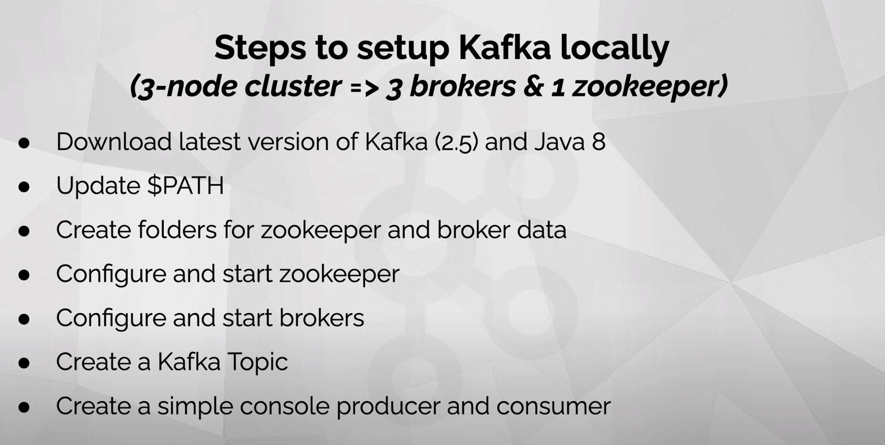

# kafka and zeekeeper

* kafka_2.12-2.5.0.tgz

* apache-zookeeper-3.5.9-bin.tar.gz

## [How to launch a Kafka Cluster on your Laptop | Apache Kafka Series - Part 02](https://www.youtube.com/watch?v=gwrslUOSez8)




```bash
$ mkdir data
$ cd data/
$ mkdir zookeeper
$ mkdir broker-0
$ mkdir broker-1
$ mkdir broker-2
$ ll
total 0
drwxr-xr-x  6 huzhi  staff  192  1 14 21:43 ./
drwxr-xr-x  7 huzhi  staff  224  1 14 21:42 ../
drwxr-xr-x  2 huzhi  staff   64  1 14 21:43 broker-0/
drwxr-xr-x  2 huzhi  staff   64  1 14 21:43 broker-1/
drwxr-xr-x  2 huzhi  staff   64  1 14 21:43 broker-2/
drwxr-xr-x  2 huzhi  staff   64  1 14 21:42 zookeeper/

$ cd ../
$ ll
total 8
drwxr-xr-x   7 huzhi  staff  224  1 14 21:42 ./
drwxr-xr-x  26 huzhi  staff  832  1 14 21:29 ../
drwxr-xr-x  12 huzhi  staff  384  1 14 21:31 .git/
-rw-r--r--@  1 huzhi  staff  151  1 14 21:35 README.md
drwxr-xr-x   6 huzhi  staff  192  1 14 21:43 data/
drwxr-xr-x   3 huzhi  staff   96  1 14 21:35 images/
drwxr-xr-x   8 huzhi  staff  256  4  8  2020 kafka_2.12-2.5.0/
$


# vim ./config/zookeeper.properties

$ ./bin/zookeeper-server-start.sh -daemon ./config/zookeeper.properties
$ jps
4739 QuorumPeerMain
4774 Jps
$


$ cp server.properties server-0.properties
$ cp server.properties server-1.properties
$ cp server.properties server-2.properties


$ vim server-0.properties
$ vim server-1.properties
$ vim server-2.properties

$ ./bin/kafka-server-start.sh -daemon ./config/server-0.properties
$ jps
4739 QuorumPeerMain
4806 ZooKeeperMainWithTlsSupportForKafka
5675 Kafka
5677 Jps
$ ./bin/kafka-server-start.sh -daemon ./config/server-1.properties
$ ./bin/kafka-server-start.sh -daemon ./config/server-2.properties
$ jps
4739 QuorumPeerMain
4806 ZooKeeperMainWithTlsSupportForKafka
6025 Kafka
6347 Kafka
5675 Kafka
6348 Jps
$

$ tree -a data/zookeeper/
data/zookeeper/
└── version-2
    ├── log.1
    └── snapshot.0

1 directory, 2 files
$
$ tree -a data/broker-0/
data/broker-0/
├── .lock
├── cleaner-offset-checkpoint
├── log-start-offset-checkpoint
├── meta.properties
├── recovery-point-offset-checkpoint
└── replication-offset-checkpoint

0 directories, 6 files
$


$ ./bin/kafka-topics.sh --zookeeper localhost:2181 --list
$ ./bin/kafka-topics.sh --zookeeper localhost:2181 --create --topic first-topic --partitions 2 --replication-factor 3
Created topic first-topic.
$ ./bin/kafka-topics.sh --zookeeper localhost:2181 --list
first-topic
$ ./bin/kafka-topics.sh --zookeeper localhost:2181 --topic first-topic --describe
Topic: first-topic	PartitionCount: 2	ReplicationFactor: 3	Configs:
	Topic: first-topic	Partition: 0	Leader: 0	Replicas: 0,1,2	Isr: 0,1,2
	Topic: first-topic	Partition: 1	Leader: 1	Replicas: 1,2,0	Isr: 1,2,0

$ cd ../

$ tree -a data/zookeeper/
data/zookeeper/
└── version-2
    ├── log.1
    └── snapshot.0

1 directory, 2 files

$ tree -a data/broker-0/
data/broker-0/
├── .lock
├── cleaner-offset-checkpoint
├── first-topic-0
│   ├── 00000000000000000000.index
│   ├── 00000000000000000000.log
│   ├── 00000000000000000000.timeindex
│   └── leader-epoch-checkpoint
├── first-topic-1
│   ├── 00000000000000000000.index
│   ├── 00000000000000000000.log
│   ├── 00000000000000000000.timeindex
│   └── leader-epoch-checkpoint
├── log-start-offset-checkpoint
├── meta.properties
├── recovery-point-offset-checkpoint
└── replication-offset-checkpoint

2 directories, 14 files

$ tree -a data/broker-1/
data/broker-1/
├── .lock
├── cleaner-offset-checkpoint
├── first-topic-0
│   ├── 00000000000000000000.index
│   ├── 00000000000000000000.log
│   ├── 00000000000000000000.timeindex
│   └── leader-epoch-checkpoint
├── first-topic-1
│   ├── 00000000000000000000.index
│   ├── 00000000000000000000.log
│   ├── 00000000000000000000.timeindex
│   └── leader-epoch-checkpoint
├── log-start-offset-checkpoint
├── meta.properties
├── recovery-point-offset-checkpoint
└── replication-offset-checkpoint

2 directories, 14 files

$ tree -a data/broker-2/
data/broker-2/
├── .lock
├── cleaner-offset-checkpoint
├── first-topic-0
│   ├── 00000000000000000000.index
│   ├── 00000000000000000000.log
│   ├── 00000000000000000000.timeindex
│   └── leader-epoch-checkpoint
├── first-topic-1
│   ├── 00000000000000000000.index
│   ├── 00000000000000000000.log
│   ├── 00000000000000000000.timeindex
│   └── leader-epoch-checkpoint
├── log-start-offset-checkpoint
├── meta.properties
├── recovery-point-offset-checkpoint
└── replication-offset-checkpoint

2 directories, 14 files
$

$ ./bin/kafka-console-producer.sh --bootstrap-server localhost:9092,localhost:9093,localhost:9094 --topic first-topic
>hello1
>hello2
>hello3
>hello4
>hello5
>hello6
>

$ ./bin/kafka-console-consumer.sh --bootstrap-server localhost:9092,localhost:9093,localhost:9094 --topic first-topic --from-beginning --group first-consumer
hello1
hello3
hello2
hello4
hello5
hello6


$ ./bin/kafka-topics.sh --zookeeper localhost:2181 --list
__consumer_offsets
first-topic

$ ./bin/kafka-topics.sh --zookeeper localhost:2181 --topic __consumer_offsets --describe
Topic: __consumer_offsets	PartitionCount: 50	ReplicationFactor: 1	Configs: compression.type=producer,cleanup.policy=compact,segment.bytes=104857600
	Topic: __consumer_offsets	Partition: 0	Leader: 2	Replicas: 2	Isr: 2
	Topic: __consumer_offsets	Partition: 1	Leader: 0	Replicas: 0	Isr: 0
	Topic: __consumer_offsets	Partition: 2	Leader: 1	Replicas: 1	Isr: 1
	Topic: __consumer_offsets	Partition: 3	Leader: 2	Replicas: 2	Isr: 2
	Topic: __consumer_offsets	Partition: 4	Leader: 0	Replicas: 0	Isr: 0
	Topic: __consumer_offsets	Partition: 5	Leader: 1	Replicas: 1	Isr: 1
	Topic: __consumer_offsets	Partition: 6	Leader: 2	Replicas: 2	Isr: 2
	Topic: __consumer_offsets	Partition: 7	Leader: 0	Replicas: 0	Isr: 0
	Topic: __consumer_offsets	Partition: 8	Leader: 1	Replicas: 1	Isr: 1
	Topic: __consumer_offsets	Partition: 9	Leader: 2	Replicas: 2	Isr: 2
	Topic: __consumer_offsets	Partition: 10	Leader: 0	Replicas: 0	Isr: 0
	Topic: __consumer_offsets	Partition: 11	Leader: 1	Replicas: 1	Isr: 1
	Topic: __consumer_offsets	Partition: 12	Leader: 2	Replicas: 2	Isr: 2
	Topic: __consumer_offsets	Partition: 13	Leader: 0	Replicas: 0	Isr: 0
	Topic: __consumer_offsets	Partition: 14	Leader: 1	Replicas: 1	Isr: 1
	Topic: __consumer_offsets	Partition: 15	Leader: 2	Replicas: 2	Isr: 2
	Topic: __consumer_offsets	Partition: 16	Leader: 0	Replicas: 0	Isr: 0
	Topic: __consumer_offsets	Partition: 17	Leader: 1	Replicas: 1	Isr: 1
	Topic: __consumer_offsets	Partition: 18	Leader: 2	Replicas: 2	Isr: 2
	Topic: __consumer_offsets	Partition: 19	Leader: 0	Replicas: 0	Isr: 0
	Topic: __consumer_offsets	Partition: 20	Leader: 1	Replicas: 1	Isr: 1
	Topic: __consumer_offsets	Partition: 21	Leader: 2	Replicas: 2	Isr: 2
	Topic: __consumer_offsets	Partition: 22	Leader: 0	Replicas: 0	Isr: 0
	Topic: __consumer_offsets	Partition: 23	Leader: 1	Replicas: 1	Isr: 1
	Topic: __consumer_offsets	Partition: 24	Leader: 2	Replicas: 2	Isr: 2
	Topic: __consumer_offsets	Partition: 25	Leader: 0	Replicas: 0	Isr: 0
	Topic: __consumer_offsets	Partition: 26	Leader: 1	Replicas: 1	Isr: 1
	Topic: __consumer_offsets	Partition: 27	Leader: 2	Replicas: 2	Isr: 2
	Topic: __consumer_offsets	Partition: 28	Leader: 0	Replicas: 0	Isr: 0
	Topic: __consumer_offsets	Partition: 29	Leader: 1	Replicas: 1	Isr: 1
	Topic: __consumer_offsets	Partition: 30	Leader: 2	Replicas: 2	Isr: 2
	Topic: __consumer_offsets	Partition: 31	Leader: 0	Replicas: 0	Isr: 0
	Topic: __consumer_offsets	Partition: 32	Leader: 1	Replicas: 1	Isr: 1
	Topic: __consumer_offsets	Partition: 33	Leader: 2	Replicas: 2	Isr: 2
	Topic: __consumer_offsets	Partition: 34	Leader: 0	Replicas: 0	Isr: 0
	Topic: __consumer_offsets	Partition: 35	Leader: 1	Replicas: 1	Isr: 1
	Topic: __consumer_offsets	Partition: 36	Leader: 2	Replicas: 2	Isr: 2
	Topic: __consumer_offsets	Partition: 37	Leader: 0	Replicas: 0	Isr: 0
	Topic: __consumer_offsets	Partition: 38	Leader: 1	Replicas: 1	Isr: 1
	Topic: __consumer_offsets	Partition: 39	Leader: 2	Replicas: 2	Isr: 2
	Topic: __consumer_offsets	Partition: 40	Leader: 0	Replicas: 0	Isr: 0
	Topic: __consumer_offsets	Partition: 41	Leader: 1	Replicas: 1	Isr: 1
	Topic: __consumer_offsets	Partition: 42	Leader: 2	Replicas: 2	Isr: 2
	Topic: __consumer_offsets	Partition: 43	Leader: 0	Replicas: 0	Isr: 0
	Topic: __consumer_offsets	Partition: 44	Leader: 1	Replicas: 1	Isr: 1
	Topic: __consumer_offsets	Partition: 45	Leader: 2	Replicas: 2	Isr: 2
	Topic: __consumer_offsets	Partition: 46	Leader: 0	Replicas: 0	Isr: 0
	Topic: __consumer_offsets	Partition: 47	Leader: 1	Replicas: 1	Isr: 1
	Topic: __consumer_offsets	Partition: 48	Leader: 2	Replicas: 2	Isr: 2
	Topic: __consumer_offsets	Partition: 49	Leader: 0	Replicas: 0	Isr: 0

$ ./bin/kafka-run-class.sh kafka.admin.ConsumerGroupCommand --bootstrap-server localhost:9092,localhost:9093,localhost:9094 --describe --group first-consumer

GROUP           TOPIC           PARTITION  CURRENT-OFFSET  LOG-END-OFFSET  LAG             CONSUMER-ID                                                    HOST            CLIENT-ID
first-consumer  first-topic     0          3               3               0               consumer-first-consumer-1-97207b6f-712d-4b46-9f93-be334a282663 /127.0.0.1      consumer-first-consumer-1
first-consumer  first-topic     1          3               3               0               consumer-first-consumer-1-97207b6f-712d-4b46-9f93-be334a282663 /127.0.0.1      consumer-first-consumer-1

$ ./bin/kafka-run-class.sh kafka.tools.GetOffsetShell --broker-list localhost:9092,localhost:9093,localhost:9094 --topic first-topic
first-topic:0:3
first-topic:1:3
$


http://localhost:9090/commands/watches
http://localhost:9090/commands/stats


$ ./bin/zookeeper-shell.sh localhost:2181
Connecting to localhost:2181
Welcome to ZooKeeper!
JLine support is disabled

WATCHER::

WatchedEvent state:SyncConnected type:None path:null
ls /brokers/ids
Node does not exist: /brokers/ids
ls /brokers/ids
Node does not exist: /brokers/ids
ls /brokers/ids
Node does not exist: /brokers/ids
ls /brokers/ids
Node does not exist: /brokers/ids
ls /brokers/ids
Node does not exist: /brokers/ids
ls /brokers/ids
[0]
ls /brokers/ids
[0, 1, 2]
ls /
[admin, brokers, cluster, config, consumers, controller, controller_epoch, isr_change_notification, latest_producer_id_block, log_dir_event_notification, zookeeper]
ls /brokers
[ids, seqid, topics]
ls /brokers/topics
[first-topic]
ls /consumers
[]
ls /consumers
[]
quit

WATCHER::

WatchedEvent state:Closed type:None path:null
$


$ git diff
diff --git a/kafka_2.12-2.5.0/config/server-0.properties b/kafka_2.12-2.5.0/config/server-0.properties
index b1cf5c4..9b55737 100644
--- a/kafka_2.12-2.5.0/config/server-0.properties
+++ b/kafka_2.12-2.5.0/config/server-0.properties
@@ -28,12 +28,12 @@ broker.id=0
 #     listeners = listener_name://host_name:port
 #   EXAMPLE:
 #     listeners = PLAINTEXT://your.host.name:9092
-#listeners=PLAINTEXT://:9092
+listeners=PLAINTEXT://localhost:9092

 # Hostname and port the broker will advertise to producers and consumers. If not set,
 # it uses the value for "listeners" if configured.  Otherwise, it will use the value
 # returned from java.net.InetAddress.getCanonicalHostName().
-#advertised.listeners=PLAINTEXT://your.host.name:9092
+advertised.listeners=PLAINTEXT://localhost:9092

 # Maps listener names to security protocols, the default is for them to be the same. See the config documentation for more details
 #listener.security.protocol.map=PLAINTEXT:PLAINTEXT,SSL:SSL,SASL_PLAINTEXT:SASL_PLAINTEXT,SASL_SSL:SASL_SSL
@@ -57,12 +57,12 @@ socket.request.max.bytes=104857600
 ############################# Log Basics #############################

 # A comma separated list of directories under which to store log files
-log.dirs=/tmp/kafka-logs
+log.dirs=/Users/huzhi/work/code/go_code/kafka/data/broker-0

 # The default number of log partitions per topic. More partitions allow greater
 # parallelism for consumption, but this will also result in more files across
 # the brokers.
-num.partitions=1
+num.partitions=3

 # The number of threads per data directory to be used for log recovery at startup and flushing at shutdown.
 # This value is recommended to be increased for installations with data dirs located in RAID array.
diff --git a/kafka_2.12-2.5.0/config/server-1.properties b/kafka_2.12-2.5.0/config/server-1.properties
index b1cf5c4..ef01944 100644
--- a/kafka_2.12-2.5.0/config/server-1.properties
+++ b/kafka_2.12-2.5.0/config/server-1.properties
@@ -18,7 +18,7 @@
 ############################# Server Basics #############################

 # The id of the broker. This must be set to a unique integer for each broker.
-broker.id=0
+broker.id=1

 ############################# Socket Server Settings #############################

@@ -28,12 +28,12 @@ broker.id=0
 #     listeners = listener_name://host_name:port
 #   EXAMPLE:
 #     listeners = PLAINTEXT://your.host.name:9092
-#listeners=PLAINTEXT://:9092
+listeners=PLAINTEXT://localhost:9093

 # Hostname and port the broker will advertise to producers and consumers. If not set,
 # it uses the value for "listeners" if configured.  Otherwise, it will use the value
 # returned from java.net.InetAddress.getCanonicalHostName().
-#advertised.listeners=PLAINTEXT://your.host.name:9092
+advertised.listeners=PLAINTEXT://localhost:9093

 # Maps listener names to security protocols, the default is for them to be the same. See the config documentation for more details
 #listener.security.protocol.map=PLAINTEXT:PLAINTEXT,SSL:SSL,SASL_PLAINTEXT:SASL_PLAINTEXT,SASL_SSL:SASL_SSL
@@ -57,12 +57,12 @@ socket.request.max.bytes=104857600
 ############################# Log Basics #############################

 # A comma separated list of directories under which to store log files
-log.dirs=/tmp/kafka-logs
+log.dirs=/Users/huzhi/work/code/go_code/kafka/data/broker-1

 # The default number of log partitions per topic. More partitions allow greater
 # parallelism for consumption, but this will also result in more files across
 # the brokers.
-num.partitions=1
+num.partitions=3

 # The number of threads per data directory to be used for log recovery at startup and flushing at shutdown.
 # This value is recommended to be increased for installations with data dirs located in RAID array.
diff --git a/kafka_2.12-2.5.0/config/server-2.properties b/kafka_2.12-2.5.0/config/server-2.properties
index b1cf5c4..86a1ac9 100644
--- a/kafka_2.12-2.5.0/config/server-2.properties
+++ b/kafka_2.12-2.5.0/config/server-2.properties
@@ -18,7 +18,7 @@
 ############################# Server Basics #############################

 # The id of the broker. This must be set to a unique integer for each broker.
-broker.id=0
+broker.id=2

 ############################# Socket Server Settings #############################

@@ -28,12 +28,12 @@ broker.id=0
 #     listeners = listener_name://host_name:port
 #   EXAMPLE:
 #     listeners = PLAINTEXT://your.host.name:9092
-#listeners=PLAINTEXT://:9092
+listeners=PLAINTEXT://localhost:9094

 # Hostname and port the broker will advertise to producers and consumers. If not set,
 # it uses the value for "listeners" if configured.  Otherwise, it will use the value
 # returned from java.net.InetAddress.getCanonicalHostName().
-#advertised.listeners=PLAINTEXT://your.host.name:9092
+advertised.listeners=PLAINTEXT://localhost:9094

 # Maps listener names to security protocols, the default is for them to be the same. See the config documentation for more details
 #listener.security.protocol.map=PLAINTEXT:PLAINTEXT,SSL:SSL,SASL_PLAINTEXT:SASL_PLAINTEXT,SASL_SSL:SASL_SSL
@@ -57,12 +57,12 @@ socket.request.max.bytes=104857600
 ############################# Log Basics #############################

 # A comma separated list of directories under which to store log files
-log.dirs=/tmp/kafka-logs
+log.dirs=/Users/huzhi/work/code/go_code/kafka/data/broker-2

 # The default number of log partitions per topic. More partitions allow greater
 # parallelism for consumption, but this will also result in more files across
 # the brokers.
-num.partitions=1
+num.partitions=3

 # The number of threads per data directory to be used for log recovery at startup and flushing at shutdown.
 # This value is recommended to be increased for installations with data dirs located in RAID array.
diff --git a/kafka_2.12-2.5.0/config/zookeeper.properties b/kafka_2.12-2.5.0/config/zookeeper.properties
index 90f4332..990c1c9 100644
--- a/kafka_2.12-2.5.0/config/zookeeper.properties
+++ b/kafka_2.12-2.5.0/config/zookeeper.properties
@@ -13,12 +13,14 @@
 # See the License for the specific language governing permissions and
 # limitations under the License.
 # the directory where the snapshot is stored.
-dataDir=/tmp/zookeeper
+dataDir=/Users/huzhi/work/code/go_code/kafka/data/zookeeper
 # the port at which the clients will connect
 clientPort=2181
 # disable the per-ip limit on the number of connections since this is a non-production config
 maxClientCnxns=0
 # Disable the adminserver by default to avoid port conflicts.
 # Set the port to something non-conflicting if choosing to enable this
-admin.enableServer=false
-# admin.serverPort=8080
+admin.enableServer=true
+admin.serverPort=9090
+server.1=localhost:2888:3888
+
$


```

## kafka config

```
advertised.host.name = null
advertised.listeners = PLAINTEXT://localhost:9092
advertised.port = null
alter.config.policy.class.name = null
alter.log.dirs.replication.quota.window.num = 11
alter.log.dirs.replication.quota.window.size.seconds = 1
authorizer.class.name =
auto.create.topics.enable = true
auto.leader.rebalance.enable = true
background.threads = 10
broker.id = 0
broker.id.generation.enable = true
broker.rack = null
client.quota.callback.class = null
compression.type = producer
connection.failed.authentication.delay.ms = 100
connections.max.idle.ms = 600000
connections.max.reauth.ms = 0
control.plane.listener.name = null
controlled.shutdown.enable = true
controlled.shutdown.max.retries = 3
controlled.shutdown.retry.backoff.ms = 5000
controller.socket.timeout.ms = 30000
create.topic.policy.class.name = null
default.replication.factor = 1
delegation.token.expiry.check.interval.ms = 3600000
delegation.token.expiry.time.ms = 86400000
delegation.token.master.key = null
delegation.token.max.lifetime.ms = 604800000
delete.records.purgatory.purge.interval.requests = 1
delete.topic.enable = true
fetch.max.bytes = 57671680
fetch.purgatory.purge.interval.requests = 1000
group.initial.rebalance.delay.ms = 0
group.max.session.timeout.ms = 1800000
group.max.size = 2147483647
group.min.session.timeout.ms = 6000
host.name =
inter.broker.listener.name = null
inter.broker.protocol.version = 2.5-IV0
kafka.metrics.polling.interval.secs = 10
kafka.metrics.reporters = []
leader.imbalance.check.interval.seconds = 300
leader.imbalance.per.broker.percentage = 10
listener.security.protocol.map = PLAINTEXT:PLAINTEXT,SSL:SSL,SASL_PLAINTEXT:SASL_PLAINTEXT,SASL_SSL:SASL_SSL
listeners = PLAINTEXT://localhost:9092
log.cleaner.backoff.ms = 15000
log.cleaner.dedupe.buffer.size = 134217728
log.cleaner.delete.retention.ms = 86400000
log.cleaner.enable = true
log.cleaner.io.buffer.load.factor = 0.9
log.cleaner.io.buffer.size = 524288
log.cleaner.io.max.bytes.per.second = 1.7976931348623157E308
log.cleaner.max.compaction.lag.ms = 9223372036854775807
log.cleaner.min.cleanable.ratio = 0.5
log.cleaner.min.compaction.lag.ms = 0
log.cleaner.threads = 1
log.cleanup.policy = [delete]
log.dir = /tmp/kafka-logs
log.dirs = /Users/huzhi/work/code/go_code/kafka_and_zookeeper/data/broker-0
log.flush.interval.messages = 9223372036854775807
log.flush.interval.ms = null
log.flush.offset.checkpoint.interval.ms = 60000
log.flush.scheduler.interval.ms = 9223372036854775807
log.flush.start.offset.checkpoint.interval.ms = 60000
log.index.interval.bytes = 4096
log.index.size.max.bytes = 10485760
log.message.downconversion.enable = true
log.message.format.version = 2.5-IV0
log.message.timestamp.difference.max.ms = 9223372036854775807
log.message.timestamp.type = CreateTime
log.preallocate = false
log.retention.bytes = -1
log.retention.check.interval.ms = 300000
log.retention.hours = 168
log.retention.minutes = null
log.retention.ms = null
log.roll.hours = 168
log.roll.jitter.hours = 0
log.roll.jitter.ms = null
log.roll.ms = null
log.segment.bytes = 1073741824
log.segment.delete.delay.ms = 60000
max.connections = 2147483647
max.connections.per.ip = 2147483647
max.connections.per.ip.overrides =
max.incremental.fetch.session.cache.slots = 1000
message.max.bytes = 1048588
metric.reporters = []
metrics.num.samples = 2
metrics.recording.level = INFO
metrics.sample.window.ms = 30000
min.insync.replicas = 1
num.io.threads = 8
num.network.threads = 3
num.partitions = 3
num.recovery.threads.per.data.dir = 1
num.replica.alter.log.dirs.threads = null
num.replica.fetchers = 1
offset.metadata.max.bytes = 4096
offsets.commit.required.acks = -1
offsets.commit.timeout.ms = 5000
offsets.load.buffer.size = 5242880
offsets.retention.check.interval.ms = 600000
offsets.retention.minutes = 10080
offsets.topic.compression.codec = 0
offsets.topic.num.partitions = 50
offsets.topic.replication.factor = 1
offsets.topic.segment.bytes = 104857600
password.encoder.cipher.algorithm = AES/CBC/PKCS5Padding
password.encoder.iterations = 4096
password.encoder.key.length = 128
password.encoder.keyfactory.algorithm = null
password.encoder.old.secret = null
password.encoder.secret = null
port = 9092
principal.builder.class = null
producer.purgatory.purge.interval.requests = 1000
queued.max.request.bytes = -1
queued.max.requests = 500
quota.consumer.default = 9223372036854775807
quota.producer.default = 9223372036854775807
quota.window.num = 11
quota.window.size.seconds = 1
replica.fetch.backoff.ms = 1000
replica.fetch.max.bytes = 1048576
replica.fetch.min.bytes = 1
replica.fetch.response.max.bytes = 10485760
replica.fetch.wait.max.ms = 500
replica.high.watermark.checkpoint.interval.ms = 5000
replica.lag.time.max.ms = 30000
replica.selector.class = null
replica.socket.receive.buffer.bytes = 65536
replica.socket.timeout.ms = 30000
replication.quota.window.num = 11
replication.quota.window.size.seconds = 1
request.timeout.ms = 30000
reserved.broker.max.id = 1000
sasl.client.callback.handler.class = null
sasl.enabled.mechanisms = [GSSAPI]
sasl.jaas.config = null
sasl.kerberos.kinit.cmd = /usr/bin/kinit
sasl.kerberos.min.time.before.relogin = 60000
sasl.kerberos.principal.to.local.rules = [DEFAULT]
sasl.kerberos.service.name = null
sasl.kerberos.ticket.renew.jitter = 0.05
sasl.kerberos.ticket.renew.window.factor = 0.8
sasl.login.callback.handler.class = null
sasl.login.class = null
sasl.login.refresh.buffer.seconds = 300
sasl.login.refresh.min.period.seconds = 60
sasl.login.refresh.window.factor = 0.8
sasl.login.refresh.window.jitter = 0.05
sasl.mechanism.inter.broker.protocol = GSSAPI
sasl.server.callback.handler.class = null
security.inter.broker.protocol = PLAINTEXT
security.providers = null
socket.receive.buffer.bytes = 102400
socket.request.max.bytes = 104857600
socket.send.buffer.bytes = 102400
ssl.cipher.suites = []
ssl.client.auth = none
ssl.enabled.protocols = [TLSv1.2]
ssl.endpoint.identification.algorithm = https
ssl.key.password = null
ssl.keymanager.algorithm = SunX509
ssl.keystore.location = null
ssl.keystore.password = null
ssl.keystore.type = JKS
ssl.principal.mapping.rules = DEFAULT
ssl.protocol = TLSv1.2
ssl.provider = null
ssl.secure.random.implementation = null
ssl.trustmanager.algorithm = PKIX
ssl.truststore.location = null
ssl.truststore.password = null
ssl.truststore.type = JKS
transaction.abort.timed.out.transaction.cleanup.interval.ms = 10000
transaction.max.timeout.ms = 900000
transaction.remove.expired.transaction.cleanup.interval.ms = 3600000
transaction.state.log.load.buffer.size = 5242880
transaction.state.log.min.isr = 1
transaction.state.log.num.partitions = 50
transaction.state.log.replication.factor = 1
transaction.state.log.segment.bytes = 104857600
transactional.id.expiration.ms = 604800000
unclean.leader.election.enable = false
zookeeper.clientCnxnSocket = null
zookeeper.connect = localhost:2181
zookeeper.connection.timeout.ms = 18000
zookeeper.max.in.flight.requests = 10
zookeeper.session.timeout.ms = 18000
zookeeper.set.acl = false
zookeeper.ssl.cipher.suites = null
zookeeper.ssl.client.enable = false
zookeeper.ssl.crl.enable = false
zookeeper.ssl.enabled.protocols = null
zookeeper.ssl.endpoint.identification.algorithm = HTTPS  # 主机名检查
zookeeper.ssl.keystore.location = null
zookeeper.ssl.keystore.password = null
zookeeper.ssl.keystore.type = null
zookeeper.ssl.ocsp.enable = false
zookeeper.ssl.protocol = TLSv1.2
zookeeper.ssl.truststore.location = null
zookeeper.ssl.truststore.password = null
zookeeper.ssl.truststore.type = null
zookeeper.sync.time.ms = 2000
```


