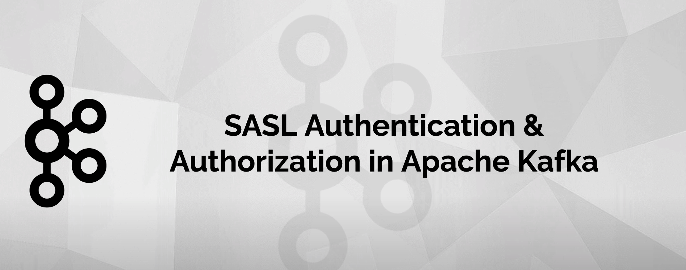
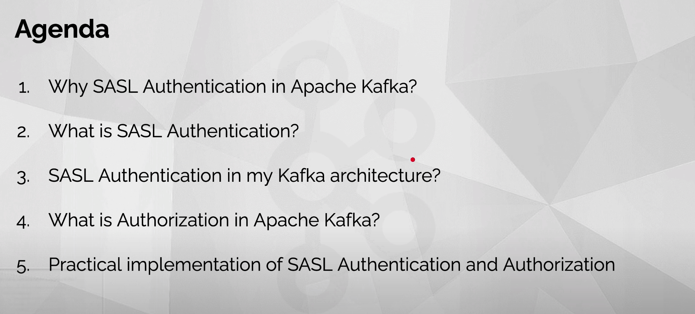
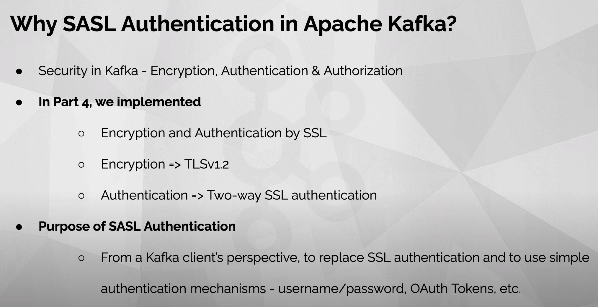
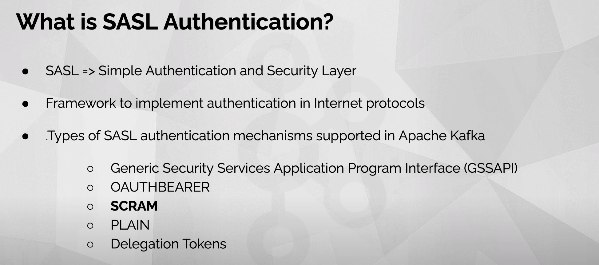
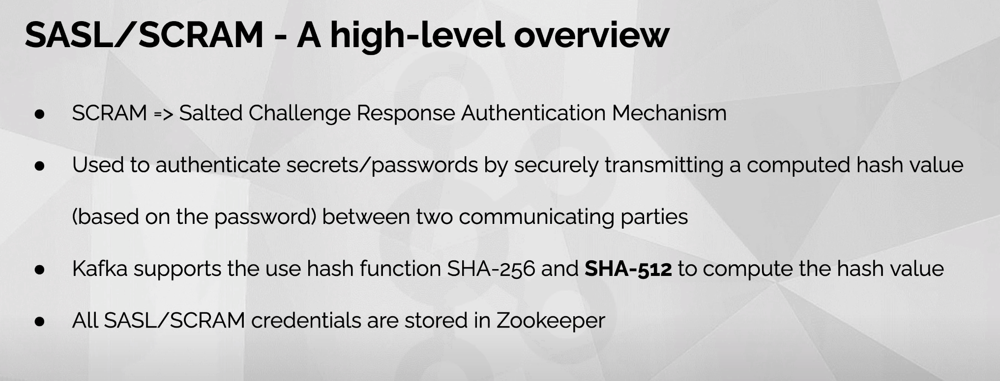
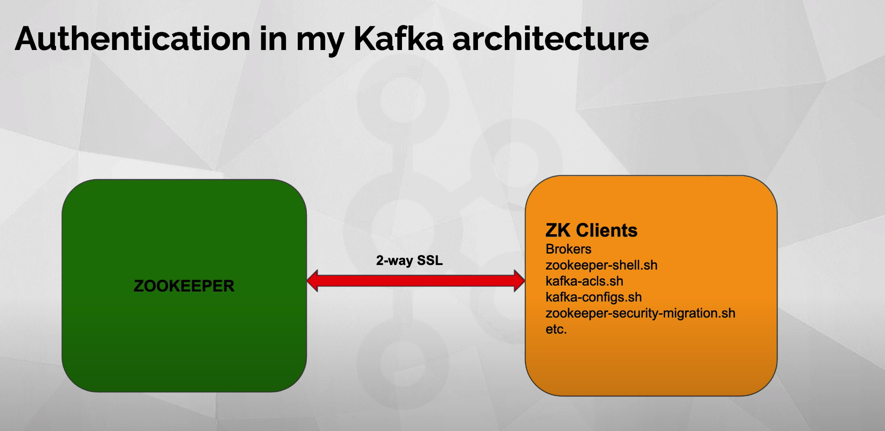
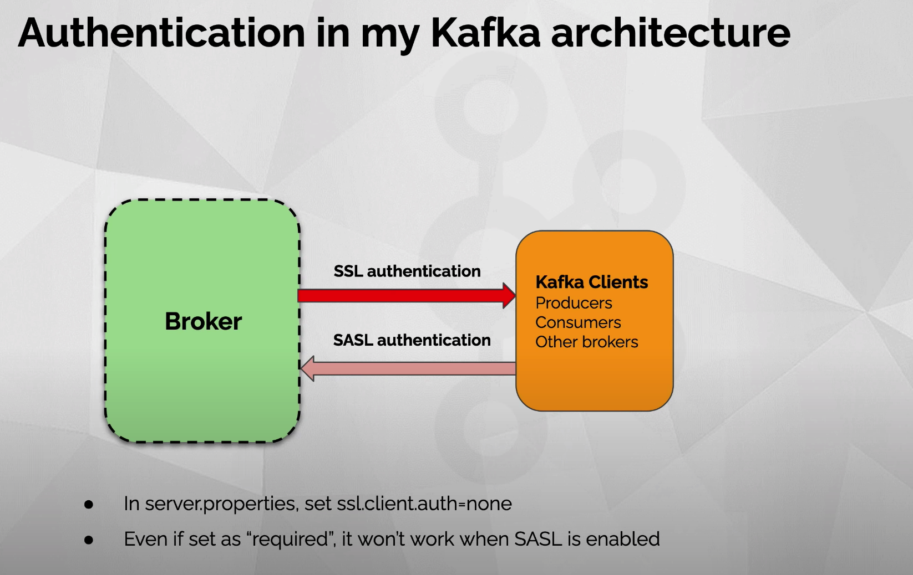
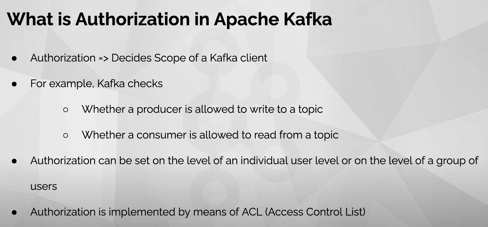

# [Kafka SASL Authentication & Authorization](https://www.youtube.com/watch?v=dC1q6LSD0F0)

















```bash


kafka-configs.sh --zookeeper localhost:2182 --zk-tls-config-file ./kafka/config/zookeeper-client.properties --entity-type users --entity-name broker-admin --alter --add-config 'SCRAM-SHA-512=[password=huzhi567233]'

kafka-configs.sh --zookeeper localhost:2182 --zk-tls-config-file ./kafka/config/zookeeper-client.properties --entity-type users --entity-name my-producer --alter --add-config 'SCRAM-SHA-512=[password=huzhi567233]'

kafka-configs.sh --zookeeper localhost:2182 --zk-tls-config-file ./kafka/config/zookeeper-client.properties --entity-type users --entity-name my-consumer --alter --add-config 'SCRAM-SHA-512=[password=huzhi567233]'

kafka-configs.sh --zookeeper localhost:2182 --zk-tls-config-file ./kafka/config/zookeeper-client.properties --entity-type users --entity-name my-consumer --describe


-Dzookeeper.clientCnxnSocket=org.apache.zookeeper.ClientCnxnSocketNetty -Dzookeeper.ssl.client.enable=true -Dzookeeper.ssl.keyStore.location=/Users/huzhi/work/code/go_code/kafka_and_zookeeper/ssl/kafka.zookeeper-client.keystore.jks -Dzookeeper.ssl.keystore.password=huzhi567233 -Dzookeeper.ssl.truststore.location=/Users/huzhi/work/code/go_code/kafka_and_zookeeper/ssl/kafka.zookeeper-client.truststore.jks -Dzookeeper.ssl.truststore.password=huzhi567233

/Library/Java/JavaVirtualMachines/adoptopenjdk-8.jdk/Contents/Home/bin/java -Xmx256M -server -XX:+UseG1GC -XX:MaxGCPauseMillis=20 -XX:InitiatingHeapOccupancyPercent=35 -XX:+ExplicitGCInvokesConcurrent -XX:MaxInlineLevel=15 -Dzookeeper.clientCnxnSocket=org.apache.zookeeper.ClientCnxnSocketNetty -Dzookeeper.ssl.client.enable=true -Dzookeeper.ssl.keyStore.location=/Users/huzhi/work/code/go_code/kafka_and_zookeeper/ssl/kafka.zookeeper-client.keystore.jks -Dzookeeper.ssl.keystore.password=huzhi567233 -Dzookeeper.ssl.truststore.location=/Users/huzhi/work/code/go_code/kafka_and_zookeeper/ssl/kafka.zookeeper-client.truststore.jks -Dzookeeper.ssl.truststore.password=huzhi567233 -Djava.awt.headless=true -Dcom.sun.management.jmxremote -Dcom.sun.management.jmxremote.authenticate=false -Dcom.sun.management.jmxremote.ssl=false -Dkafka.logs.dir=/Users/huzhi/work/code/go_code/kafka_and_zookeeper/kafka/bin/../logs -Dlog4j.configuration=file:/Users/huzhi/work/code/go_code/kafka_and_zookeeper/kafka/bin/../config/tools-log4j.properties -cp /Users/huzhi/work/code/go_code/kafka_and_zookeeper/kafka/bin/../libs/activation-1.1.1.jar:/Users/huzhi/work/code/go_code/kafka_and_zookeeper/kafka/bin/../libs/aopalliance-repackaged-2.5.0.jar:/Users/huzhi/work/code/go_code/kafka_and_zookeeper/kafka/bin/../libs/argparse4j-0.7.0.jar:/Users/huzhi/work/code/go_code/kafka_and_zookeeper/kafka/bin/../libs/audience-annotations-0.5.0.jar:/Users/huzhi/work/code/go_code/kafka_and_zookeeper/kafka/bin/../libs/commons-cli-1.4.jar:/Users/huzhi/work/code/go_code/kafka_and_zookeeper/kafka/bin/../libs/commons-lang3-3.8.1.jar:/Users/huzhi/work/code/go_code/kafka_and_zookeeper/kafka/bin/../libs/connect-api-2.5.0.jar:/Users/huzhi/work/code/go_code/kafka_and_zookeeper/kafka/bin/../libs/connect-basic-auth-extension-2.5.0.jar:/Users/huzhi/work/code/go_code/kafka_and_zookeeper/kafka/bin/../libs/connect-file-2.5.0.jar:/Users/huzhi/work/code/go_code/kafka_and_zookeeper/kafka/bin/../libs/connect-json-2.5.0.jar:/Users/huzhi/work/code/go_code/kafka_and_zookeeper/kafka/bin/../libs/connect-mirror-2.5.0.jar:/Users/huzhi/work/code/go_code/kafka_and_zookeeper/kafka/bin/../libs/connect-mirror-client-2.5.0.jar:/Users/huzhi/work/code/go_code/kafka_and_zookeeper/kafka/bin/../libs/connect-runtime-2.5.0.jar:/Users/huzhi/work/code/go_code/kafka_and_zookeeper/kafka/bin/../libs/connect-transforms-2.5.0.jar:/Users/huzhi/work/code/go_code/kafka_and_zookeeper/kafka/bin/../libs/hk2-api-2.5.0.jar:/Users/huzhi/work/code/go_code/kafka_and_zookeeper/kafka/bin/../libs/hk2-locator-2.5.0.jar:/Users/huzhi/work/code/go_code/kafka_and_zookeeper/kafka/bin/../libs/hk2-utils-2.5.0.jar:/Users/huzhi/work/code/go_code/kafka_and_zookeeper/kafka/bin/../libs/jackson-annotations-2.10.2.jar:/Users/huzhi/work/code/go_code/kafka_and_zookeeper/kafka/bin/../libs/jackson-core-2.10.2.jar:/Users/huzhi/work/code/go_code/kafka_and_zookeeper/kafka/bin/../libs/jackson-databind-2.10.2.jar:/Users/huzhi/work/code/go_code/kafka_and_zookeeper/kafka/bin/../libs/jackson-dataformat-csv-2.10.2.jar:/Users/huzhi/work/code/go_code/kafka_and_zookeeper/kafka/bin/../libs/jackson-datatype-jdk8-2.10.2.jar:/Users/huzhi/work/code/go_code/kafka_and_zookeeper/kafka/bin/../libs/jackson-jaxrs-base-2.10.2.jar:/Users/huzhi/work/code/go_code/kafka_and_zookeeper/kafka/bin/../libs/jackson-jaxrs-json-provider-2.10.2.jar:/Users/huzhi/work/code/go_code/kafka_and_zookeeper/kafka/bin/../libs/jackson-module-jaxb-annotations-2.10.2.jar:/Users/huzhi/work/code/go_code/kafka_and_zookeeper/kafka/bin/../libs/jackson-module-paranamer-2.10.2.jar:/Users/huzhi/work/code/go_code/kafka_and_zookeeper/kafka/bin/../libs/jackson-module-scala_2.12-2.10.2.jar:/Users/huzhi/work/code/go_code/kafka_and_zookeeper/kafka/bin/../libs/jakarta.activation-api-1.2.1.jar:/Users/huzhi/work/code/go_code/kafka_and_zookeeper/kafka/bin/../libs/jakarta.annotation-api-1.3.4.jar:/Users/huzhi/work/code/go_code/kafka_and_zookeeper/kafka/bin/../libs/jakarta.inject-2.5.0.jar:/Users/huzhi/work/code/go_code/kafka_and_zookeeper/kafka/bin/../libs/jakarta.ws.rs-api-2.1.5.jar:/Users/huzhi/work/code/go_code/kafka_and_zookeeper/kafka/bin/../libs/jakarta.xml.bind-api-2.3.2.jar:/Users/huzhi/work/code/go_code/kafka_and_zookeeper/kafka/bin/../libs/javassist-3.22.0-CR2.jar:/Users/huzhi/work/code/go_code/kafka_and_zookeeper/kafka/bin/../libs/javassist-3.26.0-GA.jar:/Users/huzhi/work/code/go_code/kafka_and_zookeeper/kafka/bin/../libs/javax.servlet-api-3.1.0.jar:/Users/huzhi/work/code/go_code/kafka_and_zookeeper/kafka/bin/../libs/javax.ws.rs-api-2.1.1.jar:/Users/huzhi/work/code/go_code/kafka_and_zookeeper/kafka/bin/../libs/jaxb-api-2.3.0.jar:/Users/huzhi/work/code/go_code/kafka_and_zookeeper/kafka/bin/../libs/jersey-client-2.28.jar:/Users/huzhi/work/code/go_code/kafka_and_zookeeper/kafka/bin/../libs/jersey-common-2.28.jar:/Users/huzhi/work/code/go_code/kafka_and_zookeeper/kafka/bin/../libs/jersey-container-servlet-2.28.jar:/Users/huzhi/work/code/go_code/kafka_and_zookeeper/kafka/bin/../libs/jersey-container-servlet-core-2.28.jar:/Users/huzhi/work/code/go_code/kafka_and_zookeeper/kafka/bin/../libs/jersey-hk2-2.28.jar:/Users/huzhi/work/code/go_code/kafka_and_zookeeper/kafka/bin/../libs/jersey-media-jaxb-2.28.jar:/Users/huzhi/work/code/go_code/kafka_and_zookeeper/kafka/bin/../libs/jersey-server-2.28.jar:/Users/huzhi/work/code/go_code/kafka_and_zookeeper/kafka/bin/../libs/jetty-client-9.4.24.v20191120.jar:/Users/huzhi/work/code/go_code/kafka_and_zookeeper/kafka/bin/../libs/jetty-continuation-9.4.24.v20191120.jar:/Users/huzhi/work/code/go_code/kafka_and_zookeeper/kafka/bin/../libs/jetty-http-9.4.24.v20191120.jar:/Users/huzhi/work/code/go_code/kafka_and_zookeeper/kafka/bin/../libs/jetty-io-9.4.24.v20191120.jar:/Users/huzhi/work/code/go_code/kafka_and_zookeeper/kafka/bin/../libs/jetty-security-9.4.24.v20191120.jar:/Users/huzhi/work/code/go_code/kafka_and_zookeeper/kafka/bin/../libs/jetty-server-9.4.24.v20191120.jar:/Users/huzhi/work/code/go_code/kafka_and_zookeeper/kafka/bin/../libs/jetty-servlet-9.4.24.v20191120.jar:/Users/huzhi/work/code/go_code/kafka_and_zookeeper/kafka/bin/../libs/jetty-servlets-9.4.24.v20191120.jar:/Users/huzhi/work/code/go_code/kafka_and_zookeeper/kafka/bin/../libs/jetty-util-9.4.24.v20191120.jar:/Users/huzhi/work/code/go_code/kafka_and_zookeeper/kafka/bin/../libs/jopt-simple-5.0.4.jar:/Users/huzhi/work/code/go_code/kafka_and_zookeeper/kafka/bin/../libs/kafka-clients-2.5.0.jar:/Users/huzhi/work/code/go_code/kafka_and_zookeeper/kafka/bin/../libs/kafka-log4j-appender-2.5.0.jar:/Users/huzhi/work/code/go_code/kafka_and_zookeeper/kafka/bin/../libs/kafka-streams-2.5.0.jar:/Users/huzhi/work/code/go_code/kafka_and_zookeeper/kafka/bin/../libs/kafka-streams-examples-2.5.0.jar:/Users/huzhi/work/code/go_code/kafka_and_zookeeper/kafka/bin/../libs/kafka-streams-scala_2.12-2.5.0.jar:/Users/huzhi/work/code/go_code/kafka_and_zookeeper/kafka/bin/../libs/kafka-streams-test-utils-2.5.0.jar:/Users/huzhi/work/code/go_code/kafka_and_zookeeper/kafka/bin/../libs/kafka-tools-2.5.0.jar:/Users/huzhi/work/code/go_code/kafka_and_zookeeper/kafka/bin/../libs/kafka_2.12-2.5.0-sources.jar:/Users/huzhi/work/code/go_code/kafka_and_zookeeper/kafka/bin/../libs/kafka_2.12-2.5.0.jar:/Users/huzhi/work/code/go_code/kafka_and_zookeeper/kafka/bin/../libs/log4j-1.2.17.jar:/Users/huzhi/work/code/go_code/kafka_and_zookeeper/kafka/bin/../libs/lz4-java-1.7.1.jar:/Users/huzhi/work/code/go_code/kafka_and_zookeeper/kafka/bin/../libs/maven-artifact-3.6.3.jar:/Users/huzhi/work/code/go_code/kafka_and_zookeeper/kafka/bin/../libs/metrics-core-2.2.0.jar:/Users/huzhi/work/code/go_code/kafka_and_zookeeper/kafka/bin/../libs/netty-buffer-4.1.45.Final.jar:/Users/huzhi/work/code/go_code/kafka_and_zookeeper/kafka/bin/../libs/netty-codec-4.1.45.Final.jar:/Users/huzhi/work/code/go_code/kafka_and_zookeeper/kafka/bin/../libs/netty-common-4.1.45.Final.jar:/Users/huzhi/work/code/go_code/kafka_and_zookeeper/kafka/bin/../libs/netty-handler-4.1.45.Final.jar:/Users/huzhi/work/code/go_code/kafka_and_zookeeper/kafka/bin/../libs/netty-resolver-4.1.45.Final.jar:/Users/huzhi/work/code/go_code/kafka_and_zookeeper/kafka/bin/../libs/netty-transport-4.1.45.Final.jar:/Users/huzhi/work/code/go_code/kafka_and_zookeeper/kafka/bin/../libs/netty-transport-native-epoll-4.1.45.Final.jar:/Users/huzhi/work/code/go_code/kafka_and_zookeeper/kafka/bin/../libs/netty-transport-native-unix-common-4.1.45.Final.jar:/Users/huzhi/work/code/go_code/kafka_and_zookeeper/kafka/bin/../libs/osgi-resource-locator-1.0.1.jar:/Users/huzhi/work/code/go_code/kafka_and_zookeeper/kafka/bin/../libs/paranamer-2.8.jar:/Users/huzhi/work/code/go_code/kafka_and_zookeeper/kafka/bin/../libs/plexus-utils-3.2.1.jar:/Users/huzhi/work/code/go_code/kafka_and_zookeeper/kafka/bin/../libs/reflections-0.9.12.jar:/Users/huzhi/work/code/go_code/kafka_and_zookeeper/kafka/bin/../libs/rocksdbjni-5.18.3.jar:/Users/huzhi/work/code/go_code/kafka_and_zookeeper/kafka/bin/../libs/scala-collection-compat_2.12-2.1.3.jar:/Users/huzhi/work/code/go_code/kafka_and_zookeeper/kafka/bin/../libs/scala-java8-compat_2.12-0.9.0.jar:/Users/huzhi/work/code/go_code/kafka_and_zookeeper/kafka/bin/../libs/scala-library-2.12.10.jar:/Users/huzhi/work/code/go_code/kafka_and_zookeeper/kafka/bin/../libs/scala-logging_2.12-3.9.2.jar:/Users/huzhi/work/code/go_code/kafka_and_zookeeper/kafka/bin/../libs/scala-reflect-2.12.10.jar:/Users/huzhi/work/code/go_code/kafka_and_zookeeper/kafka/bin/../libs/slf4j-api-1.7.30.jar:/Users/huzhi/work/code/go_code/kafka_and_zookeeper/kafka/bin/../libs/slf4j-log4j12-1.7.30.jar:/Users/huzhi/work/code/go_code/kafka_and_zookeeper/kafka/bin/../libs/snappy-java-1.1.7.3.jar:/Users/huzhi/work/code/go_code/kafka_and_zookeeper/kafka/bin/../libs/validation-api-2.0.1.Final.jar:/Users/huzhi/work/code/go_code/kafka_and_zookeeper/kafka/bin/../libs/zookeeper-3.5.7.jar:/Users/huzhi/work/code/go_code/kafka_and_zookeeper/kafka/bin/../libs/zookeeper-jute-3.5.7.jar:/Users/huzhi/work/code/go_code/kafka_and_zookeeper/kafka/bin/../libs/zstd-jni-1.4.4-7.jar kafka.admin.ConfigCommand --zookeeper localhost:2182 --zk-tls-config-file ./kafka/config/zookeeper-client.properties --entity-type users --entity-name my-consumer --alter --add-config 'SCRAM-SHA-512=[password=huzhi567233]'


[zk: 127.0.0.1:2182(CONNECTED) 1] ls /
[config, zookeeper]
[zk: 127.0.0.1:2182(CONNECTED) 2] ls /config
[changes, users]
[zk: 127.0.0.1:2182(CONNECTED) 3] ls /config/users
[broker-admin]
[zk: 127.0.0.1:2182(CONNECTED) 4] ls /config/users/broker-admin
[]
[zk: 127.0.0.1:2182(CONNECTED) 5] get /config/users/broker-admin
{"version":1,"config":{"SCRAM-SHA-512":"salt=bW50d3gxbGU4MmUwcDFlNHZjM2h4MjBxMg==,stored_key=cbZrhlgpCxBXswQZxG/8S2rPD5gLHxCV56+H1+inPr/k9T/SlCG6Dc+ahLQAzmULj1TdAWzPErx57pWJMZ/u1w==,server_key=GhWDXLfgilU7ZYgW6YWT7/XWFOMSdrAK9veuhWEsbyTToM34Jzefqg+hLtAmaoEPV2J/d3rgB/EGvhadTjvwFQ==,iterations=4096"}}
[zk: 127.0.0.1:2182(CONNECTED) 6]
[zk: 127.0.0.1:2182(CONNECTED) 6]
[zk: 127.0.0.1:2182(CONNECTED) 6]
[zk: 127.0.0.1:2182(CONNECTED) 6] ls /
[config, zookeeper]
[zk: 127.0.0.1:2182(CONNECTED) 7] ls /config
[changes, users]
[zk: 127.0.0.1:2182(CONNECTED) 8] ls /config/changes
[config_change_0000000000]
[zk: 127.0.0.1:2182(CONNECTED) 9] ls /config/changes/config_change_0000000000
[]
[zk: 127.0.0.1:2182(CONNECTED) 10] get /config/changes/config_change_0000000000
{"version":2,"entity_path":"users/broker-admin"}
[zk: 127.0.0.1:2182(CONNECTED) 11]


./kafka/bin/kafka-acls.sh --authorizer-properties zookeeper.connect=localhost:2182 --zk-tls-config-file ./kafka/config/zookeeper-client.properties -add --allow-principal User:my-producer --operation Write --operation Describe --operation DescribeConfigs --topic ssl-topic

./kafka/bin/kafka-acls.sh --authorizer-properties zookeeper.connect=localhost:2182 --zk-tls-config-file ./kafka/config/zookeeper-client.properties -add --allow-principal User:my-consumer --operation Read --operation Describe --topic ssl-topic

./kafka/bin/kafka-acls.sh --authorizer-properties zookeeper.connect=localhost:2182 --zk-tls-config-file ./kafka/config/zookeeper-client.properties -add --allow-principal User:my-consumer --operation Read --group ssl-consumer-group

./kafka/bin/kafka-acls.sh --authorizer-properties zookeeper.connect=localhost:2182 --zk-tls-config-file ./kafka/config/zookeeper-client.properties --list --topic ssl-topic

./kafka/bin/kafka-acls.sh --authorizer-properties zookeeper.connect=localhost:2182 --zk-tls-config-file ./kafka/config/zookeeper-client.properties --list --group ssl-consumer-group

/Library/Java/JavaVirtualMachines/adoptopenjdk-8.jdk/Contents/Home/bin/java -Xmx256M -server -XX:+UseG1GC -XX:MaxGCPauseMillis=20 -XX:InitiatingHeapOccupancyPercent=35 -XX:+ExplicitGCInvokesConcurrent -XX:MaxInlineLevel=15 -Dzookeeper.clientCnxnSocket=org.apache.zookeeper.ClientCnxnSocketNetty -Dzookeeper.ssl.client.enable=true -Dzookeeper.ssl.keyStore.location=/Users/huzhi/work/code/go_code/kafka_and_zookeeper/ssl/kafka.zookeeper-client.keystore.jks -Dzookeeper.ssl.keystore.password=huzhi567233 -Dzookeeper.ssl.truststore.location=/Users/huzhi/work/code/go_code/kafka_and_zookeeper/ssl/kafka.zookeeper-client.truststore.jks -Dzookeeper.ssl.truststore.password=huzhi567233 -Djava.awt.headless=true -Dcom.sun.management.jmxremote -Dcom.sun.management.jmxremote.authenticate=false -Dcom.sun.management.jmxremote.ssl=false -Dkafka.logs.dir=/Users/huzhi/work/code/go_code/kafka_and_zookeeper/kafka/bin/../logs -Dlog4j.configuration=file:/Users/huzhi/work/code/go_code/kafka_and_zookeeper/kafka/bin/../config/tools-log4j.properties -cp /Users/huzhi/work/code/go_code/kafka_and_zookeeper/kafka/bin/../libs/activation-1.1.1.jar:/Users/huzhi/work/code/go_code/kafka_and_zookeeper/kafka/bin/../libs/aopalliance-repackaged-2.5.0.jar:/Users/huzhi/work/code/go_code/kafka_and_zookeeper/kafka/bin/../libs/argparse4j-0.7.0.jar:/Users/huzhi/work/code/go_code/kafka_and_zookeeper/kafka/bin/../libs/audience-annotations-0.5.0.jar:/Users/huzhi/work/code/go_code/kafka_and_zookeeper/kafka/bin/../libs/commons-cli-1.4.jar:/Users/huzhi/work/code/go_code/kafka_and_zookeeper/kafka/bin/../libs/commons-lang3-3.8.1.jar:/Users/huzhi/work/code/go_code/kafka_and_zookeeper/kafka/bin/../libs/connect-api-2.5.0.jar:/Users/huzhi/work/code/go_code/kafka_and_zookeeper/kafka/bin/../libs/connect-basic-auth-extension-2.5.0.jar:/Users/huzhi/work/code/go_code/kafka_and_zookeeper/kafka/bin/../libs/connect-file-2.5.0.jar:/Users/huzhi/work/code/go_code/kafka_and_zookeeper/kafka/bin/../libs/connect-json-2.5.0.jar:/Users/huzhi/work/code/go_code/kafka_and_zookeeper/kafka/bin/../libs/connect-mirror-2.5.0.jar:/Users/huzhi/work/code/go_code/kafka_and_zookeeper/kafka/bin/../libs/connect-mirror-client-2.5.0.jar:/Users/huzhi/work/code/go_code/kafka_and_zookeeper/kafka/bin/../libs/connect-runtime-2.5.0.jar:/Users/huzhi/work/code/go_code/kafka_and_zookeeper/kafka/bin/../libs/connect-transforms-2.5.0.jar:/Users/huzhi/work/code/go_code/kafka_and_zookeeper/kafka/bin/../libs/hk2-api-2.5.0.jar:/Users/huzhi/work/code/go_code/kafka_and_zookeeper/kafka/bin/../libs/hk2-locator-2.5.0.jar:/Users/huzhi/work/code/go_code/kafka_and_zookeeper/kafka/bin/../libs/hk2-utils-2.5.0.jar:/Users/huzhi/work/code/go_code/kafka_and_zookeeper/kafka/bin/../libs/jackson-annotations-2.10.2.jar:/Users/huzhi/work/code/go_code/kafka_and_zookeeper/kafka/bin/../libs/jackson-core-2.10.2.jar:/Users/huzhi/work/code/go_code/kafka_and_zookeeper/kafka/bin/../libs/jackson-databind-2.10.2.jar:/Users/huzhi/work/code/go_code/kafka_and_zookeeper/kafka/bin/../libs/jackson-dataformat-csv-2.10.2.jar:/Users/huzhi/work/code/go_code/kafka_and_zookeeper/kafka/bin/../libs/jackson-datatype-jdk8-2.10.2.jar:/Users/huzhi/work/code/go_code/kafka_and_zookeeper/kafka/bin/../libs/jackson-jaxrs-base-2.10.2.jar:/Users/huzhi/work/code/go_code/kafka_and_zookeeper/kafka/bin/../libs/jackson-jaxrs-json-provider-2.10.2.jar:/Users/huzhi/work/code/go_code/kafka_and_zookeeper/kafka/bin/../libs/jackson-module-jaxb-annotations-2.10.2.jar:/Users/huzhi/work/code/go_code/kafka_and_zookeeper/kafka/bin/../libs/jackson-module-paranamer-2.10.2.jar:/Users/huzhi/work/code/go_code/kafka_and_zookeeper/kafka/bin/../libs/jackson-module-scala_2.12-2.10.2.jar:/Users/huzhi/work/code/go_code/kafka_and_zookeeper/kafka/bin/../libs/jakarta.activation-api-1.2.1.jar:/Users/huzhi/work/code/go_code/kafka_and_zookeeper/kafka/bin/../libs/jakarta.annotation-api-1.3.4.jar:/Users/huzhi/work/code/go_code/kafka_and_zookeeper/kafka/bin/../libs/jakarta.inject-2.5.0.jar:/Users/huzhi/work/code/go_code/kafka_and_zookeeper/kafka/bin/../libs/jakarta.ws.rs-api-2.1.5.jar:/Users/huzhi/work/code/go_code/kafka_and_zookeeper/kafka/bin/../libs/jakarta.xml.bind-api-2.3.2.jar:/Users/huzhi/work/code/go_code/kafka_and_zookeeper/kafka/bin/../libs/javassist-3.22.0-CR2.jar:/Users/huzhi/work/code/go_code/kafka_and_zookeeper/kafka/bin/../libs/javassist-3.26.0-GA.jar:/Users/huzhi/work/code/go_code/kafka_and_zookeeper/kafka/bin/../libs/javax.servlet-api-3.1.0.jar:/Users/huzhi/work/code/go_code/kafka_and_zookeeper/kafka/bin/../libs/javax.ws.rs-api-2.1.1.jar:/Users/huzhi/work/code/go_code/kafka_and_zookeeper/kafka/bin/../libs/jaxb-api-2.3.0.jar:/Users/huzhi/work/code/go_code/kafka_and_zookeeper/kafka/bin/../libs/jersey-client-2.28.jar:/Users/huzhi/work/code/go_code/kafka_and_zookeeper/kafka/bin/../libs/jersey-common-2.28.jar:/Users/huzhi/work/code/go_code/kafka_and_zookeeper/kafka/bin/../libs/jersey-container-servlet-2.28.jar:/Users/huzhi/work/code/go_code/kafka_and_zookeeper/kafka/bin/../libs/jersey-container-servlet-core-2.28.jar:/Users/huzhi/work/code/go_code/kafka_and_zookeeper/kafka/bin/../libs/jersey-hk2-2.28.jar:/Users/huzhi/work/code/go_code/kafka_and_zookeeper/kafka/bin/../libs/jersey-media-jaxb-2.28.jar:/Users/huzhi/work/code/go_code/kafka_and_zookeeper/kafka/bin/../libs/jersey-server-2.28.jar:/Users/huzhi/work/code/go_code/kafka_and_zookeeper/kafka/bin/../libs/jetty-client-9.4.24.v20191120.jar:/Users/huzhi/work/code/go_code/kafka_and_zookeeper/kafka/bin/../libs/jetty-continuation-9.4.24.v20191120.jar:/Users/huzhi/work/code/go_code/kafka_and_zookeeper/kafka/bin/../libs/jetty-http-9.4.24.v20191120.jar:/Users/huzhi/work/code/go_code/kafka_and_zookeeper/kafka/bin/../libs/jetty-io-9.4.24.v20191120.jar:/Users/huzhi/work/code/go_code/kafka_and_zookeeper/kafka/bin/../libs/jetty-security-9.4.24.v20191120.jar:/Users/huzhi/work/code/go_code/kafka_and_zookeeper/kafka/bin/../libs/jetty-server-9.4.24.v20191120.jar:/Users/huzhi/work/code/go_code/kafka_and_zookeeper/kafka/bin/../libs/jetty-servlet-9.4.24.v20191120.jar:/Users/huzhi/work/code/go_code/kafka_and_zookeeper/kafka/bin/../libs/jetty-servlets-9.4.24.v20191120.jar:/Users/huzhi/work/code/go_code/kafka_and_zookeeper/kafka/bin/../libs/jetty-util-9.4.24.v20191120.jar:/Users/huzhi/work/code/go_code/kafka_and_zookeeper/kafka/bin/../libs/jopt-simple-5.0.4.jar:/Users/huzhi/work/code/go_code/kafka_and_zookeeper/kafka/bin/../libs/kafka-clients-2.5.0.jar:/Users/huzhi/work/code/go_code/kafka_and_zookeeper/kafka/bin/../libs/kafka-log4j-appender-2.5.0.jar:/Users/huzhi/work/code/go_code/kafka_and_zookeeper/kafka/bin/../libs/kafka-streams-2.5.0.jar:/Users/huzhi/work/code/go_code/kafka_and_zookeeper/kafka/bin/../libs/kafka-streams-examples-2.5.0.jar:/Users/huzhi/work/code/go_code/kafka_and_zookeeper/kafka/bin/../libs/kafka-streams-scala_2.12-2.5.0.jar:/Users/huzhi/work/code/go_code/kafka_and_zookeeper/kafka/bin/../libs/kafka-streams-test-utils-2.5.0.jar:/Users/huzhi/work/code/go_code/kafka_and_zookeeper/kafka/bin/../libs/kafka-tools-2.5.0.jar:/Users/huzhi/work/code/go_code/kafka_and_zookeeper/kafka/bin/../libs/kafka_2.12-2.5.0-sources.jar:/Users/huzhi/work/code/go_code/kafka_and_zookeeper/kafka/bin/../libs/kafka_2.12-2.5.0.jar:/Users/huzhi/work/code/go_code/kafka_and_zookeeper/kafka/bin/../libs/log4j-1.2.17.jar:/Users/huzhi/work/code/go_code/kafka_and_zookeeper/kafka/bin/../libs/lz4-java-1.7.1.jar:/Users/huzhi/work/code/go_code/kafka_and_zookeeper/kafka/bin/../libs/maven-artifact-3.6.3.jar:/Users/huzhi/work/code/go_code/kafka_and_zookeeper/kafka/bin/../libs/metrics-core-2.2.0.jar:/Users/huzhi/work/code/go_code/kafka_and_zookeeper/kafka/bin/../libs/netty-buffer-4.1.45.Final.jar:/Users/huzhi/work/code/go_code/kafka_and_zookeeper/kafka/bin/../libs/netty-codec-4.1.45.Final.jar:/Users/huzhi/work/code/go_code/kafka_and_zookeeper/kafka/bin/../libs/netty-common-4.1.45.Final.jar:/Users/huzhi/work/code/go_code/kafka_and_zookeeper/kafka/bin/../libs/netty-handler-4.1.45.Final.jar:/Users/huzhi/work/code/go_code/kafka_and_zookeeper/kafka/bin/../libs/netty-resolver-4.1.45.Final.jar:/Users/huzhi/work/code/go_code/kafka_and_zookeeper/kafka/bin/../libs/netty-transport-4.1.45.Final.jar:/Users/huzhi/work/code/go_code/kafka_and_zookeeper/kafka/bin/../libs/netty-transport-native-epoll-4.1.45.Final.jar:/Users/huzhi/work/code/go_code/kafka_and_zookeeper/kafka/bin/../libs/netty-transport-native-unix-common-4.1.45.Final.jar:/Users/huzhi/work/code/go_code/kafka_and_zookeeper/kafka/bin/../libs/osgi-resource-locator-1.0.1.jar:/Users/huzhi/work/code/go_code/kafka_and_zookeeper/kafka/bin/../libs/paranamer-2.8.jar:/Users/huzhi/work/code/go_code/kafka_and_zookeeper/kafka/bin/../libs/plexus-utils-3.2.1.jar:/Users/huzhi/work/code/go_code/kafka_and_zookeeper/kafka/bin/../libs/reflections-0.9.12.jar:/Users/huzhi/work/code/go_code/kafka_and_zookeeper/kafka/bin/../libs/rocksdbjni-5.18.3.jar:/Users/huzhi/work/code/go_code/kafka_and_zookeeper/kafka/bin/../libs/scala-collection-compat_2.12-2.1.3.jar:/Users/huzhi/work/code/go_code/kafka_and_zookeeper/kafka/bin/../libs/scala-java8-compat_2.12-0.9.0.jar:/Users/huzhi/work/code/go_code/kafka_and_zookeeper/kafka/bin/../libs/scala-library-2.12.10.jar:/Users/huzhi/work/code/go_code/kafka_and_zookeeper/kafka/bin/../libs/scala-logging_2.12-3.9.2.jar:/Users/huzhi/work/code/go_code/kafka_and_zookeeper/kafka/bin/../libs/scala-reflect-2.12.10.jar:/Users/huzhi/work/code/go_code/kafka_and_zookeeper/kafka/bin/../libs/slf4j-api-1.7.30.jar:/Users/huzhi/work/code/go_code/kafka_and_zookeeper/kafka/bin/../libs/slf4j-log4j12-1.7.30.jar:/Users/huzhi/work/code/go_code/kafka_and_zookeeper/kafka/bin/../libs/snappy-java-1.1.7.3.jar:/Users/huzhi/work/code/go_code/kafka_and_zookeeper/kafka/bin/../libs/validation-api-2.0.1.Final.jar:/Users/huzhi/work/code/go_code/kafka_and_zookeeper/kafka/bin/../libs/zookeeper-3.5.7.jar:/Users/huzhi/work/code/go_code/kafka_and_zookeeper/kafka/bin/../libs/zookeeper-jute-3.5.7.jar:/Users/huzhi/work/code/go_code/kafka_and_zookeeper/kafka/bin/../libs/zstd-jni-1.4.4-7.jar kafka.admin.AclCommand --authorizer-properties zookeeper.connect=localhost:2182 --zk-tls-config-file ./kafka/config/zookeeper-client.properties -add --allow-principal User:my-producer --operation Write --operation Describe --operation DescribeConfigs --topic ssl-topic


java -cp ./lib/*:./* org.apache.zookeeper.server.auth.DigestAuthenticationProvider su:passwd

```


