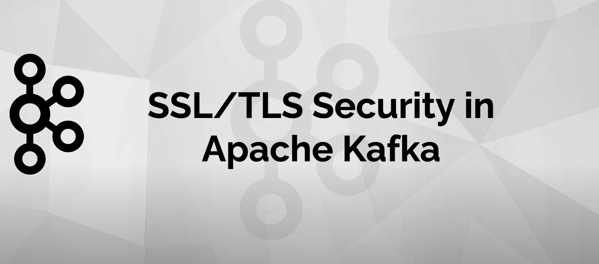
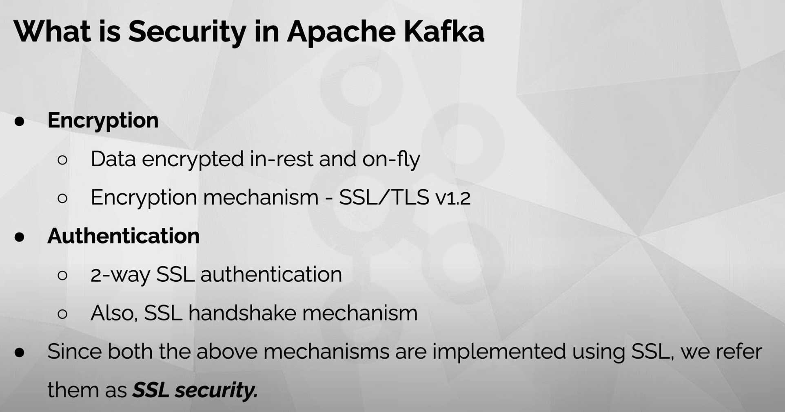
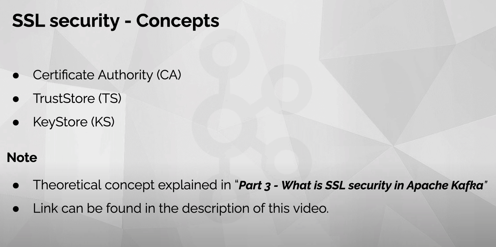
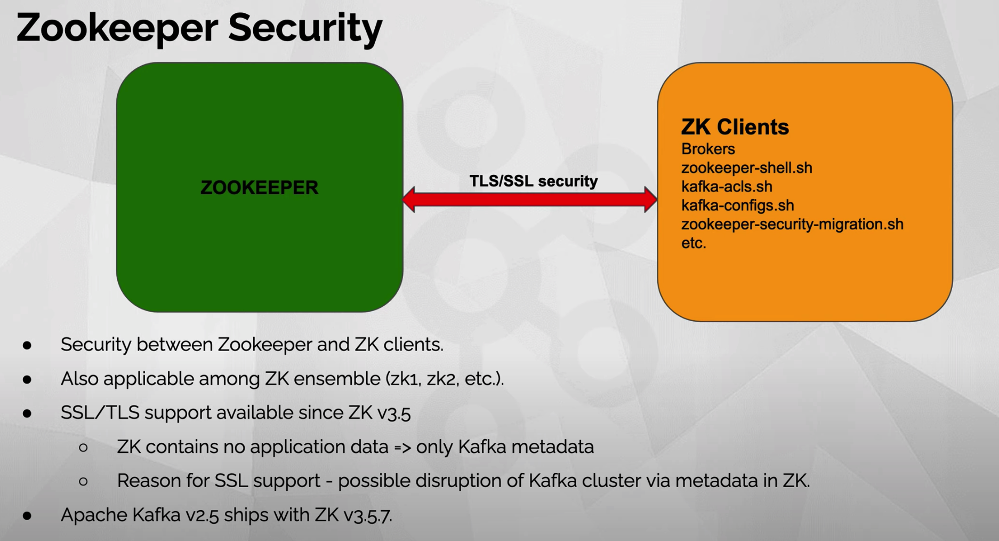
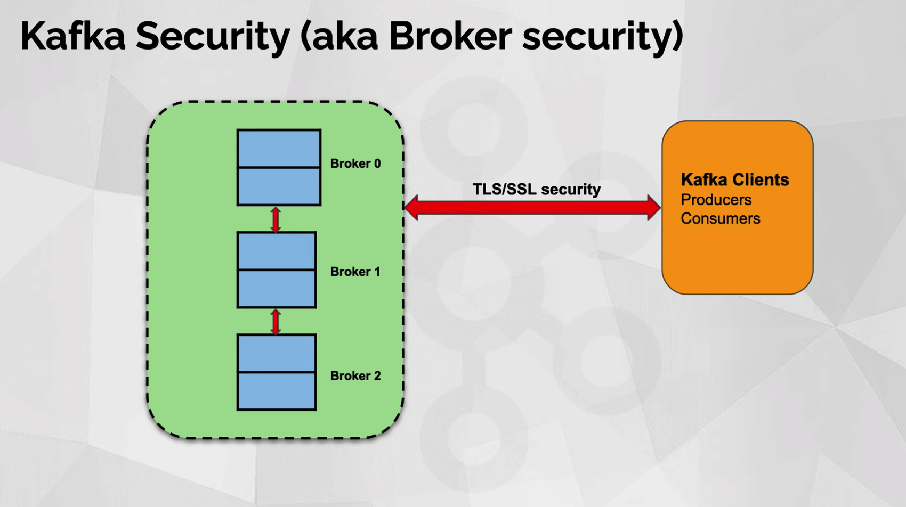
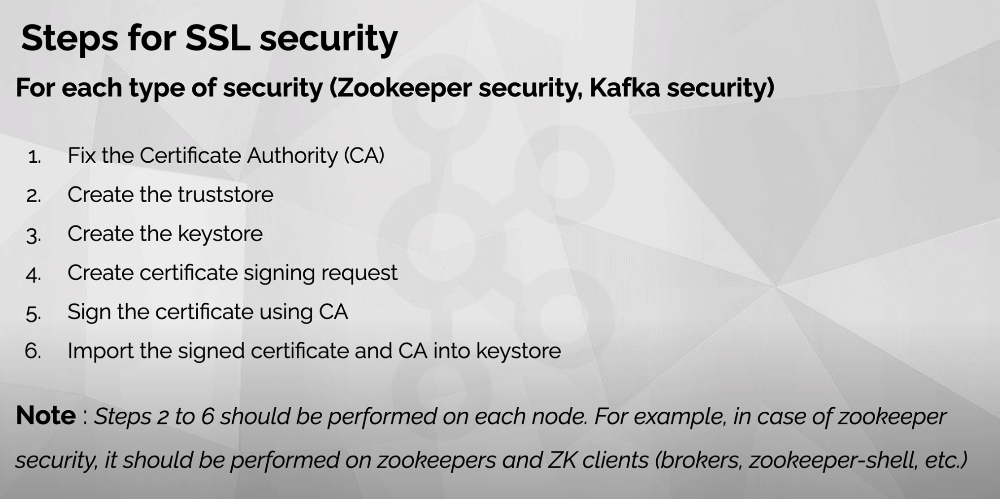

## [Apache Kafka Tamizh - Part 04 | Kafka SSL Configuration](https://www.youtube.com/watch?v=LaRBSqIPCtQ)














```bash
openssl req -new -x509 -keyout ca-key -out ca-cert -days 3650
keytool -keystore kafka.zookeeper.truststore.jks -alias ca-cert -import -file ca-cert
keytool -keystore kafka.zookeeper.keystore.jks -alias zookeeper -validity 3650 -genkey -keyalg RSA -ext SAN=dns:localhost
keytool -keystore kafka.zookeeper.keystore.jks -alias zookeeper -certreq -file ca-request-zookeeper
openssl x509 -req -CA ca-cert -CAkey ca-key -in ca-request-zookeeper -out ca-signed-zookeeper -days 3650 -CAcreateserial
keytool -keystore kafka.zookeeper.keystore.jks -alias ca-cert -import -file ca-cert
keytool -keystore kafka.zookeeper.keystore.jks -alias zookeeper -import -file ca-signed-zookeeper

vim zoo.cfg

keytool -keystore kafka.zookeeper-client.truststore.jks -alias ca-cert -import -file ca-cert
keytool -keystore kafka.zookeeper-client.keystore.jks -alias zookeeper-client -validity 3650 -genkey -keyalg RSA -ext SAN=dns:localhost
keytool -keystore kafka.zookeeper-client.keystore.jks -alias zookeeper-client -certreq -file ca-request-zookeeper-client
openssl x509 -req -CA ca-cert -CAkey ca-key -in ca-request-zookeeper-client -out ca-signed-zookeeper-client -days 3650 -CAcreateserial
keytool -keystore kafka.zookeeper-client.keystore.jks -alias ca-cert -import -file ca-cert
keytool -keystore kafka.zookeeper-client.keystore.jks -alias zookeeper-client -import -file ca-signed-zookeeper-client

sudo keytool -delete -alias kafka-zookeeper-ca-cert -keystore /Library/Java/JavaVirtualMachines/adoptopenjdk-8.jdk/Contents/Home/jre/lib/security/cacerts
sudo keytool -keystore /Library/Java/JavaVirtualMachines/adoptopenjdk-8.jdk/Contents/Home/jre/lib/security/cacerts -alias kafka-zookeeper-ca-cert -import -file ca-cert

#######
keytool -keystore kafka.broker0.truststore.jks -alias ca-cert -import -file ca-cert
keytool -keystore kafka.broker0.keystore.jks -alias broker0 -validity 3650 -genkey -keyalg RSA -ext SAN=dns:localhost
keytool -keystore kafka.broker0.keystore.jks -alias broker0 -certreq -file ca-request-broker0
openssl x509 -req -CA ca-cert -CAkey ca-key -in ca-request-broker0 -out ca-signed-broker0 -days 3650 -CAcreateserial
keytool -keystore kafka.broker0.keystore.jks -alias ca-cert -import -file ca-cert
keytool -keystore kafka.broker0.keystore.jks -alias broker0 -import -file ca-signed-broker0

# server-0.properties

# server-1.properties

# server-2.properties


keytool -keystore kafka.producer.truststore.jks -alias ca-cert -import -file ca-cert
keytool -keystore kafka.producer.keystore.jks -alias producer -validity 3650 -genkey -keyalg RSA -ext SAN=dns:localhost
keytool -keystore kafka.producer.keystore.jks -alias producer -certreq -file ca-request-producer
openssl x509 -req -CA ca-cert -CAkey ca-key -in ca-request-producer -out ca-signed-producer -days 3650 -CAcreateserial
keytool -keystore kafka.producer.keystore.jks -alias ca-cert -import -file ca-cert
keytool -keystore kafka.producer.keystore.jks -alias producer -import -file ca-signed-producer


keytool -keystore kafka.consumer.truststore.jks -alias ca-cert -import -file ca-cert
keytool -keystore kafka.consumer.keystore.jks -alias consumer -validity 3650 -genkey -keyalg RSA -ext SAN=dns:localhost
keytool -keystore kafka.consumer.keystore.jks -alias consumer -certreq -file ca-request-consumer
openssl x509 -req -CA ca-cert -CAkey ca-key -in ca-request-consumer -out ca-signed-consumer -days 3650 -CAcreateserial
keytool -keystore kafka.consumer.keystore.jks -alias ca-cert -import -file ca-cert
keytool -keystore kafka.consumer.keystore.jks -alias consumer -import -file ca-signed-consumer


/Library/Java/JavaVirtualMachines/adoptopenjdk-8.jdk/Contents/Home/bin/java -Xmx512M -server -XX:+UseG1GC -XX:MaxGCPauseMillis=20 -XX:InitiatingHeapOccupancyPercent=35 -XX:+ExplicitGCInvokesConcurrent -XX:MaxInlineLevel=15 -Djavax.net.debug=ssl,handshake -Djava.awt.headless=true -Dcom.sun.management.jmxremote -Dcom.sun.management.jmxremote.authenticate=false -Dcom.sun.management.jmxremote.ssl=false -Dkafka.logs.dir=/Users/huzhi/work/code/go_code/kafka_and_zookeeper/kafka/bin/../logs -Dlog4j.configuration=file:/Users/huzhi/work/code/go_code/kafka_and_zookeeper/kafka/bin/../config/tools-log4j.properties -cp /Users/huzhi/work/code/go_code/kafka_and_zookeeper/kafka/bin/../libs/activation-1.1.1.jar:/Users/huzhi/work/code/go_code/kafka_and_zookeeper/kafka/bin/../libs/aopalliance-repackaged-2.5.0.jar:/Users/huzhi/work/code/go_code/kafka_and_zookeeper/kafka/bin/../libs/argparse4j-0.7.0.jar:/Users/huzhi/work/code/go_code/kafka_and_zookeeper/kafka/bin/../libs/audience-annotations-0.5.0.jar:/Users/huzhi/work/code/go_code/kafka_and_zookeeper/kafka/bin/../libs/commons-cli-1.4.jar:/Users/huzhi/work/code/go_code/kafka_and_zookeeper/kafka/bin/../libs/commons-lang3-3.8.1.jar:/Users/huzhi/work/code/go_code/kafka_and_zookeeper/kafka/bin/../libs/connect-api-2.5.0.jar:/Users/huzhi/work/code/go_code/kafka_and_zookeeper/kafka/bin/../libs/connect-basic-auth-extension-2.5.0.jar:/Users/huzhi/work/code/go_code/kafka_and_zookeeper/kafka/bin/../libs/connect-file-2.5.0.jar:/Users/huzhi/work/code/go_code/kafka_and_zookeeper/kafka/bin/../libs/connect-json-2.5.0.jar:/Users/huzhi/work/code/go_code/kafka_and_zookeeper/kafka/bin/../libs/connect-mirror-2.5.0.jar:/Users/huzhi/work/code/go_code/kafka_and_zookeeper/kafka/bin/../libs/connect-mirror-client-2.5.0.jar:/Users/huzhi/work/code/go_code/kafka_and_zookeeper/kafka/bin/../libs/connect-runtime-2.5.0.jar:/Users/huzhi/work/code/go_code/kafka_and_zookeeper/kafka/bin/../libs/connect-transforms-2.5.0.jar:/Users/huzhi/work/code/go_code/kafka_and_zookeeper/kafka/bin/../libs/hk2-api-2.5.0.jar:/Users/huzhi/work/code/go_code/kafka_and_zookeeper/kafka/bin/../libs/hk2-locator-2.5.0.jar:/Users/huzhi/work/code/go_code/kafka_and_zookeeper/kafka/bin/../libs/hk2-utils-2.5.0.jar:/Users/huzhi/work/code/go_code/kafka_and_zookeeper/kafka/bin/../libs/jackson-annotations-2.10.2.jar:/Users/huzhi/work/code/go_code/kafka_and_zookeeper/kafka/bin/../libs/jackson-core-2.10.2.jar:/Users/huzhi/work/code/go_code/kafka_and_zookeeper/kafka/bin/../libs/jackson-databind-2.10.2.jar:/Users/huzhi/work/code/go_code/kafka_and_zookeeper/kafka/bin/../libs/jackson-dataformat-csv-2.10.2.jar:/Users/huzhi/work/code/go_code/kafka_and_zookeeper/kafka/bin/../libs/jackson-datatype-jdk8-2.10.2.jar:/Users/huzhi/work/code/go_code/kafka_and_zookeeper/kafka/bin/../libs/jackson-jaxrs-base-2.10.2.jar:/Users/huzhi/work/code/go_code/kafka_and_zookeeper/kafka/bin/../libs/jackson-jaxrs-json-provider-2.10.2.jar:/Users/huzhi/work/code/go_code/kafka_and_zookeeper/kafka/bin/../libs/jackson-module-jaxb-annotations-2.10.2.jar:/Users/huzhi/work/code/go_code/kafka_and_zookeeper/kafka/bin/../libs/jackson-module-paranamer-2.10.2.jar:/Users/huzhi/work/code/go_code/kafka_and_zookeeper/kafka/bin/../libs/jackson-module-scala_2.12-2.10.2.jar:/Users/huzhi/work/code/go_code/kafka_and_zookeeper/kafka/bin/../libs/jakarta.activation-api-1.2.1.jar:/Users/huzhi/work/code/go_code/kafka_and_zookeeper/kafka/bin/../libs/jakarta.annotation-api-1.3.4.jar:/Users/huzhi/work/code/go_code/kafka_and_zookeeper/kafka/bin/../libs/jakarta.inject-2.5.0.jar:/Users/huzhi/work/code/go_code/kafka_and_zookeeper/kafka/bin/../libs/jakarta.ws.rs-api-2.1.5.jar:/Users/huzhi/work/code/go_code/kafka_and_zookeeper/kafka/bin/../libs/jakarta.xml.bind-api-2.3.2.jar:/Users/huzhi/work/code/go_code/kafka_and_zookeeper/kafka/bin/../libs/javassist-3.22.0-CR2.jar:/Users/huzhi/work/code/go_code/kafka_and_zookeeper/kafka/bin/../libs/javassist-3.26.0-GA.jar:/Users/huzhi/work/code/go_code/kafka_and_zookeeper/kafka/bin/../libs/javax.servlet-api-3.1.0.jar:/Users/huzhi/work/code/go_code/kafka_and_zookeeper/kafka/bin/../libs/javax.ws.rs-api-2.1.1.jar:/Users/huzhi/work/code/go_code/kafka_and_zookeeper/kafka/bin/../libs/jaxb-api-2.3.0.jar:/Users/huzhi/work/code/go_code/kafka_and_zookeeper/kafka/bin/../libs/jersey-client-2.28.jar:/Users/huzhi/work/code/go_code/kafka_and_zookeeper/kafka/bin/../libs/jersey-common-2.28.jar:/Users/huzhi/work/code/go_code/kafka_and_zookeeper/kafka/bin/../libs/jersey-container-servlet-2.28.jar:/Users/huzhi/work/code/go_code/kafka_and_zookeeper/kafka/bin/../libs/jersey-container-servlet-core-2.28.jar:/Users/huzhi/work/code/go_code/kafka_and_zookeeper/kafka/bin/../libs/jersey-hk2-2.28.jar:/Users/huzhi/work/code/go_code/kafka_and_zookeeper/kafka/bin/../libs/jersey-media-jaxb-2.28.jar:/Users/huzhi/work/code/go_code/kafka_and_zookeeper/kafka/bin/../libs/jersey-server-2.28.jar:/Users/huzhi/work/code/go_code/kafka_and_zookeeper/kafka/bin/../libs/jetty-client-9.4.24.v20191120.jar:/Users/huzhi/work/code/go_code/kafka_and_zookeeper/kafka/bin/../libs/jetty-continuation-9.4.24.v20191120.jar:/Users/huzhi/work/code/go_code/kafka_and_zookeeper/kafka/bin/../libs/jetty-http-9.4.24.v20191120.jar:/Users/huzhi/work/code/go_code/kafka_and_zookeeper/kafka/bin/../libs/jetty-io-9.4.24.v20191120.jar:/Users/huzhi/work/code/go_code/kafka_and_zookeeper/kafka/bin/../libs/jetty-security-9.4.24.v20191120.jar:/Users/huzhi/work/code/go_code/kafka_and_zookeeper/kafka/bin/../libs/jetty-server-9.4.24.v20191120.jar:/Users/huzhi/work/code/go_code/kafka_and_zookeeper/kafka/bin/../libs/jetty-servlet-9.4.24.v20191120.jar:/Users/huzhi/work/code/go_code/kafka_and_zookeeper/kafka/bin/../libs/jetty-servlets-9.4.24.v20191120.jar:/Users/huzhi/work/code/go_code/kafka_and_zookeeper/kafka/bin/../libs/jetty-util-9.4.24.v20191120.jar:/Users/huzhi/work/code/go_code/kafka_and_zookeeper/kafka/bin/../libs/jopt-simple-5.0.4.jar:/Users/huzhi/work/code/go_code/kafka_and_zookeeper/kafka/bin/../libs/kafka-clients-2.5.0.jar:/Users/huzhi/work/code/go_code/kafka_and_zookeeper/kafka/bin/../libs/kafka-log4j-appender-2.5.0.jar:/Users/huzhi/work/code/go_code/kafka_and_zookeeper/kafka/bin/../libs/kafka-streams-2.5.0.jar:/Users/huzhi/work/code/go_code/kafka_and_zookeeper/kafka/bin/../libs/kafka-streams-examples-2.5.0.jar:/Users/huzhi/work/code/go_code/kafka_and_zookeeper/kafka/bin/../libs/kafka-streams-scala_2.12-2.5.0.jar:/Users/huzhi/work/code/go_code/kafka_and_zookeeper/kafka/bin/../libs/kafka-streams-test-utils-2.5.0.jar:/Users/huzhi/work/code/go_code/kafka_and_zookeeper/kafka/bin/../libs/kafka-tools-2.5.0.jar:/Users/huzhi/work/code/go_code/kafka_and_zookeeper/kafka/bin/../libs/kafka_2.12-2.5.0-sources.jar:/Users/huzhi/work/code/go_code/kafka_and_zookeeper/kafka/bin/../libs/kafka_2.12-2.5.0.jar:/Users/huzhi/work/code/go_code/kafka_and_zookeeper/kafka/bin/../libs/log4j-1.2.17.jar:/Users/huzhi/work/code/go_code/kafka_and_zookeeper/kafka/bin/../libs/lz4-java-1.7.1.jar:/Users/huzhi/work/code/go_code/kafka_and_zookeeper/kafka/bin/../libs/maven-artifact-3.6.3.jar:/Users/huzhi/work/code/go_code/kafka_and_zookeeper/kafka/bin/../libs/metrics-core-2.2.0.jar:/Users/huzhi/work/code/go_code/kafka_and_zookeeper/kafka/bin/../libs/netty-buffer-4.1.45.Final.jar:/Users/huzhi/work/code/go_code/kafka_and_zookeeper/kafka/bin/../libs/netty-codec-4.1.45.Final.jar:/Users/huzhi/work/code/go_code/kafka_and_zookeeper/kafka/bin/../libs/netty-common-4.1.45.Final.jar:/Users/huzhi/work/code/go_code/kafka_and_zookeeper/kafka/bin/../libs/netty-handler-4.1.45.Final.jar:/Users/huzhi/work/code/go_code/kafka_and_zookeeper/kafka/bin/../libs/netty-resolver-4.1.45.Final.jar:/Users/huzhi/work/code/go_code/kafka_and_zookeeper/kafka/bin/../libs/netty-transport-4.1.45.Final.jar:/Users/huzhi/work/code/go_code/kafka_and_zookeeper/kafka/bin/../libs/netty-transport-native-epoll-4.1.45.Final.jar:/Users/huzhi/work/code/go_code/kafka_and_zookeeper/kafka/bin/../libs/netty-transport-native-unix-common-4.1.45.Final.jar:/Users/huzhi/work/code/go_code/kafka_and_zookeeper/kafka/bin/../libs/osgi-resource-locator-1.0.1.jar:/Users/huzhi/work/code/go_code/kafka_and_zookeeper/kafka/bin/../libs/paranamer-2.8.jar:/Users/huzhi/work/code/go_code/kafka_and_zookeeper/kafka/bin/../libs/plexus-utils-3.2.1.jar:/Users/huzhi/work/code/go_code/kafka_and_zookeeper/kafka/bin/../libs/reflections-0.9.12.jar:/Users/huzhi/work/code/go_code/kafka_and_zookeeper/kafka/bin/../libs/rocksdbjni-5.18.3.jar:/Users/huzhi/work/code/go_code/kafka_and_zookeeper/kafka/bin/../libs/scala-collection-compat_2.12-2.1.3.jar:/Users/huzhi/work/code/go_code/kafka_and_zookeeper/kafka/bin/../libs/scala-java8-compat_2.12-0.9.0.jar:/Users/huzhi/work/code/go_code/kafka_and_zookeeper/kafka/bin/../libs/scala-library-2.12.10.jar:/Users/huzhi/work/code/go_code/kafka_and_zookeeper/kafka/bin/../libs/scala-logging_2.12-3.9.2.jar:/Users/huzhi/work/code/go_code/kafka_and_zookeeper/kafka/bin/../libs/scala-reflect-2.12.10.jar:/Users/huzhi/work/code/go_code/kafka_and_zookeeper/kafka/bin/../libs/slf4j-api-1.7.30.jar:/Users/huzhi/work/code/go_code/kafka_and_zookeeper/kafka/bin/../libs/slf4j-log4j12-1.7.30.jar:/Users/huzhi/work/code/go_code/kafka_and_zookeeper/kafka/bin/../libs/snappy-java-1.1.7.3.jar:/Users/huzhi/work/code/go_code/kafka_and_zookeeper/kafka/bin/../libs/validation-api-2.0.1.Final.jar:/Users/huzhi/work/code/go_code/kafka_and_zookeeper/kafka/bin/../libs/zookeeper-3.5.7.jar:/Users/huzhi/work/code/go_code/kafka_and_zookeeper/kafka/bin/../libs/zookeeper-jute-3.5.7.jar:/Users/huzhi/work/code/go_code/kafka_and_zookeeper/kafka/bin/../libs/zstd-jni-1.4.4-7.jar kafka.tools.ConsoleProducer --bootstrap-server localhost:9093,localhost:9095,localhost:9097 --topic ssl-topic --producer.config ./kafka/config/producer.properties


keytool -keystore server.keystore.jks -alias localhost -validity 3650 -genkey -keyalg RSA -storetype pkcs12
keytool -keystore server.keystore.jks -alias localhost -validity 3650 -genkey -keyalg RSA -storetype pkcs12 -ext SAN=DNS:{FQDN}

keytool -keystore client.keystore.jks -alias localhost -validity 3650 -genkey -keyalg RSA -storetype pkcs12


openssl req -new -x509 -keyout ca-key -out ca-cert -days 3650

keytool -keystore client.truststore.jks -alias CARoot -import -file ca-cert
keytool -keystore server.truststore.jks -alias CARoot -import -file ca-cert


keytool -keystore server.keystore.jks -alias localhost -certreq -file cert-file
openssl x509 -req -CA ca-cert -CAkey ca-key -in cert-file -out cert-signed -days 3650 -CAcreateserial
keytool -keystore server.keystore.jks -alias CARoot -import -file ca-cert
keytool -keystore server.keystore.jks -alias localhost -import -file cert-signed


keytool -keystore client.keystore.jks -alias localhost -certreq -file cert-client
openssl x509 -req -CA ca-cert -CAkey ca-key -in cert-client -out cert-client-signed -days 3650 -CAcreateserial
keytool -keystore client.keystore.jks -alias CARoot -import -file ca-cert
keytool -keystore client.keystore.jks -alias localhost -import -file cert-client-signed

-Djavax.net.debug=ssl,handshake 


/Library/Java/JavaVirtualMachines/adoptopenjdk-8.jdk/Contents/Home/bin/java -Xmx1G -Xms1G -server -XX:+UseG1GC -XX:MaxGCPauseMillis=20 -XX:InitiatingHeapOccupancyPercent=35 -XX:+ExplicitGCInvokesConcurrent -XX:MaxInlineLevel=15 -Djava.awt.headless=true -Xloggc:/Users/huzhi/work/code/go_code/kafka_and_zookeeper/kafka/bin/../logs/kafkaServer-gc.log -verbose:gc -XX:+PrintGCDetails -XX:+PrintGCDateStamps -XX:+PrintGCTimeStamps -XX:+UseGCLogFileRotation -XX:NumberOfGCLogFiles=10 -XX:GCLogFileSize=100M -Dcom.sun.management.jmxremote -Dcom.sun.management.jmxremote.authenticate=false -Dcom.sun.management.jmxremote.ssl=false -Dkafka.logs.dir=/Users/huzhi/work/code/go_code/kafka_and_zookeeper/kafka/bin/../logs -Dlog4j.configuration=file:./kafka/bin/../config/log4j.properties -cp /Users/huzhi/work/code/go_code/kafka_and_zookeeper/kafka/bin/../libs/activation-1.1.1.jar:/Users/huzhi/work/code/go_code/kafka_and_zookeeper/kafka/bin/../libs/aopalliance-repackaged-2.5.0.jar:/Users/huzhi/work/code/go_code/kafka_and_zookeeper/kafka/bin/../libs/argparse4j-0.7.0.jar:/Users/huzhi/work/code/go_code/kafka_and_zookeeper/kafka/bin/../libs/audience-annotations-0.5.0.jar:/Users/huzhi/work/code/go_code/kafka_and_zookeeper/kafka/bin/../libs/commons-cli-1.4.jar:/Users/huzhi/work/code/go_code/kafka_and_zookeeper/kafka/bin/../libs/commons-lang3-3.8.1.jar:/Users/huzhi/work/code/go_code/kafka_and_zookeeper/kafka/bin/../libs/connect-api-2.5.0.jar:/Users/huzhi/work/code/go_code/kafka_and_zookeeper/kafka/bin/../libs/connect-basic-auth-extension-2.5.0.jar:/Users/huzhi/work/code/go_code/kafka_and_zookeeper/kafka/bin/../libs/connect-file-2.5.0.jar:/Users/huzhi/work/code/go_code/kafka_and_zookeeper/kafka/bin/../libs/connect-json-2.5.0.jar:/Users/huzhi/work/code/go_code/kafka_and_zookeeper/kafka/bin/../libs/connect-mirror-2.5.0.jar:/Users/huzhi/work/code/go_code/kafka_and_zookeeper/kafka/bin/../libs/connect-mirror-client-2.5.0.jar:/Users/huzhi/work/code/go_code/kafka_and_zookeeper/kafka/bin/../libs/connect-runtime-2.5.0.jar:/Users/huzhi/work/code/go_code/kafka_and_zookeeper/kafka/bin/../libs/connect-transforms-2.5.0.jar:/Users/huzhi/work/code/go_code/kafka_and_zookeeper/kafka/bin/../libs/hk2-api-2.5.0.jar:/Users/huzhi/work/code/go_code/kafka_and_zookeeper/kafka/bin/../libs/hk2-locator-2.5.0.jar:/Users/huzhi/work/code/go_code/kafka_and_zookeeper/kafka/bin/../libs/hk2-utils-2.5.0.jar:/Users/huzhi/work/code/go_code/kafka_and_zookeeper/kafka/bin/../libs/jackson-annotations-2.10.2.jar:/Users/huzhi/work/code/go_code/kafka_and_zookeeper/kafka/bin/../libs/jackson-core-2.10.2.jar:/Users/huzhi/work/code/go_code/kafka_and_zookeeper/kafka/bin/../libs/jackson-databind-2.10.2.jar:/Users/huzhi/work/code/go_code/kafka_and_zookeeper/kafka/bin/../libs/jackson-dataformat-csv-2.10.2.jar:/Users/huzhi/work/code/go_code/kafka_and_zookeeper/kafka/bin/../libs/jackson-datatype-jdk8-2.10.2.jar:/Users/huzhi/work/code/go_code/kafka_and_zookeeper/kafka/bin/../libs/jackson-jaxrs-base-2.10.2.jar:/Users/huzhi/work/code/go_code/kafka_and_zookeeper/kafka/bin/../libs/jackson-jaxrs-json-provider-2.10.2.jar:/Users/huzhi/work/code/go_code/kafka_and_zookeeper/kafka/bin/../libs/jackson-module-jaxb-annotations-2.10.2.jar:/Users/huzhi/work/code/go_code/kafka_and_zookeeper/kafka/bin/../libs/jackson-module-paranamer-2.10.2.jar:/Users/huzhi/work/code/go_code/kafka_and_zookeeper/kafka/bin/../libs/jackson-module-scala_2.12-2.10.2.jar:/Users/huzhi/work/code/go_code/kafka_and_zookeeper/kafka/bin/../libs/jakarta.activation-api-1.2.1.jar:/Users/huzhi/work/code/go_code/kafka_and_zookeeper/kafka/bin/../libs/jakarta.annotation-api-1.3.4.jar:/Users/huzhi/work/code/go_code/kafka_and_zookeeper/kafka/bin/../libs/jakarta.inject-2.5.0.jar:/Users/huzhi/work/code/go_code/kafka_and_zookeeper/kafka/bin/../libs/jakarta.ws.rs-api-2.1.5.jar:/Users/huzhi/work/code/go_code/kafka_and_zookeeper/kafka/bin/../libs/jakarta.xml.bind-api-2.3.2.jar:/Users/huzhi/work/code/go_code/kafka_and_zookeeper/kafka/bin/../libs/javassist-3.22.0-CR2.jar:/Users/huzhi/work/code/go_code/kafka_and_zookeeper/kafka/bin/../libs/javassist-3.26.0-GA.jar:/Users/huzhi/work/code/go_code/kafka_and_zookeeper/kafka/bin/../libs/javax.servlet-api-3.1.0.jar:/Users/huzhi/work/code/go_code/kafka_and_zookeeper/kafka/bin/../libs/javax.ws.rs-api-2.1.1.jar:/Users/huzhi/work/code/go_code/kafka_and_zookeeper/kafka/bin/../libs/jaxb-api-2.3.0.jar:/Users/huzhi/work/code/go_code/kafka_and_zookeeper/kafka/bin/../libs/jersey-client-2.28.jar:/Users/huzhi/work/code/go_code/kafka_and_zookeeper/kafka/bin/../libs/jersey-common-2.28.jar:/Users/huzhi/work/code/go_code/kafka_and_zookeeper/kafka/bin/../libs/jersey-container-servlet-2.28.jar:/Users/huzhi/work/code/go_code/kafka_and_zookeeper/kafka/bin/../libs/jersey-container-servlet-core-2.28.jar:/Users/huzhi/work/code/go_code/kafka_and_zookeeper/kafka/bin/../libs/jersey-hk2-2.28.jar:/Users/huzhi/work/code/go_code/kafka_and_zookeeper/kafka/bin/../libs/jersey-media-jaxb-2.28.jar:/Users/huzhi/work/code/go_code/kafka_and_zookeeper/kafka/bin/../libs/jersey-server-2.28.jar:/Users/huzhi/work/code/go_code/kafka_and_zookeeper/kafka/bin/../libs/jetty-client-9.4.24.v20191120.jar:/Users/huzhi/work/code/go_code/kafka_and_zookeeper/kafka/bin/../libs/jetty-continuation-9.4.24.v20191120.jar:/Users/huzhi/work/code/go_code/kafka_and_zookeeper/kafka/bin/../libs/jetty-http-9.4.24.v20191120.jar:/Users/huzhi/work/code/go_code/kafka_and_zookeeper/kafka/bin/../libs/jetty-io-9.4.24.v20191120.jar:/Users/huzhi/work/code/go_code/kafka_and_zookeeper/kafka/bin/../libs/jetty-security-9.4.24.v20191120.jar:/Users/huzhi/work/code/go_code/kafka_and_zookeeper/kafka/bin/../libs/jetty-server-9.4.24.v20191120.jar:/Users/huzhi/work/code/go_code/kafka_and_zookeeper/kafka/bin/../libs/jetty-servlet-9.4.24.v20191120.jar:/Users/huzhi/work/code/go_code/kafka_and_zookeeper/kafka/bin/../libs/jetty-servlets-9.4.24.v20191120.jar:/Users/huzhi/work/code/go_code/kafka_and_zookeeper/kafka/bin/../libs/jetty-util-9.4.24.v20191120.jar:/Users/huzhi/work/code/go_code/kafka_and_zookeeper/kafka/bin/../libs/jopt-simple-5.0.4.jar:/Users/huzhi/work/code/go_code/kafka_and_zookeeper/kafka/bin/../libs/kafka-clients-2.5.0.jar:/Users/huzhi/work/code/go_code/kafka_and_zookeeper/kafka/bin/../libs/kafka-log4j-appender-2.5.0.jar:/Users/huzhi/work/code/go_code/kafka_and_zookeeper/kafka/bin/../libs/kafka-streams-2.5.0.jar:/Users/huzhi/work/code/go_code/kafka_and_zookeeper/kafka/bin/../libs/kafka-streams-examples-2.5.0.jar:/Users/huzhi/work/code/go_code/kafka_and_zookeeper/kafka/bin/../libs/kafka-streams-scala_2.12-2.5.0.jar:/Users/huzhi/work/code/go_code/kafka_and_zookeeper/kafka/bin/../libs/kafka-streams-test-utils-2.5.0.jar:/Users/huzhi/work/code/go_code/kafka_and_zookeeper/kafka/bin/../libs/kafka-tools-2.5.0.jar:/Users/huzhi/work/code/go_code/kafka_and_zookeeper/kafka/bin/../libs/kafka_2.12-2.5.0-sources.jar:/Users/huzhi/work/code/go_code/kafka_and_zookeeper/kafka/bin/../libs/kafka_2.12-2.5.0.jar:/Users/huzhi/work/code/go_code/kafka_and_zookeeper/kafka/bin/../libs/log4j-1.2.17.jar:/Users/huzhi/work/code/go_code/kafka_and_zookeeper/kafka/bin/../libs/lz4-java-1.7.1.jar:/Users/huzhi/work/code/go_code/kafka_and_zookeeper/kafka/bin/../libs/maven-artifact-3.6.3.jar:/Users/huzhi/work/code/go_code/kafka_and_zookeeper/kafka/bin/../libs/metrics-core-2.2.0.jar:/Users/huzhi/work/code/go_code/kafka_and_zookeeper/kafka/bin/../libs/netty-buffer-4.1.45.Final.jar:/Users/huzhi/work/code/go_code/kafka_and_zookeeper/kafka/bin/../libs/netty-codec-4.1.45.Final.jar:/Users/huzhi/work/code/go_code/kafka_and_zookeeper/kafka/bin/../libs/netty-common-4.1.45.Final.jar:/Users/huzhi/work/code/go_code/kafka_and_zookeeper/kafka/bin/../libs/netty-handler-4.1.45.Final.jar:/Users/huzhi/work/code/go_code/kafka_and_zookeeper/kafka/bin/../libs/netty-resolver-4.1.45.Final.jar:/Users/huzhi/work/code/go_code/kafka_and_zookeeper/kafka/bin/../libs/netty-transport-4.1.45.Final.jar:/Users/huzhi/work/code/go_code/kafka_and_zookeeper/kafka/bin/../libs/netty-transport-native-epoll-4.1.45.Final.jar:/Users/huzhi/work/code/go_code/kafka_and_zookeeper/kafka/bin/../libs/netty-transport-native-unix-common-4.1.45.Final.jar:/Users/huzhi/work/code/go_code/kafka_and_zookeeper/kafka/bin/../libs/osgi-resource-locator-1.0.1.jar:/Users/huzhi/work/code/go_code/kafka_and_zookeeper/kafka/bin/../libs/paranamer-2.8.jar:/Users/huzhi/work/code/go_code/kafka_and_zookeeper/kafka/bin/../libs/plexus-utils-3.2.1.jar:/Users/huzhi/work/code/go_code/kafka_and_zookeeper/kafka/bin/../libs/reflections-0.9.12.jar:/Users/huzhi/work/code/go_code/kafka_and_zookeeper/kafka/bin/../libs/rocksdbjni-5.18.3.jar:/Users/huzhi/work/code/go_code/kafka_and_zookeeper/kafka/bin/../libs/scala-collection-compat_2.12-2.1.3.jar:/Users/huzhi/work/code/go_code/kafka_and_zookeeper/kafka/bin/../libs/scala-java8-compat_2.12-0.9.0.jar:/Users/huzhi/work/code/go_code/kafka_and_zookeeper/kafka/bin/../libs/scala-library-2.12.10.jar:/Users/huzhi/work/code/go_code/kafka_and_zookeeper/kafka/bin/../libs/scala-logging_2.12-3.9.2.jar:/Users/huzhi/work/code/go_code/kafka_and_zookeeper/kafka/bin/../libs/scala-reflect-2.12.10.jar:/Users/huzhi/work/code/go_code/kafka_and_zookeeper/kafka/bin/../libs/slf4j-api-1.7.30.jar:/Users/huzhi/work/code/go_code/kafka_and_zookeeper/kafka/bin/../libs/slf4j-log4j12-1.7.30.jar:/Users/huzhi/work/code/go_code/kafka_and_zookeeper/kafka/bin/../libs/snappy-java-1.1.7.3.jar:/Users/huzhi/work/code/go_code/kafka_and_zookeeper/kafka/bin/../libs/validation-api-2.0.1.Final.jar:/Users/huzhi/work/code/go_code/kafka_and_zookeeper/kafka/bin/../libs/zookeeper-3.5.7.jar:/Users/huzhi/work/code/go_code/kafka_and_zookeeper/kafka/bin/../libs/zookeeper-jute-3.5.7.jar:/Users/huzhi/work/code/go_code/kafka_and_zookeeper/kafka/bin/../libs/zstd-jni-1.4.4-7.jar -Dzookeeper.ssl.client.enable=true -Dzookeeper.clientCnxnSocket=org.apache.zookeeper.ClientCnxnSocketNetty -Dzookeeper.ssl.keyStore.location=/Users/huzhi/work/code/go_code/kafka_and_zookeeper/ssl/kafka.zookeeper-client.keystore.jks -Dzookeeper.ssl.keyStore.password=huzhi567233 -Dzookeeper.ssl.trustStore.location=/Users/huzhi/work/code/go_code/kafka_and_zookeeper/ssl/kafka.zookeeper-client.truststore.jks -Dzookeeper.ssl.trustStore.password=huzhi567233 kafka.Kafka ./kafka/config/server-0.properties


[2021-01-23 22:02:01,048] INFO Registered kafka:type=kafka.Log4jController MBean (kafka.utils.Log4jControllerRegistration$)
[2021-01-23 22:02:01,425] INFO Setting -D jdk.tls.rejectClientInitiatedRenegotiation=true to disable client-initiated TLS renegotiation (org.apache.zookeeper.common.X509Util)
[2021-01-23 22:02:01,455] INFO Registered signal handlers for TERM, INT, HUP (org.apache.kafka.common.utils.LoggingSignalHandler)
[2021-01-23 22:02:01,460] INFO starting (kafka.server.KafkaServer)
[2021-01-23 22:02:01,461] INFO Connecting to zookeeper on 127.0.0.1:2281 (kafka.server.KafkaServer)
[2021-01-23 22:02:01,475] INFO [ZooKeeperClient Kafka server] Initializing a new session to 127.0.0.1:2281. (kafka.zookeeper.ZooKeeperClient)
[2021-01-23 22:02:01,481] INFO Client environment:zookeeper.version=3.5.7-f0fdd52973d373ffd9c86b81d99842dc2c7f660e, built on 02/10/2020 11:30 GMT (org.apache.zookeeper.ZooKeeper)
[2021-01-23 22:02:01,481] INFO Client environment:host.name=localhost (org.apache.zookeeper.ZooKeeper)
[2021-01-23 22:02:01,481] INFO Client environment:java.version=1.8.0_275 (org.apache.zookeeper.ZooKeeper)
[2021-01-23 22:02:01,481] INFO Client environment:java.vendor=AdoptOpenJDK (org.apache.zookeeper.ZooKeeper)
[2021-01-23 22:02:01,481] INFO Client environment:java.home=/Library/Java/JavaVirtualMachines/adoptopenjdk-8.jdk/Contents/Home/jre (org.apache.zookeeper.ZooKeeper)
[2021-01-23 22:02:01,481] INFO Client environment:java.class.path=
/Users/huzhi/work/code/go_code/kafka_and_zookeeper/kafka/bin/../libs/activation-1.1.1.jar:
/Users/huzhi/work/code/go_code/kafka_and_zookeeper/kafka/bin/../libs/aopalliance-repackaged-2.5.0.jar:
/Users/huzhi/work/code/go_code/kafka_and_zookeeper/kafka/bin/../libs/argparse4j-0.7.0.jar:
/Users/huzhi/work/code/go_code/kafka_and_zookeeper/kafka/bin/../libs/audience-annotations-0.5.0.jar:
/Users/huzhi/work/code/go_code/kafka_and_zookeeper/kafka/bin/../libs/commons-cli-1.4.jar:
/Users/huzhi/work/code/go_code/kafka_and_zookeeper/kafka/bin/../libs/commons-lang3-3.8.1.jar:
/Users/huzhi/work/code/go_code/kafka_and_zookeeper/kafka/bin/../libs/connect-api-2.5.0.jar:
/Users/huzhi/work/code/go_code/kafka_and_zookeeper/kafka/bin/../libs/connect-basic-auth-extension-2.5.0.jar:
/Users/huzhi/work/code/go_code/kafka_and_zookeeper/kafka/bin/../libs/connect-file-2.5.0.jar:
/Users/huzhi/work/code/go_code/kafka_and_zookeeper/kafka/bin/../libs/connect-json-2.5.0.jar:
/Users/huzhi/work/code/go_code/kafka_and_zookeeper/kafka/bin/../libs/connect-mirror-2.5.0.jar:
/Users/huzhi/work/code/go_code/kafka_and_zookeeper/kafka/bin/../libs/connect-mirror-client-2.5.0.jar:
/Users/huzhi/work/code/go_code/kafka_and_zookeeper/kafka/bin/../libs/connect-runtime-2.5.0.jar:
/Users/huzhi/work/code/go_code/kafka_and_zookeeper/kafka/bin/../libs/connect-transforms-2.5.0.jar:
/Users/huzhi/work/code/go_code/kafka_and_zookeeper/kafka/bin/../libs/hk2-api-2.5.0.jar:
/Users/huzhi/work/code/go_code/kafka_and_zookeeper/kafka/bin/../libs/hk2-locator-2.5.0.jar:
/Users/huzhi/work/code/go_code/kafka_and_zookeeper/kafka/bin/../libs/hk2-utils-2.5.0.jar:
/Users/huzhi/work/code/go_code/kafka_and_zookeeper/kafka/bin/../libs/jackson-annotations-2.10.2.jar:
/Users/huzhi/work/code/go_code/kafka_and_zookeeper/kafka/bin/../libs/jackson-core-2.10.2.jar:
/Users/huzhi/work/code/go_code/kafka_and_zookeeper/kafka/bin/../libs/jackson-databind-2.10.2.jar:
/Users/huzhi/work/code/go_code/kafka_and_zookeeper/kafka/bin/../libs/jackson-dataformat-csv-2.10.2.jar:
/Users/huzhi/work/code/go_code/kafka_and_zookeeper/kafka/bin/../libs/jackson-datatype-jdk8-2.10.2.jar:
/Users/huzhi/work/code/go_code/kafka_and_zookeeper/kafka/bin/../libs/jackson-jaxrs-base-2.10.2.jar:
/Users/huzhi/work/code/go_code/kafka_and_zookeeper/kafka/bin/../libs/jackson-jaxrs-json-provider-2.10.2.jar:
/Users/huzhi/work/code/go_code/kafka_and_zookeeper/kafka/bin/../libs/jackson-module-jaxb-annotations-2.10.2.jar:
/Users/huzhi/work/code/go_code/kafka_and_zookeeper/kafka/bin/../libs/jackson-module-paranamer-2.10.2.jar:
/Users/huzhi/work/code/go_code/kafka_and_zookeeper/kafka/bin/../libs/jackson-module-scala_2.12-2.10.2.jar:
/Users/huzhi/work/code/go_code/kafka_and_zookeeper/kafka/bin/../libs/jakarta.activation-api-1.2.1.jar:
/Users/huzhi/work/code/go_code/kafka_and_zookeeper/kafka/bin/../libs/jakarta.annotation-api-1.3.4.jar:
/Users/huzhi/work/code/go_code/kafka_and_zookeeper/kafka/bin/../libs/jakarta.inject-2.5.0.jar:
/Users/huzhi/work/code/go_code/kafka_and_zookeeper/kafka/bin/../libs/jakarta.ws.rs-api-2.1.5.jar:
/Users/huzhi/work/code/go_code/kafka_and_zookeeper/kafka/bin/../libs/jakarta.xml.bind-api-2.3.2.jar:
/Users/huzhi/work/code/go_code/kafka_and_zookeeper/kafka/bin/../libs/javassist-3.22.0-CR2.jar:
/Users/huzhi/work/code/go_code/kafka_and_zookeeper/kafka/bin/../libs/javassist-3.26.0-GA.jar:
/Users/huzhi/work/code/go_code/kafka_and_zookeeper/kafka/bin/../libs/javax.servlet-api-3.1.0.jar:
/Users/huzhi/work/code/go_code/kafka_and_zookeeper/kafka/bin/../libs/javax.ws.rs-api-2.1.1.jar:
/Users/huzhi/work/code/go_code/kafka_and_zookeeper/kafka/bin/../libs/jaxb-api-2.3.0.jar:
/Users/huzhi/work/code/go_code/kafka_and_zookeeper/kafka/bin/../libs/jersey-client-2.28.jar:
/Users/huzhi/work/code/go_code/kafka_and_zookeeper/kafka/bin/../libs/jersey-common-2.28.jar:
/Users/huzhi/work/code/go_code/kafka_and_zookeeper/kafka/bin/../libs/jersey-container-servlet-2.28.jar:
/Users/huzhi/work/code/go_code/kafka_and_zookeeper/kafka/bin/../libs/jersey-container-servlet-core-2.28.jar:
/Users/huzhi/work/code/go_code/kafka_and_zookeeper/kafka/bin/../libs/jersey-hk2-2.28.jar:
/Users/huzhi/work/code/go_code/kafka_and_zookeeper/kafka/bin/../libs/jersey-media-jaxb-2.28.jar:
/Users/huzhi/work/code/go_code/kafka_and_zookeeper/kafka/bin/../libs/jersey-server-2.28.jar:
/Users/huzhi/work/code/go_code/kafka_and_zookeeper/kafka/bin/../libs/jetty-client-9.4.24.v20191120.jar:
/Users/huzhi/work/code/go_code/kafka_and_zookeeper/kafka/bin/../libs/jetty-continuation-9.4.24.v20191120.jar:
/Users/huzhi/work/code/go_code/kafka_and_zookeeper/kafka/bin/../libs/jetty-http-9.4.24.v20191120.jar:
/Users/huzhi/work/code/go_code/kafka_and_zookeeper/kafka/bin/../libs/jetty-io-9.4.24.v20191120.jar:
/Users/huzhi/work/code/go_code/kafka_and_zookeeper/kafka/bin/../libs/jetty-security-9.4.24.v20191120.jar:
/Users/huzhi/work/code/go_code/kafka_and_zookeeper/kafka/bin/../libs/jetty-server-9.4.24.v20191120.jar:
/Users/huzhi/work/code/go_code/kafka_and_zookeeper/kafka/bin/../libs/jetty-servlet-9.4.24.v20191120.jar:
/Users/huzhi/work/code/go_code/kafka_and_zookeeper/kafka/bin/../libs/jetty-servlets-9.4.24.v20191120.jar:
/Users/huzhi/work/code/go_code/kafka_and_zookeeper/kafka/bin/../libs/jetty-util-9.4.24.v20191120.jar:
/Users/huzhi/work/code/go_code/kafka_and_zookeeper/kafka/bin/../libs/jopt-simple-5.0.4.jar:
/Users/huzhi/work/code/go_code/kafka_and_zookeeper/kafka/bin/../libs/kafka-clients-2.5.0.jar:
/Users/huzhi/work/code/go_code/kafka_and_zookeeper/kafka/bin/../libs/kafka-log4j-appender-2.5.0.jar:
/Users/huzhi/work/code/go_code/kafka_and_zookeeper/kafka/bin/../libs/kafka-streams-2.5.0.jar:
/Users/huzhi/work/code/go_code/kafka_and_zookeeper/kafka/bin/../libs/kafka-streams-examples-2.5.0.jar:
/Users/huzhi/work/code/go_code/kafka_and_zookeeper/kafka/bin/../libs/kafka-streams-scala_2.12-2.5.0.jar:
/Users/huzhi/work/code/go_code/kafka_and_zookeeper/kafka/bin/../libs/kafka-streams-test-utils-2.5.0.jar:
/Users/huzhi/work/code/go_code/kafka_and_zookeeper/kafka/bin/../libs/kafka-tools-2.5.0.jar:
/Users/huzhi/work/code/go_code/kafka_and_zookeeper/kafka/bin/../libs/kafka_2.12-2.5.0-sources.jar:
/Users/huzhi/work/code/go_code/kafka_and_zookeeper/kafka/bin/../libs/kafka_2.12-2.5.0.jar:
/Users/huzhi/work/code/go_code/kafka_and_zookeeper/kafka/bin/../libs/log4j-1.2.17.jar:
/Users/huzhi/work/code/go_code/kafka_and_zookeeper/kafka/bin/../libs/lz4-java-1.7.1.jar:
/Users/huzhi/work/code/go_code/kafka_and_zookeeper/kafka/bin/../libs/maven-artifact-3.6.3.jar:
/Users/huzhi/work/code/go_code/kafka_and_zookeeper/kafka/bin/../libs/metrics-core-2.2.0.jar:
/Users/huzhi/work/code/go_code/kafka_and_zookeeper/kafka/bin/../libs/netty-buffer-4.1.45.Final.jar:
/Users/huzhi/work/code/go_code/kafka_and_zookeeper/kafka/bin/../libs/netty-codec-4.1.45.Final.jar:
/Users/huzhi/work/code/go_code/kafka_and_zookeeper/kafka/bin/../libs/netty-common-4.1.45.Final.jar:
/Users/huzhi/work/code/go_code/kafka_and_zookeeper/kafka/bin/../libs/netty-handler-4.1.45.Final.jar:
/Users/huzhi/work/code/go_code/kafka_and_zookeeper/kafka/bin/../libs/netty-resolver-4.1.45.Final.jar:
/Users/huzhi/work/code/go_code/kafka_and_zookeeper/kafka/bin/../libs/netty-transport-4.1.45.Final.jar:
/Users/huzhi/work/code/go_code/kafka_and_zookeeper/kafka/bin/../libs/netty-transport-native-epoll-4.1.45.Final.jar:
/Users/huzhi/work/code/go_code/kafka_and_zookeeper/kafka/bin/../libs/netty-transport-native-unix-common-4.1.45.Final.jar:
/Users/huzhi/work/code/go_code/kafka_and_zookeeper/kafka/bin/../libs/osgi-resource-locator-1.0.1.jar:
/Users/huzhi/work/code/go_code/kafka_and_zookeeper/kafka/bin/../libs/paranamer-2.8.jar:
/Users/huzhi/work/code/go_code/kafka_and_zookeeper/kafka/bin/../libs/plexus-utils-3.2.1.jar:
/Users/huzhi/work/code/go_code/kafka_and_zookeeper/kafka/bin/../libs/reflections-0.9.12.jar:
/Users/huzhi/work/code/go_code/kafka_and_zookeeper/kafka/bin/../libs/rocksdbjni-5.18.3.jar:
/Users/huzhi/work/code/go_code/kafka_and_zookeeper/kafka/bin/../libs/scala-collection-compat_2.12-2.1.3.jar:
/Users/huzhi/work/code/go_code/kafka_and_zookeeper/kafka/bin/../libs/scala-java8-compat_2.12-0.9.0.jar:
/Users/huzhi/work/code/go_code/kafka_and_zookeeper/kafka/bin/../libs/scala-library-2.12.10.jar:
/Users/huzhi/work/code/go_code/kafka_and_zookeeper/kafka/bin/../libs/scala-logging_2.12-3.9.2.jar:
/Users/huzhi/work/code/go_code/kafka_and_zookeeper/kafka/bin/../libs/scala-reflect-2.12.10.jar:
/Users/huzhi/work/code/go_code/kafka_and_zookeeper/kafka/bin/../libs/slf4j-api-1.7.30.jar:
/Users/huzhi/work/code/go_code/kafka_and_zookeeper/kafka/bin/../libs/slf4j-log4j12-1.7.30.jar:
/Users/huzhi/work/code/go_code/kafka_and_zookeeper/kafka/bin/../libs/snappy-java-1.1.7.3.jar:
/Users/huzhi/work/code/go_code/kafka_and_zookeeper/kafka/bin/../libs/validation-api-2.0.1.Final.jar:
/Users/huzhi/work/code/go_code/kafka_and_zookeeper/kafka/bin/../libs/zookeeper-3.5.7.jar:
/Users/huzhi/work/code/go_code/kafka_and_zookeeper/kafka/bin/../libs/zookeeper-jute-3.5.7.jar:
/Users/huzhi/work/code/go_code/kafka_and_zookeeper/kafka/bin/../libs/zstd-jni-1.4.4-7.jar (org.apache.zookeeper.ZooKeeper)
[2021-01-23 22:02:01,482] INFO Client environment:java.library.path=/Users/huzhi/Library/Java/Extensions:/Library/Java/Extensions:/Network/Library/Java/Extensions:/System/Library/Java/Extensions:/usr/lib/java:. (org.apache.zookeeper.ZooKeeper)
[2021-01-23 22:02:01,482] INFO Client environment:java.io.tmpdir=/var/folders/4f/gy92m6hd2xj3c6_yz0dht6880000gn/T/ (org.apache.zookeeper.ZooKeeper)
[2021-01-23 22:02:01,482] INFO Client environment:java.compiler=<NA> (org.apache.zookeeper.ZooKeeper)
[2021-01-23 22:02:01,482] INFO Client environment:os.name=Mac OS X (org.apache.zookeeper.ZooKeeper)
[2021-01-23 22:02:01,482] INFO Client environment:os.arch=x86_64 (org.apache.zookeeper.ZooKeeper)
[2021-01-23 22:02:01,482] INFO Client environment:os.version=10.16 (org.apache.zookeeper.ZooKeeper)
[2021-01-23 22:02:01,482] INFO Client environment:user.name=huzhi (org.apache.zookeeper.ZooKeeper)
[2021-01-23 22:02:01,482] INFO Client environment:user.home=/Users/huzhi (org.apache.zookeeper.ZooKeeper)
[2021-01-23 22:02:01,482] INFO Client environment:user.dir=/Users/huzhi/work/code/go_code/kafka_and_zookeeper (org.apache.zookeeper.ZooKeeper)
[2021-01-23 22:02:01,482] INFO Client environment:os.memory.free=976MB (org.apache.zookeeper.ZooKeeper)
[2021-01-23 22:02:01,482] INFO Client environment:os.memory.max=1024MB (org.apache.zookeeper.ZooKeeper)
[2021-01-23 22:02:01,482] INFO Client environment:os.memory.total=1024MB (org.apache.zookeeper.ZooKeeper)
[2021-01-23 22:02:01,484] INFO Initiating client connection, connectString=127.0.0.1:2281 sessionTimeout=18000 watcher=kafka.zookeeper.ZooKeeperClient$ZooKeeperClientWatcher$@479d31f3 (org.apache.zookeeper.ZooKeeper)
[2021-01-23 22:02:01,543] INFO jute.maxbuffer value is 4194304 Bytes (org.apache.zookeeper.ClientCnxnSocket)
[2021-01-23 22:02:01,548] INFO zookeeper.request.timeout value is 0. feature enabled= (org.apache.zookeeper.ClientCnxn)
[2021-01-23 22:02:01,550] INFO [ZooKeeperClient Kafka server] Waiting until connected. (kafka.zookeeper.ZooKeeperClient)
[2021-01-23 22:02:01,552] INFO Opening socket connection to server localhost/127.0.0.1:2281. Will not attempt to authenticate using SASL (unknown error) (org.apache.zookeeper.ClientCnxn)
[2021-01-23 22:02:01,614] WARN zookeeper.ssl.keyStore.location not specified (org.apache.zookeeper.common.X509Util)
[2021-01-23 22:02:01,614] WARN zookeeper.ssl.trustStore.location not specified (org.apache.zookeeper.common.X509Util)
javax.net.ssl|FINE|1B|nioEventLoopGroup-2-1|2021-01-23 22:02:01.676 CST|Logger.java:765|jdk.tls.keyLimits:  entry = AES/GCM/NoPadding KeyUpdate 2^37. AES/GCM/NOPADDING:KEYUPDATE = 137438953472
[2021-01-23 22:02:01,743] INFO SSL handler added for channel: [id: 0xb65a8e1f] (org.apache.zookeeper.ClientCnxnSocketNetty)
[2021-01-23 22:02:01,750] INFO Socket connection established, initiating session, client: /127.0.0.1:49569, server: localhost/127.0.0.1:2281 (org.apache.zookeeper.ClientCnxn)
[2021-01-23 22:02:01,751] INFO channel is connected: [id: 0xb65a8e1f, L:/127.0.0.1:49569 - R:localhost/127.0.0.1:2281] (org.apache.zookeeper.ClientCnxnSocketNetty)
javax.net.ssl|WARNING|1B|nioEventLoopGroup-2-1|2021-01-23 22:02:01.764 CST|Logger.java:765|Unable to indicate server name
javax.net.ssl|FINE|1B|nioEventLoopGroup-2-1|2021-01-23 22:02:01.764 CST|Logger.java:765|Ignore, context unavailable extension: server_name
javax.net.ssl|FINE|1B|nioEventLoopGroup-2-1|2021-01-23 22:02:01.764 CST|Logger.java:765|Ignore, context unavailable extension: status_request
javax.net.ssl|WARNING|1B|nioEventLoopGroup-2-1|2021-01-23 22:02:01.767 CST|Logger.java:765|Signature algorithm, ed25519, is not supported by the underlying providers
javax.net.ssl|WARNING|1B|nioEventLoopGroup-2-1|2021-01-23 22:02:01.767 CST|Logger.java:765|Signature algorithm, ed448, is not supported by the underlying providers
javax.net.ssl|INFO|1B|nioEventLoopGroup-2-1|2021-01-23 22:02:01.770 CST|Logger.java:765|No available application protocols
javax.net.ssl|FINE|1B|nioEventLoopGroup-2-1|2021-01-23 22:02:01.770 CST|Logger.java:765|Ignore, context unavailable extension: application_layer_protocol_negotiation
javax.net.ssl|FINE|1B|nioEventLoopGroup-2-1|2021-01-23 22:02:01.770 CST|Logger.java:765|Ignore, context unavailable extension: status_request_v2
javax.net.ssl|FINE|1B|nioEventLoopGroup-2-1|2021-01-23 22:02:01.771 CST|Logger.java:765|Ignore, context unavailable extension: renegotiation_info
javax.net.ssl|FINE|1B|nioEventLoopGroup-2-1|2021-01-23 22:02:01.772 CST|Logger.java:765|Produced ClientHello handshake message (
"ClientHello": {
  "client version"      : "TLSv1.2",
  "random"              : "8D BB 78 35 3B 81 E4 DA F9 7C DA C2 80 0E 4B 76 85 B2 93 9C 2D 13 91 CB 1B 83 85 AC 6B 0A 7A 8A",
  "session id"          : "",
  "cipher suites"       : "[TLS_ECDHE_ECDSA_WITH_AES_256_GCM_SHA384(0xC02C), TLS_ECDHE_ECDSA_WITH_AES_128_GCM_SHA256(0xC02B), TLS_ECDHE_RSA_WITH_AES_256_GCM_SHA384(0xC030), TLS_RSA_WITH_AES_256_GCM_SHA384(0x009D), TLS_ECDH_ECDSA_WITH_AES_256_GCM_SHA384(0xC02E), TLS_ECDH_RSA_WITH_AES_256_GCM_SHA384(0xC032), TLS_DHE_RSA_WITH_AES_256_GCM_SHA384(0x009F), TLS_DHE_DSS_WITH_AES_256_GCM_SHA384(0x00A3), TLS_ECDHE_RSA_WITH_AES_128_GCM_SHA256(0xC02F), TLS_RSA_WITH_AES_128_GCM_SHA256(0x009C), TLS_ECDH_ECDSA_WITH_AES_128_GCM_SHA256(0xC02D), TLS_ECDH_RSA_WITH_AES_128_GCM_SHA256(0xC031), TLS_DHE_RSA_WITH_AES_128_GCM_SHA256(0x009E), TLS_DHE_DSS_WITH_AES_128_GCM_SHA256(0x00A2), TLS_ECDHE_ECDSA_WITH_AES_256_CBC_SHA384(0xC024), TLS_ECDHE_RSA_WITH_AES_256_CBC_SHA384(0xC028), TLS_RSA_WITH_AES_256_CBC_SHA256(0x003D), TLS_ECDH_ECDSA_WITH_AES_256_CBC_SHA384(0xC026), TLS_ECDH_RSA_WITH_AES_256_CBC_SHA384(0xC02A), TLS_DHE_RSA_WITH_AES_256_CBC_SHA256(0x006B), TLS_DHE_DSS_WITH_AES_256_CBC_SHA256(0x006A), TLS_ECDHE_ECDSA_WITH_AES_256_CBC_SHA(0xC00A), TLS_ECDHE_RSA_WITH_AES_256_CBC_SHA(0xC014), TLS_RSA_WITH_AES_256_CBC_SHA(0x0035), TLS_ECDH_ECDSA_WITH_AES_256_CBC_SHA(0xC005), TLS_ECDH_RSA_WITH_AES_256_CBC_SHA(0xC00F), TLS_DHE_RSA_WITH_AES_256_CBC_SHA(0x0039), TLS_DHE_DSS_WITH_AES_256_CBC_SHA(0x0038), TLS_ECDHE_ECDSA_WITH_AES_128_CBC_SHA256(0xC023), TLS_ECDHE_RSA_WITH_AES_128_CBC_SHA256(0xC027), TLS_RSA_WITH_AES_128_CBC_SHA256(0x003C), TLS_ECDH_ECDSA_WITH_AES_128_CBC_SHA256(0xC025), TLS_ECDH_RSA_WITH_AES_128_CBC_SHA256(0xC029), TLS_DHE_RSA_WITH_AES_128_CBC_SHA256(0x0067), TLS_DHE_DSS_WITH_AES_128_CBC_SHA256(0x0040), TLS_ECDHE_ECDSA_WITH_AES_128_CBC_SHA(0xC009), TLS_ECDHE_RSA_WITH_AES_128_CBC_SHA(0xC013), TLS_RSA_WITH_AES_128_CBC_SHA(0x002F), TLS_ECDH_ECDSA_WITH_AES_128_CBC_SHA(0xC004), TLS_ECDH_RSA_WITH_AES_128_CBC_SHA(0xC00E), TLS_DHE_RSA_WITH_AES_128_CBC_SHA(0x0033), TLS_DHE_DSS_WITH_AES_128_CBC_SHA(0x0032), TLS_EMPTY_RENEGOTIATION_INFO_SCSV(0x00FF)]",
  "compression methods" : "00",
  "extensions"          : [
    "supported_groups (10)": {
      "versions": [secp256r1, secp384r1, secp521r1, ffdhe2048, ffdhe3072, ffdhe4096, ffdhe6144, ffdhe8192]
    },
    "ec_point_formats (11)": {
      "formats": [uncompressed]
    },
    "signature_algorithms (13)": {
      "signature schemes": [ecdsa_secp256r1_sha256, ecdsa_secp384r1_sha384, ecdsa_secp521r1_sha512, rsa_pss_rsae_sha256, rsa_pss_rsae_sha384, rsa_pss_rsae_sha512, rsa_pss_pss_sha256, rsa_pss_pss_sha384, rsa_pss_pss_sha512, rsa_pkcs1_sha256, rsa_pkcs1_sha384, rsa_pkcs1_sha512, dsa_sha256, ecdsa_sha224, rsa_sha224, dsa_sha224, ecdsa_sha1, rsa_pkcs1_sha1, dsa_sha1]
    },
    "signature_algorithms_cert (50)": {
      "signature schemes": [ecdsa_secp256r1_sha256, ecdsa_secp384r1_sha384, ecdsa_secp521r1_sha512, rsa_pss_rsae_sha256, rsa_pss_rsae_sha384, rsa_pss_rsae_sha512, rsa_pss_pss_sha256, rsa_pss_pss_sha384, rsa_pss_pss_sha512, rsa_pkcs1_sha256, rsa_pkcs1_sha384, rsa_pkcs1_sha512, dsa_sha256, ecdsa_sha224, rsa_sha224, dsa_sha224, ecdsa_sha1, rsa_pkcs1_sha1, dsa_sha1]
    },
    "extended_master_secret (23)": {
      <empty>
    },
    "supported_versions (43)": {
      "versions": [TLSv1.2, TLSv1.1, TLSv1]
    }
  ]
}
)
javax.net.ssl|FINE|1B|nioEventLoopGroup-2-1|2021-01-23 22:02:01.796 CST|Logger.java:765|Consuming ServerHello handshake message (
"ServerHello": {
  "server version"      : "TLSv1.2",
  "random"              : "AB E1 15 89 99 73 1A 98 BD 53 AE 53 C0 63 0D D1 65 A8 D5 D4 1F E2 DA 6F 4A 36 40 E7 DC 33 A9 E1",
  "session id"          : "11 86 61 11 E4 06 B0 0F 6F D3 AA D0 3C 0C F0 A7 BA E1 5D 72 C9 E8 21 26 10 AA 16 AD 57 12 42 F6",
  "cipher suite"        : "TLS_ECDHE_RSA_WITH_AES_256_GCM_SHA384(0xC030)",
  "compression methods" : "00",
  "extensions"          : [
    "extended_master_secret (23)": {
      <empty>
    },
    "renegotiation_info (65,281)": {
      "renegotiated connection": [<no renegotiated connection>]
    }
  ]
}
)
javax.net.ssl|FINE|1B|nioEventLoopGroup-2-1|2021-01-23 22:02:01.796 CST|Logger.java:765|Ignore unavailable extension: supported_versions
javax.net.ssl|FINE|1B|nioEventLoopGroup-2-1|2021-01-23 22:02:01.796 CST|Logger.java:765|Negotiated protocol version: TLSv1.2
javax.net.ssl|FINE|1B|nioEventLoopGroup-2-1|2021-01-23 22:02:01.797 CST|Logger.java:765|Consumed extension: renegotiation_info
javax.net.ssl|FINE|1B|nioEventLoopGroup-2-1|2021-01-23 22:02:01.797 CST|Logger.java:765|Ignore unavailable extension: server_name
javax.net.ssl|FINE|1B|nioEventLoopGroup-2-1|2021-01-23 22:02:01.797 CST|Logger.java:765|Ignore unavailable extension: max_fragment_length
javax.net.ssl|FINE|1B|nioEventLoopGroup-2-1|2021-01-23 22:02:01.797 CST|Logger.java:765|Ignore unavailable extension: status_request
javax.net.ssl|FINE|1B|nioEventLoopGroup-2-1|2021-01-23 22:02:01.797 CST|Logger.java:765|Ignore unavailable extension: ec_point_formats
javax.net.ssl|FINE|1B|nioEventLoopGroup-2-1|2021-01-23 22:02:01.797 CST|Logger.java:765|Ignore unavailable extension: status_request_v2
javax.net.ssl|FINE|1B|nioEventLoopGroup-2-1|2021-01-23 22:02:01.798 CST|Logger.java:765|Consumed extension: extended_master_secret
javax.net.ssl|FINE|1B|nioEventLoopGroup-2-1|2021-01-23 22:02:01.798 CST|Logger.java:765|Consumed extension: renegotiation_info
javax.net.ssl|FINE|1B|nioEventLoopGroup-2-1|2021-01-23 22:02:01.798 CST|Logger.java:765|Ignore unavailable extension: server_name
javax.net.ssl|FINE|1B|nioEventLoopGroup-2-1|2021-01-23 22:02:01.798 CST|Logger.java:765|Ignore unavailable extension: max_fragment_length
javax.net.ssl|FINE|1B|nioEventLoopGroup-2-1|2021-01-23 22:02:01.798 CST|Logger.java:765|Ignore unavailable extension: status_request
javax.net.ssl|FINE|1B|nioEventLoopGroup-2-1|2021-01-23 22:02:01.798 CST|Logger.java:765|Ignore unavailable extension: ec_point_formats
javax.net.ssl|FINE|1B|nioEventLoopGroup-2-1|2021-01-23 22:02:01.798 CST|Logger.java:765|Ignore unavailable extension: application_layer_protocol_negotiation
javax.net.ssl|FINE|1B|nioEventLoopGroup-2-1|2021-01-23 22:02:01.798 CST|Logger.java:765|Ignore unavailable extension: status_request_v2
javax.net.ssl|WARNING|1B|nioEventLoopGroup-2-1|2021-01-23 22:02:01.798 CST|Logger.java:765|Ignore impact of unsupported extension: extended_master_secret
javax.net.ssl|WARNING|1B|nioEventLoopGroup-2-1|2021-01-23 22:02:01.799 CST|Logger.java:765|Ignore impact of unsupported extension: renegotiation_info
javax.net.ssl|FINE|1B|nioEventLoopGroup-2-1|2021-01-23 22:02:01.801 CST|Logger.java:765|Consuming server Certificate handshake message (
"Certificates": [
  "certificate" : {
    "version"            : "v1",
    "serial number"      : "00 CA E2 10 31 59 C6 F3 45",
    "signature algorithm": "SHA1withRSA",
    "issuer"             : "EMAILADDRESS=hzhilamp@163.com, CN=ca-cert, OU=alauda, O=alauda, L=beijing, ST=beijing, C=CN",
    "not before"         : "2021-01-23 17:44:44.000 CST",
    "not  after"         : "2031-01-21 17:44:44.000 CST",
    "subject"            : "CN=localhost, OU=alauda, O=alauda, L=beijing, ST=beijing, C=CN",
    "subject public key" : "RSA"},
  "certificate" : {
    "version"            : "v1",
    "serial number"      : "00 A4 EF FB 5F D7 70 5D EC",
    "signature algorithm": "SHA256withRSA",
    "issuer"             : "EMAILADDRESS=hzhilamp@163.com, CN=ca-cert, OU=alauda, O=alauda, L=beijing, ST=beijing, C=CN",
    "not before"         : "2021-01-23 17:39:50.000 CST",
    "not  after"         : "2031-01-21 17:39:50.000 CST",
    "subject"            : "EMAILADDRESS=hzhilamp@163.com, CN=ca-cert, OU=alauda, O=alauda, L=beijing, ST=beijing, C=CN",
    "subject public key" : "RSA"}
]
)
javax.net.ssl|FINE|1B|nioEventLoopGroup-2-1|2021-01-23 22:02:01.831 CST|Logger.java:765|Consuming ECDH ServerKeyExchange handshake message (
"ECDH ServerKeyExchange": {
  "parameters": {
    "named group": "secp256r1"
    "ecdh public": {
      0000: 04 B6 28 A4 3F C0 90 55   D7 AD C0 8F 23 6F A6 6A  ..(.?..U....#o.j
      0010: AA 61 59 E9 4A 4C 11 78   2B 83 5E 27 B3 F8 34 6A  .aY.JL.x+.^'..4j
      0020: C4 61 A6 72 C7 D9 DD 36   FD 0F D5 B7 C2 5A 01 65  .a.r...6.....Z.e
      0030: 1E 7E F9 17 1B D6 D6 C6   F6 3E 0E D5 8A A2 42 A3  .........>....B.
      0040: 01                                                 .
    },
  },
  "digital signature":  {
    "signature algorithm": "rsa_pss_rsae_sha256"
    "signature": {
      0000: 55 AB 9D 30 32 CF 35 05   13 60 1C 7E 65 15 03 AE  U..02.5..`..e...
      0010: 7F 1E 7F BE 55 AD F6 6A   76 AE F5 7D C2 B8 93 85  ....U..jv.......
      0020: 4E 40 2E 10 57 09 07 A2   AC E7 BE 9F 18 6B 2A DC  N@..W........k*.
      0030: F3 B2 83 38 D1 00 7F D0   C3 22 24 4A F0 40 97 D7  ...8....."$J.@..
      0040: 2B 16 B3 D1 46 23 48 59   A6 C6 27 D7 EE DD B5 6B  +...F#HY..'....k
      0050: 25 76 F4 0D 8C 15 7C 60   52 DC B1 4B 98 90 F6 67  %v.....`R..K...g
      0060: 6E D0 FC F8 7E 58 A4 59   F5 79 09 4E 07 AC 83 E6  n....X.Y.y.N....
      0070: 5B 3F F3 92 FC 08 11 1F   7D FD BF 30 9B 3C 9D 8B  [?.........0.<..
      0080: 90 07 91 93 70 0A BF 53   6E 33 D4 21 91 34 C9 1E  ....p..Sn3.!.4..
      0090: 21 6A 11 99 56 AA 43 E6   84 03 92 A3 2F 01 C5 E7  !j..V.C...../...
      00A0: EE 39 C0 58 D1 95 23 0B   69 B6 E2 35 B9 84 AB 00  .9.X..#.i..5....
      00B0: 11 17 19 7E DC BD 5F 45   33 2A 09 50 0A 73 BF 9A  ......_E3*.P.s..
      00C0: DF D0 53 FD C6 7F 79 7A   FC 86 C4 EE 1B AF 6B CC  ..S...yz......k.
      00D0: F3 5E 42 0E ED 9F FF 55   F3 0F 2F 07 C5 42 C4 F7  .^B....U../..B..
      00E0: 4D 00 80 BE 44 D7 88 70   D6 4B 24 45 69 E2 F5 DC  M...D..p.K$Ei...
      00F0: 4F D0 68 5E 65 96 04 27   74 B6 3D A5 94 8F 05 F7  O.h^e..'t.=.....
    },
  }
}
)
javax.net.ssl|FINE|1B|nioEventLoopGroup-2-1|2021-01-23 22:02:01.832 CST|Logger.java:765|Consuming CertificateRequest handshake message (
"CertificateRequest": {
  "certificate types": [ecdsa_sign, rsa_sign, dss_sign]
  "supported signature algorithms": [ecdsa_secp256r1_sha256, ecdsa_secp384r1_sha384, ecdsa_secp521r1_sha512, rsa_pss_rsae_sha256, rsa_pss_rsae_sha384, rsa_pss_rsae_sha512, rsa_pss_pss_sha256, rsa_pss_pss_sha384, rsa_pss_pss_sha512, rsa_pkcs1_sha256, rsa_pkcs1_sha384, rsa_pkcs1_sha512, dsa_sha256, ecdsa_sha224, rsa_sha224, dsa_sha224, ecdsa_sha1, rsa_pkcs1_sha1, dsa_sha1]
  "certificate authorities": [EMAILADDRESS=hzhilamp@163.com, CN=ca-cert, OU=alauda, O=alauda, L=beijing, ST=beijing, C=CN]
}
)
javax.net.ssl|ALL|1B|nioEventLoopGroup-2-1|2021-01-23 22:02:01.833 CST|Logger.java:765|No X.509 cert selected for EC
javax.net.ssl|WARNING|1B|nioEventLoopGroup-2-1|2021-01-23 22:02:01.833 CST|Logger.java:765|Unavailable authentication scheme: ecdsa_secp256r1_sha256
javax.net.ssl|ALL|1B|nioEventLoopGroup-2-1|2021-01-23 22:02:01.833 CST|Logger.java:765|No X.509 cert selected for EC
javax.net.ssl|WARNING|1B|nioEventLoopGroup-2-1|2021-01-23 22:02:01.833 CST|Logger.java:765|Unavailable authentication scheme: ecdsa_secp384r1_sha384
javax.net.ssl|ALL|1B|nioEventLoopGroup-2-1|2021-01-23 22:02:01.833 CST|Logger.java:765|No X.509 cert selected for EC
javax.net.ssl|WARNING|1B|nioEventLoopGroup-2-1|2021-01-23 22:02:01.834 CST|Logger.java:765|Unavailable authentication scheme: ecdsa_secp521r1_sha512
javax.net.ssl|ALL|1B|nioEventLoopGroup-2-1|2021-01-23 22:02:01.834 CST|Logger.java:765|No X.509 cert selected for RSA
javax.net.ssl|WARNING|1B|nioEventLoopGroup-2-1|2021-01-23 22:02:01.834 CST|Logger.java:765|Unavailable authentication scheme: rsa_pss_rsae_sha256
javax.net.ssl|ALL|1B|nioEventLoopGroup-2-1|2021-01-23 22:02:01.834 CST|Logger.java:765|No X.509 cert selected for RSA
javax.net.ssl|WARNING|1B|nioEventLoopGroup-2-1|2021-01-23 22:02:01.834 CST|Logger.java:765|Unavailable authentication scheme: rsa_pss_rsae_sha384
javax.net.ssl|ALL|1B|nioEventLoopGroup-2-1|2021-01-23 22:02:01.834 CST|Logger.java:765|No X.509 cert selected for RSA
javax.net.ssl|WARNING|1B|nioEventLoopGroup-2-1|2021-01-23 22:02:01.834 CST|Logger.java:765|Unavailable authentication scheme: rsa_pss_rsae_sha512
javax.net.ssl|ALL|1B|nioEventLoopGroup-2-1|2021-01-23 22:02:01.834 CST|Logger.java:765|No X.509 cert selected for RSASSA-PSS
javax.net.ssl|WARNING|1B|nioEventLoopGroup-2-1|2021-01-23 22:02:01.834 CST|Logger.java:765|Unavailable authentication scheme: rsa_pss_pss_sha256
javax.net.ssl|ALL|1B|nioEventLoopGroup-2-1|2021-01-23 22:02:01.834 CST|Logger.java:765|No X.509 cert selected for RSASSA-PSS
javax.net.ssl|WARNING|1B|nioEventLoopGroup-2-1|2021-01-23 22:02:01.835 CST|Logger.java:765|Unavailable authentication scheme: rsa_pss_pss_sha384
javax.net.ssl|ALL|1B|nioEventLoopGroup-2-1|2021-01-23 22:02:01.835 CST|Logger.java:765|No X.509 cert selected for RSASSA-PSS
javax.net.ssl|WARNING|1B|nioEventLoopGroup-2-1|2021-01-23 22:02:01.835 CST|Logger.java:765|Unavailable authentication scheme: rsa_pss_pss_sha512
javax.net.ssl|ALL|1B|nioEventLoopGroup-2-1|2021-01-23 22:02:01.835 CST|Logger.java:765|No X.509 cert selected for RSA
javax.net.ssl|WARNING|1B|nioEventLoopGroup-2-1|2021-01-23 22:02:01.835 CST|Logger.java:765|Unavailable authentication scheme: rsa_pkcs1_sha256
javax.net.ssl|ALL|1B|nioEventLoopGroup-2-1|2021-01-23 22:02:01.835 CST|Logger.java:765|No X.509 cert selected for RSA
javax.net.ssl|WARNING|1B|nioEventLoopGroup-2-1|2021-01-23 22:02:01.835 CST|Logger.java:765|Unavailable authentication scheme: rsa_pkcs1_sha384
javax.net.ssl|ALL|1B|nioEventLoopGroup-2-1|2021-01-23 22:02:01.835 CST|Logger.java:765|No X.509 cert selected for RSA
javax.net.ssl|WARNING|1B|nioEventLoopGroup-2-1|2021-01-23 22:02:01.835 CST|Logger.java:765|Unavailable authentication scheme: rsa_pkcs1_sha512
javax.net.ssl|ALL|1B|nioEventLoopGroup-2-1|2021-01-23 22:02:01.836 CST|Logger.java:765|No X.509 cert selected for DSA
javax.net.ssl|WARNING|1B|nioEventLoopGroup-2-1|2021-01-23 22:02:01.836 CST|Logger.java:765|Unavailable authentication scheme: dsa_sha256
javax.net.ssl|ALL|1B|nioEventLoopGroup-2-1|2021-01-23 22:02:01.836 CST|Logger.java:765|No X.509 cert selected for EC
javax.net.ssl|WARNING|1B|nioEventLoopGroup-2-1|2021-01-23 22:02:01.836 CST|Logger.java:765|Unavailable authentication scheme: ecdsa_sha224
javax.net.ssl|ALL|1B|nioEventLoopGroup-2-1|2021-01-23 22:02:01.836 CST|Logger.java:765|No X.509 cert selected for RSA
javax.net.ssl|WARNING|1B|nioEventLoopGroup-2-1|2021-01-23 22:02:01.836 CST|Logger.java:765|Unavailable authentication scheme: rsa_sha224
javax.net.ssl|ALL|1B|nioEventLoopGroup-2-1|2021-01-23 22:02:01.836 CST|Logger.java:765|No X.509 cert selected for DSA
javax.net.ssl|WARNING|1B|nioEventLoopGroup-2-1|2021-01-23 22:02:01.837 CST|Logger.java:765|Unavailable authentication scheme: dsa_sha224
javax.net.ssl|ALL|1B|nioEventLoopGroup-2-1|2021-01-23 22:02:01.837 CST|Logger.java:765|No X.509 cert selected for EC
javax.net.ssl|WARNING|1B|nioEventLoopGroup-2-1|2021-01-23 22:02:01.837 CST|Logger.java:765|Unavailable authentication scheme: ecdsa_sha1
javax.net.ssl|ALL|1B|nioEventLoopGroup-2-1|2021-01-23 22:02:01.837 CST|Logger.java:765|No X.509 cert selected for RSA
javax.net.ssl|WARNING|1B|nioEventLoopGroup-2-1|2021-01-23 22:02:01.837 CST|Logger.java:765|Unavailable authentication scheme: rsa_pkcs1_sha1
javax.net.ssl|ALL|1B|nioEventLoopGroup-2-1|2021-01-23 22:02:01.837 CST|Logger.java:765|No X.509 cert selected for DSA
javax.net.ssl|WARNING|1B|nioEventLoopGroup-2-1|2021-01-23 22:02:01.837 CST|Logger.java:765|Unavailable authentication scheme: dsa_sha1
javax.net.ssl|WARNING|1B|nioEventLoopGroup-2-1|2021-01-23 22:02:01.837 CST|Logger.java:765|No available authentication scheme
javax.net.ssl|FINE|1B|nioEventLoopGroup-2-1|2021-01-23 22:02:01.838 CST|Logger.java:765|Consuming ServerHelloDone handshake message (
<empty>
)
javax.net.ssl|FINE|1B|nioEventLoopGroup-2-1|2021-01-23 22:02:01.838 CST|Logger.java:765|No X.509 certificate for client authentication, use empty Certificate message instead
javax.net.ssl|FINE|1B|nioEventLoopGroup-2-1|2021-01-23 22:02:01.838 CST|Logger.java:765|Produced client Certificate handshake message (
"Certificates": <empty list>
)
javax.net.ssl|FINE|1B|nioEventLoopGroup-2-1|2021-01-23 22:02:01.849 CST|Logger.java:765|Produced ECDHE ClientKeyExchange handshake message (
"ECDH ClientKeyExchange": {
  "ecdh public": {
    0000: 04 AB EF A7 72 09 20 1F   E2 ED F3 E3 03 88 55 F7  ....r. .......U.
    0010: 75 3C FC A1 C7 65 6D 77   7A 61 16 B7 E3 0E 6E B1  u<...emwza....n.
    0020: D8 1D 6C A1 F6 2F 1E 92   6F 4E A3 C9 B6 D3 CD 64  ..l../..oN.....d
    0030: C2 79 12 B8 51 E7 62 A1   A6 5B 54 53 DB D3 2E C5  .y..Q.b..[TS....
    0040: AE                                                 .
  },
}
)
javax.net.ssl|FINE|1B|nioEventLoopGroup-2-1|2021-01-23 22:02:01.861 CST|Logger.java:765|Produced ChangeCipherSpec message
javax.net.ssl|FINE|1B|nioEventLoopGroup-2-1|2021-01-23 22:02:01.862 CST|Logger.java:765|Produced client Finished handshake message (
"Finished": {
  "verify data": {
    0000: 0D FA BA E7 FF 4E 9F E6   4A B4 6D 6C
  }'}
)
javax.net.ssl|FINE|1B|nioEventLoopGroup-2-1|2021-01-23 22:02:01.880 CST|Logger.java:765|Received alert message (
"Alert": {
  "level"      : "fatal",
  "description": "bad_certificate"
}
)
javax.net.ssl|SEVERE|1B|nioEventLoopGroup-2-1|2021-01-23 22:02:01.881 CST|Logger.java:765|Fatal (BAD_CERTIFICATE): Received fatal alert: bad_certificate (
"throwable" : {
  javax.net.ssl.SSLHandshakeException: Received fatal alert: bad_certificate
  	at sun.security.ssl.Alert.createSSLException(Alert.java:131)
  	at sun.security.ssl.Alert.createSSLException(Alert.java:117)
  	at sun.security.ssl.TransportContext.fatal(TransportContext.java:311)
  	at sun.security.ssl.Alert$AlertConsumer.consume(Alert.java:293)
  	at sun.security.ssl.TransportContext.dispatch(TransportContext.java:185)
  	at sun.security.ssl.SSLTransport.decode(SSLTransport.java:149)
  	at sun.security.ssl.SSLEngineImpl.decode(SSLEngineImpl.java:575)
  	at sun.security.ssl.SSLEngineImpl.readRecord(SSLEngineImpl.java:531)
  	at sun.security.ssl.SSLEngineImpl.unwrap(SSLEngineImpl.java:398)
  	at sun.security.ssl.SSLEngineImpl.unwrap(SSLEngineImpl.java:377)
  	at javax.net.ssl.SSLEngine.unwrap(SSLEngine.java:626)
  	at io.netty.handler.ssl.SslHandler$SslEngineType$3.unwrap(SslHandler.java:281)
  	at io.netty.handler.ssl.SslHandler.unwrap(SslHandler.java:1324)
  	at io.netty.handler.ssl.SslHandler.decodeJdkCompatible(SslHandler.java:1219)
  	at io.netty.handler.ssl.SslHandler.decode(SslHandler.java:1266)
  	at io.netty.handler.codec.ByteToMessageDecoder.decodeRemovalReentryProtection(ByteToMessageDecoder.java:498)
  	at io.netty.handler.codec.ByteToMessageDecoder.callDecode(ByteToMessageDecoder.java:437)
  	at io.netty.handler.codec.ByteToMessageDecoder.channelRead(ByteToMessageDecoder.java:276)
  	at io.netty.channel.AbstractChannelHandlerContext.invokeChannelRead(AbstractChannelHandlerContext.java:377)
  	at io.netty.channel.AbstractChannelHandlerContext.invokeChannelRead(AbstractChannelHandlerContext.java:363)
  	at io.netty.channel.AbstractChannelHandlerContext.fireChannelRead(AbstractChannelHandlerContext.java:355)
  	at io.netty.channel.DefaultChannelPipeline$HeadContext.channelRead(DefaultChannelPipeline.java:1410)
  	at io.netty.channel.AbstractChannelHandlerContext.invokeChannelRead(AbstractChannelHandlerContext.java:377)
  	at io.netty.channel.AbstractChannelHandlerContext.invokeChannelRead(AbstractChannelHandlerContext.java:363)
  	at io.netty.channel.DefaultChannelPipeline.fireChannelRead(DefaultChannelPipeline.java:919)
  	at io.netty.channel.nio.AbstractNioByteChannel$NioByteUnsafe.read(AbstractNioByteChannel.java:163)
  	at io.netty.channel.nio.NioEventLoop.processSelectedKey(NioEventLoop.java:714)
  	at io.netty.channel.nio.NioEventLoop.processSelectedKeysOptimized(NioEventLoop.java:650)
  	at io.netty.channel.nio.NioEventLoop.processSelectedKeys(NioEventLoop.java:576)
  	at io.netty.channel.nio.NioEventLoop.run(NioEventLoop.java:493)
  	at io.netty.util.concurrent.SingleThreadEventExecutor$4.run(SingleThreadEventExecutor.java:989)
  	at io.netty.util.internal.ThreadExecutorMap$2.run(ThreadExecutorMap.java:74)
  	at io.netty.util.concurrent.FastThreadLocalRunnable.run(FastThreadLocalRunnable.java:30)
  	at java.lang.Thread.run(Thread.java:748)}

)
[2021-01-23 22:02:01,885] WARN Exception caught (org.apache.zookeeper.ClientCnxnSocketNetty)
io.netty.handler.codec.DecoderException: javax.net.ssl.SSLHandshakeException: Received fatal alert: bad_certificate
	at io.netty.handler.codec.ByteToMessageDecoder.callDecode(ByteToMessageDecoder.java:468)
	at io.netty.handler.codec.ByteToMessageDecoder.channelRead(ByteToMessageDecoder.java:276)
	at io.netty.channel.AbstractChannelHandlerContext.invokeChannelRead(AbstractChannelHandlerContext.java:377)
	at io.netty.channel.AbstractChannelHandlerContext.invokeChannelRead(AbstractChannelHandlerContext.java:363)
	at io.netty.channel.AbstractChannelHandlerContext.fireChannelRead(AbstractChannelHandlerContext.java:355)
	at io.netty.channel.DefaultChannelPipeline$HeadContext.channelRead(DefaultChannelPipeline.java:1410)
	at io.netty.channel.AbstractChannelHandlerContext.invokeChannelRead(AbstractChannelHandlerContext.java:377)
	at io.netty.channel.AbstractChannelHandlerContext.invokeChannelRead(AbstractChannelHandlerContext.java:363)
	at io.netty.channel.DefaultChannelPipeline.fireChannelRead(DefaultChannelPipeline.java:919)
	at io.netty.channel.nio.AbstractNioByteChannel$NioByteUnsafe.read(AbstractNioByteChannel.java:163)
	at io.netty.channel.nio.NioEventLoop.processSelectedKey(NioEventLoop.java:714)
	at io.netty.channel.nio.NioEventLoop.processSelectedKeysOptimized(NioEventLoop.java:650)
	at io.netty.channel.nio.NioEventLoop.processSelectedKeys(NioEventLoop.java:576)
	at io.netty.channel.nio.NioEventLoop.run(NioEventLoop.java:493)
	at io.netty.util.concurrent.SingleThreadEventExecutor$4.run(SingleThreadEventExecutor.java:989)
	at io.netty.util.internal.ThreadExecutorMap$2.run(ThreadExecutorMap.java:74)
	at io.netty.util.concurrent.FastThreadLocalRunnable.run(FastThreadLocalRunnable.java:30)
	at java.lang.Thread.run(Thread.java:748)
Caused by: javax.net.ssl.SSLHandshakeException: Received fatal alert: bad_certificate
	at sun.security.ssl.Alert.createSSLException(Alert.java:131)
	at sun.security.ssl.Alert.createSSLException(Alert.java:117)
	at sun.security.ssl.TransportContext.fatal(TransportContext.java:311)
	at sun.security.ssl.Alert$AlertConsumer.consume(Alert.java:293)
	at sun.security.ssl.TransportContext.dispatch(TransportContext.java:185)
	at sun.security.ssl.SSLTransport.decode(SSLTransport.java:149)
	at sun.security.ssl.SSLEngineImpl.decode(SSLEngineImpl.java:575)
	at sun.security.ssl.SSLEngineImpl.readRecord(SSLEngineImpl.java:531)
	at sun.security.ssl.SSLEngineImpl.unwrap(SSLEngineImpl.java:398)
	at sun.security.ssl.SSLEngineImpl.unwrap(SSLEngineImpl.java:377)
	at javax.net.ssl.SSLEngine.unwrap(SSLEngine.java:626)
	at io.netty.handler.ssl.SslHandler$SslEngineType$3.unwrap(SslHandler.java:281)
	at io.netty.handler.ssl.SslHandler.unwrap(SslHandler.java:1324)
	at io.netty.handler.ssl.SslHandler.decodeJdkCompatible(SslHandler.java:1219)
	at io.netty.handler.ssl.SslHandler.decode(SslHandler.java:1266)
	at io.netty.handler.codec.ByteToMessageDecoder.decodeRemovalReentryProtection(ByteToMessageDecoder.java:498)
	at io.netty.handler.codec.ByteToMessageDecoder.callDecode(ByteToMessageDecoder.java:437)
	... 17 more
[2021-01-23 22:02:01,887] INFO channel is told closing (org.apache.zookeeper.ClientCnxnSocketNetty)
[2021-01-23 22:02:01,888] INFO channel for sessionid 0x0 is lost, closing socket connection and attempting reconnect (org.apache.zookeeper.ClientCnxn)
[2021-01-23 22:02:01,888] INFO channel is disconnected: [id: 0xb65a8e1f, L:/127.0.0.1:49569 ! R:localhost/127.0.0.1:2281] (org.apache.zookeeper.ClientCnxnSocketNetty)
[2021-01-23 22:02:03,363] INFO Opening socket connection to server localhost/127.0.0.1:2281. Will not attempt to authenticate using SASL (unknown error) (org.apache.zookeeper.ClientCnxn)
[2021-01-23 22:02:03,365] WARN zookeeper.ssl.keyStore.location not specified (org.apache.zookeeper.common.X509Util)
[2021-01-23 22:02:03,366] WARN zookeeper.ssl.trustStore.location not specified (org.apache.zookeeper.common.X509Util)
[2021-01-23 22:02:03,366] INFO SSL handler added for channel: [id: 0x3cc3830e] (org.apache.zookeeper.ClientCnxnSocketNetty)
[2021-01-23 22:02:03,366] INFO Socket connection established, initiating session, client: /127.0.0.1:49570, server: localhost/127.0.0.1:2281 (org.apache.zookeeper.ClientCnxn)
[2021-01-23 22:02:03,367] INFO channel is connected: [id: 0x3cc3830e, L:/127.0.0.1:49570 - R:localhost/127.0.0.1:2281] (org.apache.zookeeper.ClientCnxnSocketNetty)
javax.net.ssl|WARNING|1B|nioEventLoopGroup-2-1|2021-01-23 22:02:03.369 CST|Logger.java:765|Unable to indicate server name
javax.net.ssl|FINE|1B|nioEventLoopGroup-2-1|2021-01-23 22:02:03.369 CST|Logger.java:765|Ignore, context unavailable extension: server_name
javax.net.ssl|FINE|1B|nioEventLoopGroup-2-1|2021-01-23 22:02:03.369 CST|Logger.java:765|Ignore, context unavailable extension: status_request
javax.net.ssl|INFO|1B|nioEventLoopGroup-2-1|2021-01-23 22:02:03.370 CST|Logger.java:765|No available application protocols
javax.net.ssl|FINE|1B|nioEventLoopGroup-2-1|2021-01-23 22:02:03.370 CST|Logger.java:765|Ignore, context unavailable extension: application_layer_protocol_negotiation
javax.net.ssl|FINE|1B|nioEventLoopGroup-2-1|2021-01-23 22:02:03.370 CST|Logger.java:765|Ignore, context unavailable extension: status_request_v2
javax.net.ssl|FINE|1B|nioEventLoopGroup-2-1|2021-01-23 22:02:03.370 CST|Logger.java:765|Ignore, context unavailable extension: renegotiation_info
javax.net.ssl|FINE|1B|nioEventLoopGroup-2-1|2021-01-23 22:02:03.371 CST|Logger.java:765|Produced ClientHello handshake message (
"ClientHello": {
  "client version"      : "TLSv1.2",
  "random"              : "28 E9 69 57 DA 44 4F 10 91 84 38 28 C4 2F 0E 29 2E 13 41 C4 F5 C5 9C BA 85 D7 1B 50 84 21 B6 4A",
  "session id"          : "",
  "cipher suites"       : "[TLS_ECDHE_ECDSA_WITH_AES_256_GCM_SHA384(0xC02C), TLS_ECDHE_ECDSA_WITH_AES_128_GCM_SHA256(0xC02B), TLS_ECDHE_RSA_WITH_AES_256_GCM_SHA384(0xC030), TLS_RSA_WITH_AES_256_GCM_SHA384(0x009D), TLS_ECDH_ECDSA_WITH_AES_256_GCM_SHA384(0xC02E), TLS_ECDH_RSA_WITH_AES_256_GCM_SHA384(0xC032), TLS_DHE_RSA_WITH_AES_256_GCM_SHA384(0x009F), TLS_DHE_DSS_WITH_AES_256_GCM_SHA384(0x00A3), TLS_ECDHE_RSA_WITH_AES_128_GCM_SHA256(0xC02F), TLS_RSA_WITH_AES_128_GCM_SHA256(0x009C), TLS_ECDH_ECDSA_WITH_AES_128_GCM_SHA256(0xC02D), TLS_ECDH_RSA_WITH_AES_128_GCM_SHA256(0xC031), TLS_DHE_RSA_WITH_AES_128_GCM_SHA256(0x009E), TLS_DHE_DSS_WITH_AES_128_GCM_SHA256(0x00A2), TLS_ECDHE_ECDSA_WITH_AES_256_CBC_SHA384(0xC024), TLS_ECDHE_RSA_WITH_AES_256_CBC_SHA384(0xC028), TLS_RSA_WITH_AES_256_CBC_SHA256(0x003D), TLS_ECDH_ECDSA_WITH_AES_256_CBC_SHA384(0xC026), TLS_ECDH_RSA_WITH_AES_256_CBC_SHA384(0xC02A), TLS_DHE_RSA_WITH_AES_256_CBC_SHA256(0x006B), TLS_DHE_DSS_WITH_AES_256_CBC_SHA256(0x006A), TLS_ECDHE_ECDSA_WITH_AES_256_CBC_SHA(0xC00A), TLS_ECDHE_RSA_WITH_AES_256_CBC_SHA(0xC014), TLS_RSA_WITH_AES_256_CBC_SHA(0x0035), TLS_ECDH_ECDSA_WITH_AES_256_CBC_SHA(0xC005), TLS_ECDH_RSA_WITH_AES_256_CBC_SHA(0xC00F), TLS_DHE_RSA_WITH_AES_256_CBC_SHA(0x0039), TLS_DHE_DSS_WITH_AES_256_CBC_SHA(0x0038), TLS_ECDHE_ECDSA_WITH_AES_128_CBC_SHA256(0xC023), TLS_ECDHE_RSA_WITH_AES_128_CBC_SHA256(0xC027), TLS_RSA_WITH_AES_128_CBC_SHA256(0x003C), TLS_ECDH_ECDSA_WITH_AES_128_CBC_SHA256(0xC025), TLS_ECDH_RSA_WITH_AES_128_CBC_SHA256(0xC029), TLS_DHE_RSA_WITH_AES_128_CBC_SHA256(0x0067), TLS_DHE_DSS_WITH_AES_128_CBC_SHA256(0x0040), TLS_ECDHE_ECDSA_WITH_AES_128_CBC_SHA(0xC009), TLS_ECDHE_RSA_WITH_AES_128_CBC_SHA(0xC013), TLS_RSA_WITH_AES_128_CBC_SHA(0x002F), TLS_ECDH_ECDSA_WITH_AES_128_CBC_SHA(0xC004), TLS_ECDH_RSA_WITH_AES_128_CBC_SHA(0xC00E), TLS_DHE_RSA_WITH_AES_128_CBC_SHA(0x0033), TLS_DHE_DSS_WITH_AES_128_CBC_SHA(0x0032), TLS_EMPTY_RENEGOTIATION_INFO_SCSV(0x00FF)]",
  "compression methods" : "00",
  "extensions"          : [
    "supported_groups (10)": {
      "versions": [secp256r1, secp384r1, secp521r1, ffdhe2048, ffdhe3072, ffdhe4096, ffdhe6144, ffdhe8192]
    },
    "ec_point_formats (11)": {
      "formats": [uncompressed]
    },
    "signature_algorithms (13)": {
      "signature schemes": [ecdsa_secp256r1_sha256, ecdsa_secp384r1_sha384, ecdsa_secp521r1_sha512, rsa_pss_rsae_sha256, rsa_pss_rsae_sha384, rsa_pss_rsae_sha512, rsa_pss_pss_sha256, rsa_pss_pss_sha384, rsa_pss_pss_sha512, rsa_pkcs1_sha256, rsa_pkcs1_sha384, rsa_pkcs1_sha512, dsa_sha256, ecdsa_sha224, rsa_sha224, dsa_sha224, ecdsa_sha1, rsa_pkcs1_sha1, dsa_sha1]
    },
    "signature_algorithms_cert (50)": {
      "signature schemes": [ecdsa_secp256r1_sha256, ecdsa_secp384r1_sha384, ecdsa_secp521r1_sha512, rsa_pss_rsae_sha256, rsa_pss_rsae_sha384, rsa_pss_rsae_sha512, rsa_pss_pss_sha256, rsa_pss_pss_sha384, rsa_pss_pss_sha512, rsa_pkcs1_sha256, rsa_pkcs1_sha384, rsa_pkcs1_sha512, dsa_sha256, ecdsa_sha224, rsa_sha224, dsa_sha224, ecdsa_sha1, rsa_pkcs1_sha1, dsa_sha1]
    },
    "extended_master_secret (23)": {
      <empty>
    },
    "supported_versions (43)": {
      "versions": [TLSv1.2, TLSv1.1, TLSv1]
    }
  ]
}
)
javax.net.ssl|FINE|1B|nioEventLoopGroup-2-1|2021-01-23 22:02:03.377 CST|Logger.java:765|Consuming ServerHello handshake message (
"ServerHello": {
  "server version"      : "TLSv1.2",
  "random"              : "1B 6F 1E 9A D9 D3 46 37 8B C1 A7 1C 33 30 DB 4B 1A CE BC F2 04 10 4F F6 56 B7 10 5A 00 5B E4 71",
  "session id"          : "4F DB 1F 27 B4 93 30 9E 28 69 C3 15 46 0D 02 28 FF C4 32 C1 4A B5 AF A0 EB 4A 36 E2 58 E3 04 29",
  "cipher suite"        : "TLS_ECDHE_RSA_WITH_AES_256_GCM_SHA384(0xC030)",
  "compression methods" : "00",
  "extensions"          : [
    "extended_master_secret (23)": {
      <empty>
    },
    "renegotiation_info (65,281)": {
      "renegotiated connection": [<no renegotiated connection>]
    }
  ]
}
)
javax.net.ssl|FINE|1B|nioEventLoopGroup-2-1|2021-01-23 22:02:03.378 CST|Logger.java:765|Ignore unavailable extension: supported_versions
javax.net.ssl|FINE|1B|nioEventLoopGroup-2-1|2021-01-23 22:02:03.378 CST|Logger.java:765|Negotiated protocol version: TLSv1.2
javax.net.ssl|FINE|1B|nioEventLoopGroup-2-1|2021-01-23 22:02:03.378 CST|Logger.java:765|Consumed extension: renegotiation_info
javax.net.ssl|FINE|1B|nioEventLoopGroup-2-1|2021-01-23 22:02:03.378 CST|Logger.java:765|Ignore unavailable extension: server_name
javax.net.ssl|FINE|1B|nioEventLoopGroup-2-1|2021-01-23 22:02:03.378 CST|Logger.java:765|Ignore unavailable extension: max_fragment_length
javax.net.ssl|FINE|1B|nioEventLoopGroup-2-1|2021-01-23 22:02:03.378 CST|Logger.java:765|Ignore unavailable extension: status_request
javax.net.ssl|FINE|1B|nioEventLoopGroup-2-1|2021-01-23 22:02:03.378 CST|Logger.java:765|Ignore unavailable extension: ec_point_formats
javax.net.ssl|FINE|1B|nioEventLoopGroup-2-1|2021-01-23 22:02:03.379 CST|Logger.java:765|Ignore unavailable extension: status_request_v2
javax.net.ssl|FINE|1B|nioEventLoopGroup-2-1|2021-01-23 22:02:03.379 CST|Logger.java:765|Consumed extension: extended_master_secret
javax.net.ssl|FINE|1B|nioEventLoopGroup-2-1|2021-01-23 22:02:03.379 CST|Logger.java:765|Consumed extension: renegotiation_info
javax.net.ssl|FINE|1B|nioEventLoopGroup-2-1|2021-01-23 22:02:03.379 CST|Logger.java:765|Ignore unavailable extension: server_name
javax.net.ssl|FINE|1B|nioEventLoopGroup-2-1|2021-01-23 22:02:03.379 CST|Logger.java:765|Ignore unavailable extension: max_fragment_length
javax.net.ssl|FINE|1B|nioEventLoopGroup-2-1|2021-01-23 22:02:03.379 CST|Logger.java:765|Ignore unavailable extension: status_request
javax.net.ssl|FINE|1B|nioEventLoopGroup-2-1|2021-01-23 22:02:03.379 CST|Logger.java:765|Ignore unavailable extension: ec_point_formats
javax.net.ssl|FINE|1B|nioEventLoopGroup-2-1|2021-01-23 22:02:03.379 CST|Logger.java:765|Ignore unavailable extension: application_layer_protocol_negotiation
javax.net.ssl|FINE|1B|nioEventLoopGroup-2-1|2021-01-23 22:02:03.379 CST|Logger.java:765|Ignore unavailable extension: status_request_v2
javax.net.ssl|WARNING|1B|nioEventLoopGroup-2-1|2021-01-23 22:02:03.380 CST|Logger.java:765|Ignore impact of unsupported extension: extended_master_secret
javax.net.ssl|WARNING|1B|nioEventLoopGroup-2-1|2021-01-23 22:02:03.380 CST|Logger.java:765|Ignore impact of unsupported extension: renegotiation_info
javax.net.ssl|FINE|1B|nioEventLoopGroup-2-1|2021-01-23 22:02:03.380 CST|Logger.java:765|Consuming server Certificate handshake message (
"Certificates": [
  "certificate" : {
    "version"            : "v1",
    "serial number"      : "00 CA E2 10 31 59 C6 F3 45",
    "signature algorithm": "SHA1withRSA",
    "issuer"             : "EMAILADDRESS=hzhilamp@163.com, CN=ca-cert, OU=alauda, O=alauda, L=beijing, ST=beijing, C=CN",
    "not before"         : "2021-01-23 17:44:44.000 CST",
    "not  after"         : "2031-01-21 17:44:44.000 CST",
    "subject"            : "CN=localhost, OU=alauda, O=alauda, L=beijing, ST=beijing, C=CN",
    "subject public key" : "RSA"},
  "certificate" : {
    "version"            : "v1",
    "serial number"      : "00 A4 EF FB 5F D7 70 5D EC",
    "signature algorithm": "SHA256withRSA",
    "issuer"             : "EMAILADDRESS=hzhilamp@163.com, CN=ca-cert, OU=alauda, O=alauda, L=beijing, ST=beijing, C=CN",
    "not before"         : "2021-01-23 17:39:50.000 CST",
    "not  after"         : "2031-01-21 17:39:50.000 CST",
    "subject"            : "EMAILADDRESS=hzhilamp@163.com, CN=ca-cert, OU=alauda, O=alauda, L=beijing, ST=beijing, C=CN",
    "subject public key" : "RSA"}
]
)
javax.net.ssl|FINE|1B|nioEventLoopGroup-2-1|2021-01-23 22:02:03.383 CST|Logger.java:765|Consuming ECDH ServerKeyExchange handshake message (
"ECDH ServerKeyExchange": {
  "parameters": {
    "named group": "secp256r1"
    "ecdh public": {
      0000: 04 19 BE 80 09 F8 D4 1C   60 22 4D 19 DE 81 F3 EC  ........`"M.....
      0010: 13 B7 D1 4A C3 AA BF 1C   72 5E BA 04 74 69 E2 28  ...J....r^..ti.(
      0020: 66 24 57 58 3F B0 38 54   FA 5D 79 6F BE B5 03 E4  f$WX?.8T.]yo....
      0030: 61 8B B0 40 59 6D 05 34   DE 8D ED A8 DB 5E 9B 1C  a..@Ym.4.....^..
      0040: D6                                                 .
    },
  },
  "digital signature":  {
    "signature algorithm": "rsa_pss_rsae_sha256"
    "signature": {
      0000: 50 25 A9 03 A2 68 A0 38   85 71 56 CB 63 16 19 23  P%...h.8.qV.c..#
      0010: 7F 98 AD B4 17 F5 0B 2E   AD 89 7D 66 2C BB E6 83  ...........f,...
      0020: 87 95 A2 2E 8D 7A 96 2C   33 F5 AA 9F 1B 36 1D D5  .....z.,3....6..
      0030: BE 69 D5 10 5C CD 3F E4   85 5F F3 84 ED 9F 43 15  .i..\.?.._....C.
      0040: C3 9B 45 03 29 44 9F 51   1F 0F 12 65 DD 87 FB F8  ..E.)D.Q...e....
      0050: 9B 6E F0 72 CA 75 0F EC   37 08 16 E1 60 CD 8F 1D  .n.r.u..7...`...
      0060: AB DD C8 04 A8 B2 7B BD   62 7F 74 C9 7D 70 74 50  ........b.t..ptP
      0070: C0 37 45 6F 7A 9F E2 0C   6E 76 26 CA 06 F3 95 AE  .7Eoz...nv&.....
      0080: BE 8F 5A FC 1E 5F B9 F9   78 12 20 3C 45 52 36 C7  ..Z.._..x. <ER6.
      0090: 9A FC 48 4B A1 13 75 91   77 D2 46 CB 6D 0D C4 5D  ..HK..u.w.F.m..]
      00A0: E0 43 BE 97 5A B0 9D 31   48 CD 33 D0 B7 64 14 6E  .C..Z..1H.3..d.n
      00B0: 02 70 DE 4F 8A EF 5A CB   18 42 A9 47 74 C5 3A A5  .p.O..Z..B.Gt.:.
      00C0: A7 48 CE C2 2D 7D C5 63   E7 B4 D6 06 40 45 F6 58  .H..-..c....@E.X
      00D0: DB 98 0D 7E E7 C7 95 FE   75 9C 7C 08 C5 7F 76 65  ........u.....ve
      00E0: 2C 4A C2 46 C8 13 22 D4   D4 88 7B 32 E1 72 86 E9  ,J.F.."....2.r..
      00F0: 23 BF 07 FF 84 EE 0A 01   E3 FE 94 06 D0 95 19 D2  #...............
    },
  }
}
)
javax.net.ssl|FINE|1B|nioEventLoopGroup-2-1|2021-01-23 22:02:03.384 CST|Logger.java:765|Consuming CertificateRequest handshake message (
"CertificateRequest": {
  "certificate types": [ecdsa_sign, rsa_sign, dss_sign]
  "supported signature algorithms": [ecdsa_secp256r1_sha256, ecdsa_secp384r1_sha384, ecdsa_secp521r1_sha512, rsa_pss_rsae_sha256, rsa_pss_rsae_sha384, rsa_pss_rsae_sha512, rsa_pss_pss_sha256, rsa_pss_pss_sha384, rsa_pss_pss_sha512, rsa_pkcs1_sha256, rsa_pkcs1_sha384, rsa_pkcs1_sha512, dsa_sha256, ecdsa_sha224, rsa_sha224, dsa_sha224, ecdsa_sha1, rsa_pkcs1_sha1, dsa_sha1]
  "certificate authorities": [EMAILADDRESS=hzhilamp@163.com, CN=ca-cert, OU=alauda, O=alauda, L=beijing, ST=beijing, C=CN]
}
)
javax.net.ssl|ALL|1B|nioEventLoopGroup-2-1|2021-01-23 22:02:03.384 CST|Logger.java:765|No X.509 cert selected for EC
javax.net.ssl|WARNING|1B|nioEventLoopGroup-2-1|2021-01-23 22:02:03.384 CST|Logger.java:765|Unavailable authentication scheme: ecdsa_secp256r1_sha256
javax.net.ssl|ALL|1B|nioEventLoopGroup-2-1|2021-01-23 22:02:03.384 CST|Logger.java:765|No X.509 cert selected for EC
javax.net.ssl|WARNING|1B|nioEventLoopGroup-2-1|2021-01-23 22:02:03.384 CST|Logger.java:765|Unavailable authentication scheme: ecdsa_secp384r1_sha384
javax.net.ssl|ALL|1B|nioEventLoopGroup-2-1|2021-01-23 22:02:03.384 CST|Logger.java:765|No X.509 cert selected for EC
javax.net.ssl|WARNING|1B|nioEventLoopGroup-2-1|2021-01-23 22:02:03.385 CST|Logger.java:765|Unavailable authentication scheme: ecdsa_secp521r1_sha512
javax.net.ssl|ALL|1B|nioEventLoopGroup-2-1|2021-01-23 22:02:03.385 CST|Logger.java:765|No X.509 cert selected for RSA
javax.net.ssl|WARNING|1B|nioEventLoopGroup-2-1|2021-01-23 22:02:03.385 CST|Logger.java:765|Unavailable authentication scheme: rsa_pss_rsae_sha256
javax.net.ssl|ALL|1B|nioEventLoopGroup-2-1|2021-01-23 22:02:03.385 CST|Logger.java:765|No X.509 cert selected for RSA
javax.net.ssl|WARNING|1B|nioEventLoopGroup-2-1|2021-01-23 22:02:03.385 CST|Logger.java:765|Unavailable authentication scheme: rsa_pss_rsae_sha384
javax.net.ssl|ALL|1B|nioEventLoopGroup-2-1|2021-01-23 22:02:03.385 CST|Logger.java:765|No X.509 cert selected for RSA
javax.net.ssl|WARNING|1B|nioEventLoopGroup-2-1|2021-01-23 22:02:03.385 CST|Logger.java:765|Unavailable authentication scheme: rsa_pss_rsae_sha512
javax.net.ssl|ALL|1B|nioEventLoopGroup-2-1|2021-01-23 22:02:03.385 CST|Logger.java:765|No X.509 cert selected for RSASSA-PSS
javax.net.ssl|WARNING|1B|nioEventLoopGroup-2-1|2021-01-23 22:02:03.385 CST|Logger.java:765|Unavailable authentication scheme: rsa_pss_pss_sha256
javax.net.ssl|ALL|1B|nioEventLoopGroup-2-1|2021-01-23 22:02:03.386 CST|Logger.java:765|No X.509 cert selected for RSASSA-PSS
javax.net.ssl|WARNING|1B|nioEventLoopGroup-2-1|2021-01-23 22:02:03.386 CST|Logger.java:765|Unavailable authentication scheme: rsa_pss_pss_sha384
javax.net.ssl|ALL|1B|nioEventLoopGroup-2-1|2021-01-23 22:02:03.386 CST|Logger.java:765|No X.509 cert selected for RSASSA-PSS
javax.net.ssl|WARNING|1B|nioEventLoopGroup-2-1|2021-01-23 22:02:03.386 CST|Logger.java:765|Unavailable authentication scheme: rsa_pss_pss_sha512
javax.net.ssl|ALL|1B|nioEventLoopGroup-2-1|2021-01-23 22:02:03.386 CST|Logger.java:765|No X.509 cert selected for RSA
javax.net.ssl|WARNING|1B|nioEventLoopGroup-2-1|2021-01-23 22:02:03.386 CST|Logger.java:765|Unavailable authentication scheme: rsa_pkcs1_sha256
javax.net.ssl|ALL|1B|nioEventLoopGroup-2-1|2021-01-23 22:02:03.386 CST|Logger.java:765|No X.509 cert selected for RSA
javax.net.ssl|WARNING|1B|nioEventLoopGroup-2-1|2021-01-23 22:02:03.387 CST|Logger.java:765|Unavailable authentication scheme: rsa_pkcs1_sha384
javax.net.ssl|ALL|1B|nioEventLoopGroup-2-1|2021-01-23 22:02:03.387 CST|Logger.java:765|No X.509 cert selected for RSA
javax.net.ssl|WARNING|1B|nioEventLoopGroup-2-1|2021-01-23 22:02:03.387 CST|Logger.java:765|Unavailable authentication scheme: rsa_pkcs1_sha512
javax.net.ssl|ALL|1B|nioEventLoopGroup-2-1|2021-01-23 22:02:03.387 CST|Logger.java:765|No X.509 cert selected for DSA
javax.net.ssl|WARNING|1B|nioEventLoopGroup-2-1|2021-01-23 22:02:03.387 CST|Logger.java:765|Unavailable authentication scheme: dsa_sha256
javax.net.ssl|ALL|1B|nioEventLoopGroup-2-1|2021-01-23 22:02:03.387 CST|Logger.java:765|No X.509 cert selected for EC
javax.net.ssl|WARNING|1B|nioEventLoopGroup-2-1|2021-01-23 22:02:03.387 CST|Logger.java:765|Unavailable authentication scheme: ecdsa_sha224
javax.net.ssl|ALL|1B|nioEventLoopGroup-2-1|2021-01-23 22:02:03.387 CST|Logger.java:765|No X.509 cert selected for RSA
javax.net.ssl|WARNING|1B|nioEventLoopGroup-2-1|2021-01-23 22:02:03.387 CST|Logger.java:765|Unavailable authentication scheme: rsa_sha224
javax.net.ssl|ALL|1B|nioEventLoopGroup-2-1|2021-01-23 22:02:03.387 CST|Logger.java:765|No X.509 cert selected for DSA
javax.net.ssl|WARNING|1B|nioEventLoopGroup-2-1|2021-01-23 22:02:03.388 CST|Logger.java:765|Unavailable authentication scheme: dsa_sha224
javax.net.ssl|ALL|1B|nioEventLoopGroup-2-1|2021-01-23 22:02:03.388 CST|Logger.java:765|No X.509 cert selected for EC
javax.net.ssl|WARNING|1B|nioEventLoopGroup-2-1|2021-01-23 22:02:03.388 CST|Logger.java:765|Unavailable authentication scheme: ecdsa_sha1
javax.net.ssl|ALL|1B|nioEventLoopGroup-2-1|2021-01-23 22:02:03.388 CST|Logger.java:765|No X.509 cert selected for RSA
javax.net.ssl|WARNING|1B|nioEventLoopGroup-2-1|2021-01-23 22:02:03.388 CST|Logger.java:765|Unavailable authentication scheme: rsa_pkcs1_sha1
javax.net.ssl|ALL|1B|nioEventLoopGroup-2-1|2021-01-23 22:02:03.388 CST|Logger.java:765|No X.509 cert selected for DSA
javax.net.ssl|WARNING|1B|nioEventLoopGroup-2-1|2021-01-23 22:02:03.388 CST|Logger.java:765|Unavailable authentication scheme: dsa_sha1
javax.net.ssl|WARNING|1B|nioEventLoopGroup-2-1|2021-01-23 22:02:03.388 CST|Logger.java:765|No available authentication scheme
javax.net.ssl|FINE|1B|nioEventLoopGroup-2-1|2021-01-23 22:02:03.388 CST|Logger.java:765|Consuming ServerHelloDone handshake message (
<empty>
)
javax.net.ssl|FINE|1B|nioEventLoopGroup-2-1|2021-01-23 22:02:03.389 CST|Logger.java:765|No X.509 certificate for client authentication, use empty Certificate message instead
javax.net.ssl|FINE|1B|nioEventLoopGroup-2-1|2021-01-23 22:02:03.389 CST|Logger.java:765|Produced client Certificate handshake message (
"Certificates": <empty list>
)
javax.net.ssl|FINE|1B|nioEventLoopGroup-2-1|2021-01-23 22:02:03.391 CST|Logger.java:765|Produced ECDHE ClientKeyExchange handshake message (
"ECDH ClientKeyExchange": {
  "ecdh public": {
    0000: 04 F2 7D A1 76 05 4B 8D   0B 51 73 29 12 01 67 73  ....v.K..Qs)..gs
    0010: D3 AE 00 58 38 07 33 44   A4 E9 E8 29 E6 CE 58 89  ...X8.3D...)..X.
    0020: E6 1B 56 9C 3C 68 7E 5D   15 2F 1A A4 9B 63 50 D3  ..V.<h.]./...cP.
    0030: 95 36 69 DF 02 D3 FE DD   14 49 7F AA 31 7D 45 1D  .6i......I..1.E.
    0040: 4D                                                 M
  },
}
)
javax.net.ssl|FINE|1B|nioEventLoopGroup-2-1|2021-01-23 22:02:03.396 CST|Logger.java:765|Produced ChangeCipherSpec message
javax.net.ssl|FINE|1B|nioEventLoopGroup-2-1|2021-01-23 22:02:03.396 CST|Logger.java:765|Produced client Finished handshake message (
"Finished": {
  "verify data": {
    0000: D7 2C 16 89 95 59 30 5E   B5 34 61 B5
  }'}
)
javax.net.ssl|FINE|1B|nioEventLoopGroup-2-1|2021-01-23 22:02:03.398 CST|Logger.java:765|Received alert message (
"Alert": {
  "level"      : "fatal",
  "description": "bad_certificate"
}
)
javax.net.ssl|SEVERE|1B|nioEventLoopGroup-2-1|2021-01-23 22:02:03.398 CST|Logger.java:765|Fatal (BAD_CERTIFICATE): Received fatal alert: bad_certificate (
"throwable" : {
  javax.net.ssl.SSLHandshakeException: Received fatal alert: bad_certificate
  	at sun.security.ssl.Alert.createSSLException(Alert.java:131)
  	at sun.security.ssl.Alert.createSSLException(Alert.java:117)
  	at sun.security.ssl.TransportContext.fatal(TransportContext.java:311)
  	at sun.security.ssl.Alert$AlertConsumer.consume(Alert.java:293)
  	at sun.security.ssl.TransportContext.dispatch(TransportContext.java:185)
  	at sun.security.ssl.SSLTransport.decode(SSLTransport.java:149)
  	at sun.security.ssl.SSLEngineImpl.decode(SSLEngineImpl.java:575)
  	at sun.security.ssl.SSLEngineImpl.readRecord(SSLEngineImpl.java:531)
  	at sun.security.ssl.SSLEngineImpl.unwrap(SSLEngineImpl.java:398)
  	at sun.security.ssl.SSLEngineImpl.unwrap(SSLEngineImpl.java:377)
  	at javax.net.ssl.SSLEngine.unwrap(SSLEngine.java:626)
  	at io.netty.handler.ssl.SslHandler$SslEngineType$3.unwrap(SslHandler.java:281)
  	at io.netty.handler.ssl.SslHandler.unwrap(SslHandler.java:1324)
  	at io.netty.handler.ssl.SslHandler.decodeJdkCompatible(SslHandler.java:1219)
  	at io.netty.handler.ssl.SslHandler.decode(SslHandler.java:1266)
  	at io.netty.handler.codec.ByteToMessageDecoder.decodeRemovalReentryProtection(ByteToMessageDecoder.java:498)
  	at io.netty.handler.codec.ByteToMessageDecoder.callDecode(ByteToMessageDecoder.java:437)
  	at io.netty.handler.codec.ByteToMessageDecoder.channelRead(ByteToMessageDecoder.java:276)
  	at io.netty.channel.AbstractChannelHandlerContext.invokeChannelRead(AbstractChannelHandlerContext.java:377)
  	at io.netty.channel.AbstractChannelHandlerContext.invokeChannelRead(AbstractChannelHandlerContext.java:363)
  	at io.netty.channel.AbstractChannelHandlerContext.fireChannelRead(AbstractChannelHandlerContext.java:355)
  	at io.netty.channel.DefaultChannelPipeline$HeadContext.channelRead(DefaultChannelPipeline.java:1410)
  	at io.netty.channel.AbstractChannelHandlerContext.invokeChannelRead(AbstractChannelHandlerContext.java:377)
  	at io.netty.channel.AbstractChannelHandlerContext.invokeChannelRead(AbstractChannelHandlerContext.java:363)
  	at io.netty.channel.DefaultChannelPipeline.fireChannelRead(DefaultChannelPipeline.java:919)
  	at io.netty.channel.nio.AbstractNioByteChannel$NioByteUnsafe.read(AbstractNioByteChannel.java:163)
  	at io.netty.channel.nio.NioEventLoop.processSelectedKey(NioEventLoop.java:714)
  	at io.netty.channel.nio.NioEventLoop.processSelectedKeysOptimized(NioEventLoop.java:650)
  	at io.netty.channel.nio.NioEventLoop.processSelectedKeys(NioEventLoop.java:576)
  	at io.netty.channel.nio.NioEventLoop.run(NioEventLoop.java:493)
  	at io.netty.util.concurrent.SingleThreadEventExecutor$4.run(SingleThreadEventExecutor.java:989)
  	at io.netty.util.internal.ThreadExecutorMap$2.run(ThreadExecutorMap.java:74)
  	at io.netty.util.concurrent.FastThreadLocalRunnable.run(FastThreadLocalRunnable.java:30)
  	at java.lang.Thread.run(Thread.java:748)}

)
[2021-01-23 22:02:03,400] WARN Exception caught (org.apache.zookeeper.ClientCnxnSocketNetty)
io.netty.handler.codec.DecoderException: javax.net.ssl.SSLHandshakeException: Received fatal alert: bad_certificate
	at io.netty.handler.codec.ByteToMessageDecoder.callDecode(ByteToMessageDecoder.java:468)
	at io.netty.handler.codec.ByteToMessageDecoder.channelRead(ByteToMessageDecoder.java:276)
	at io.netty.channel.AbstractChannelHandlerContext.invokeChannelRead(AbstractChannelHandlerContext.java:377)
	at io.netty.channel.AbstractChannelHandlerContext.invokeChannelRead(AbstractChannelHandlerContext.java:363)
	at io.netty.channel.AbstractChannelHandlerContext.fireChannelRead(AbstractChannelHandlerContext.java:355)
	at io.netty.channel.DefaultChannelPipeline$HeadContext.channelRead(DefaultChannelPipeline.java:1410)
	at io.netty.channel.AbstractChannelHandlerContext.invokeChannelRead(AbstractChannelHandlerContext.java:377)
	at io.netty.channel.AbstractChannelHandlerContext.invokeChannelRead(AbstractChannelHandlerContext.java:363)
	at io.netty.channel.DefaultChannelPipeline.fireChannelRead(DefaultChannelPipeline.java:919)
	at io.netty.channel.nio.AbstractNioByteChannel$NioByteUnsafe.read(AbstractNioByteChannel.java:163)
	at io.netty.channel.nio.NioEventLoop.processSelectedKey(NioEventLoop.java:714)
	at io.netty.channel.nio.NioEventLoop.processSelectedKeysOptimized(NioEventLoop.java:650)
	at io.netty.channel.nio.NioEventLoop.processSelectedKeys(NioEventLoop.java:576)
	at io.netty.channel.nio.NioEventLoop.run(NioEventLoop.java:493)
	at io.netty.util.concurrent.SingleThreadEventExecutor$4.run(SingleThreadEventExecutor.java:989)
	at io.netty.util.internal.ThreadExecutorMap$2.run(ThreadExecutorMap.java:74)
	at io.netty.util.concurrent.FastThreadLocalRunnable.run(FastThreadLocalRunnable.java:30)
	at java.lang.Thread.run(Thread.java:748)
Caused by: javax.net.ssl.SSLHandshakeException: Received fatal alert: bad_certificate
	at sun.security.ssl.Alert.createSSLException(Alert.java:131)
	at sun.security.ssl.Alert.createSSLException(Alert.java:117)
	at sun.security.ssl.TransportContext.fatal(TransportContext.java:311)
	at sun.security.ssl.Alert$AlertConsumer.consume(Alert.java:293)
	at sun.security.ssl.TransportContext.dispatch(TransportContext.java:185)
	at sun.security.ssl.SSLTransport.decode(SSLTransport.java:149)
	at sun.security.ssl.SSLEngineImpl.decode(SSLEngineImpl.java:575)
	at sun.security.ssl.SSLEngineImpl.readRecord(SSLEngineImpl.java:531)
	at sun.security.ssl.SSLEngineImpl.unwrap(SSLEngineImpl.java:398)
	at sun.security.ssl.SSLEngineImpl.unwrap(SSLEngineImpl.java:377)
	at javax.net.ssl.SSLEngine.unwrap(SSLEngine.java:626)
	at io.netty.handler.ssl.SslHandler$SslEngineType$3.unwrap(SslHandler.java:281)
	at io.netty.handler.ssl.SslHandler.unwrap(SslHandler.java:1324)
	at io.netty.handler.ssl.SslHandler.decodeJdkCompatible(SslHandler.java:1219)
	at io.netty.handler.ssl.SslHandler.decode(SslHandler.java:1266)
	at io.netty.handler.codec.ByteToMessageDecoder.decodeRemovalReentryProtection(ByteToMessageDecoder.java:498)
	at io.netty.handler.codec.ByteToMessageDecoder.callDecode(ByteToMessageDecoder.java:437)
	... 17 more
[2021-01-23 22:02:03,401] INFO channel is told closing (org.apache.zookeeper.ClientCnxnSocketNetty)
[2021-01-23 22:02:03,401] INFO channel for sessionid 0x0 is lost, closing socket connection and attempting reconnect (org.apache.zookeeper.ClientCnxn)
[2021-01-23 22:02:03,401] INFO channel is disconnected: [id: 0x3cc3830e, L:/127.0.0.1:49570 ! R:localhost/127.0.0.1:2281] (org.apache.zookeeper.ClientCnxnSocketNetty)
^C[2021-01-23 22:02:05,283] INFO Terminating process due to signal SIGINT (org.apache.kafka.common.utils.LoggingSignalHandler)
[2021-01-23 22:02:05,284] INFO shutting down (kafka.server.KafkaServer)
[2021-01-23 22:02:05,287] ERROR Fatal error during KafkaServer shutdown. (kafka.server.KafkaServer)
java.lang.IllegalStateException: Kafka server is still starting up, cannot shut down!
	at kafka.server.KafkaServer.shutdown(KafkaServer.scala:602)
	at kafka.server.KafkaServerStartable.shutdown(KafkaServerStartable.scala:54)
	at kafka.Kafka$.$anonfun$main$3(Kafka.scala:80)
	at kafka.utils.Exit$.$anonfun$addShutdownHook$1(Exit.scala:38)
	at java.lang.Thread.run(Thread.java:748)
[2021-01-23 22:02:05,288] ERROR Halting Kafka. (kafka.server.KafkaServerStartable)
localhost:kafka_and_zookeeper huzhi$


-Dzookeeper.clientCnxnSocket=org.apache.zookeeper.ClientCnxnSocketNetty -Dzookeeper.client.secure=true -Dzookeeper.ssl.keyStore.location=/Users/huzhi/work/code/go_code/kafka_and_zookeeper/ssl/client.keystore.jks -Dzookeeper.ssl.keyStore.password=huzhi567233 -Dzookeeper.ssl.trustStore.location=/Users/huzhi/work/code/go_code/kafka_and_zookeeper/ssl/client.truststore.jks -Dzookeeper.ssl.trustStore.password=huzhi567233

/Library/Java/JavaVirtualMachines/adoptopenjdk-8.jdk/Contents/Home/bin/java -Xmx256M -server -XX:+UseG1GC -XX:MaxGCPauseMillis=20 -XX:InitiatingHeapOccupancyPercent=35 -XX:+ExplicitGCInvokesConcurrent -XX:MaxInlineLevel=15 -Djava.awt.headless=true -Dcom.sun.management.jmxremote -Dcom.sun.management.jmxremote.authenticate=false -Dcom.sun.management.jmxremote.ssl=false -Dkafka.logs.dir=/Users/huzhi/work/code/go_code/kafka_and_zookeeper/kafka/bin/../logs -Dlog4j.configuration=file:/Users/huzhi/work/code/go_code/kafka_and_zookeeper/kafka/bin/../config/tools-log4j.properties -cp /Users/huzhi/work/code/go_code/kafka_and_zookeeper/kafka/bin/../libs/activation-1.1.1.jar:/Users/huzhi/work/code/go_code/kafka_and_zookeeper/kafka/bin/../libs/aopalliance-repackaged-2.5.0.jar:/Users/huzhi/work/code/go_code/kafka_and_zookeeper/kafka/bin/../libs/argparse4j-0.7.0.jar:/Users/huzhi/work/code/go_code/kafka_and_zookeeper/kafka/bin/../libs/audience-annotations-0.5.0.jar:/Users/huzhi/work/code/go_code/kafka_and_zookeeper/kafka/bin/../libs/commons-cli-1.4.jar:/Users/huzhi/work/code/go_code/kafka_and_zookeeper/kafka/bin/../libs/commons-lang3-3.8.1.jar:/Users/huzhi/work/code/go_code/kafka_and_zookeeper/kafka/bin/../libs/connect-api-2.5.0.jar:/Users/huzhi/work/code/go_code/kafka_and_zookeeper/kafka/bin/../libs/connect-basic-auth-extension-2.5.0.jar:/Users/huzhi/work/code/go_code/kafka_and_zookeeper/kafka/bin/../libs/connect-file-2.5.0.jar:/Users/huzhi/work/code/go_code/kafka_and_zookeeper/kafka/bin/../libs/connect-json-2.5.0.jar:/Users/huzhi/work/code/go_code/kafka_and_zookeeper/kafka/bin/../libs/connect-mirror-2.5.0.jar:/Users/huzhi/work/code/go_code/kafka_and_zookeeper/kafka/bin/../libs/connect-mirror-client-2.5.0.jar:/Users/huzhi/work/code/go_code/kafka_and_zookeeper/kafka/bin/../libs/connect-runtime-2.5.0.jar:/Users/huzhi/work/code/go_code/kafka_and_zookeeper/kafka/bin/../libs/connect-transforms-2.5.0.jar:/Users/huzhi/work/code/go_code/kafka_and_zookeeper/kafka/bin/../libs/hk2-api-2.5.0.jar:/Users/huzhi/work/code/go_code/kafka_and_zookeeper/kafka/bin/../libs/hk2-locator-2.5.0.jar:/Users/huzhi/work/code/go_code/kafka_and_zookeeper/kafka/bin/../libs/hk2-utils-2.5.0.jar:/Users/huzhi/work/code/go_code/kafka_and_zookeeper/kafka/bin/../libs/jackson-annotations-2.10.2.jar:/Users/huzhi/work/code/go_code/kafka_and_zookeeper/kafka/bin/../libs/jackson-core-2.10.2.jar:/Users/huzhi/work/code/go_code/kafka_and_zookeeper/kafka/bin/../libs/jackson-databind-2.10.2.jar:/Users/huzhi/work/code/go_code/kafka_and_zookeeper/kafka/bin/../libs/jackson-dataformat-csv-2.10.2.jar:/Users/huzhi/work/code/go_code/kafka_and_zookeeper/kafka/bin/../libs/jackson-datatype-jdk8-2.10.2.jar:/Users/huzhi/work/code/go_code/kafka_and_zookeeper/kafka/bin/../libs/jackson-jaxrs-base-2.10.2.jar:/Users/huzhi/work/code/go_code/kafka_and_zookeeper/kafka/bin/../libs/jackson-jaxrs-json-provider-2.10.2.jar:/Users/huzhi/work/code/go_code/kafka_and_zookeeper/kafka/bin/../libs/jackson-module-jaxb-annotations-2.10.2.jar:/Users/huzhi/work/code/go_code/kafka_and_zookeeper/kafka/bin/../libs/jackson-module-paranamer-2.10.2.jar:/Users/huzhi/work/code/go_code/kafka_and_zookeeper/kafka/bin/../libs/jackson-module-scala_2.12-2.10.2.jar:/Users/huzhi/work/code/go_code/kafka_and_zookeeper/kafka/bin/../libs/jakarta.activation-api-1.2.1.jar:/Users/huzhi/work/code/go_code/kafka_and_zookeeper/kafka/bin/../libs/jakarta.annotation-api-1.3.4.jar:/Users/huzhi/work/code/go_code/kafka_and_zookeeper/kafka/bin/../libs/jakarta.inject-2.5.0.jar:/Users/huzhi/work/code/go_code/kafka_and_zookeeper/kafka/bin/../libs/jakarta.ws.rs-api-2.1.5.jar:/Users/huzhi/work/code/go_code/kafka_and_zookeeper/kafka/bin/../libs/jakarta.xml.bind-api-2.3.2.jar:/Users/huzhi/work/code/go_code/kafka_and_zookeeper/kafka/bin/../libs/javassist-3.22.0-CR2.jar:/Users/huzhi/work/code/go_code/kafka_and_zookeeper/kafka/bin/../libs/javassist-3.26.0-GA.jar:/Users/huzhi/work/code/go_code/kafka_and_zookeeper/kafka/bin/../libs/javax.servlet-api-3.1.0.jar:/Users/huzhi/work/code/go_code/kafka_and_zookeeper/kafka/bin/../libs/javax.ws.rs-api-2.1.1.jar:/Users/huzhi/work/code/go_code/kafka_and_zookeeper/kafka/bin/../libs/jaxb-api-2.3.0.jar:/Users/huzhi/work/code/go_code/kafka_and_zookeeper/kafka/bin/../libs/jersey-client-2.28.jar:/Users/huzhi/work/code/go_code/kafka_and_zookeeper/kafka/bin/../libs/jersey-common-2.28.jar:/Users/huzhi/work/code/go_code/kafka_and_zookeeper/kafka/bin/../libs/jersey-container-servlet-2.28.jar:/Users/huzhi/work/code/go_code/kafka_and_zookeeper/kafka/bin/../libs/jersey-container-servlet-core-2.28.jar:/Users/huzhi/work/code/go_code/kafka_and_zookeeper/kafka/bin/../libs/jersey-hk2-2.28.jar:/Users/huzhi/work/code/go_code/kafka_and_zookeeper/kafka/bin/../libs/jersey-media-jaxb-2.28.jar:/Users/huzhi/work/code/go_code/kafka_and_zookeeper/kafka/bin/../libs/jersey-server-2.28.jar:/Users/huzhi/work/code/go_code/kafka_and_zookeeper/kafka/bin/../libs/jetty-client-9.4.24.v20191120.jar:/Users/huzhi/work/code/go_code/kafka_and_zookeeper/kafka/bin/../libs/jetty-continuation-9.4.24.v20191120.jar:/Users/huzhi/work/code/go_code/kafka_and_zookeeper/kafka/bin/../libs/jetty-http-9.4.24.v20191120.jar:/Users/huzhi/work/code/go_code/kafka_and_zookeeper/kafka/bin/../libs/jetty-io-9.4.24.v20191120.jar:/Users/huzhi/work/code/go_code/kafka_and_zookeeper/kafka/bin/../libs/jetty-security-9.4.24.v20191120.jar:/Users/huzhi/work/code/go_code/kafka_and_zookeeper/kafka/bin/../libs/jetty-server-9.4.24.v20191120.jar:/Users/huzhi/work/code/go_code/kafka_and_zookeeper/kafka/bin/../libs/jetty-servlet-9.4.24.v20191120.jar:/Users/huzhi/work/code/go_code/kafka_and_zookeeper/kafka/bin/../libs/jetty-servlets-9.4.24.v20191120.jar:/Users/huzhi/work/code/go_code/kafka_and_zookeeper/kafka/bin/../libs/jetty-util-9.4.24.v20191120.jar:/Users/huzhi/work/code/go_code/kafka_and_zookeeper/kafka/bin/../libs/jopt-simple-5.0.4.jar:/Users/huzhi/work/code/go_code/kafka_and_zookeeper/kafka/bin/../libs/kafka-clients-2.5.0.jar:/Users/huzhi/work/code/go_code/kafka_and_zookeeper/kafka/bin/../libs/kafka-log4j-appender-2.5.0.jar:/Users/huzhi/work/code/go_code/kafka_and_zookeeper/kafka/bin/../libs/kafka-streams-2.5.0.jar:/Users/huzhi/work/code/go_code/kafka_and_zookeeper/kafka/bin/../libs/kafka-streams-examples-2.5.0.jar:/Users/huzhi/work/code/go_code/kafka_and_zookeeper/kafka/bin/../libs/kafka-streams-scala_2.12-2.5.0.jar:/Users/huzhi/work/code/go_code/kafka_and_zookeeper/kafka/bin/../libs/kafka-streams-test-utils-2.5.0.jar:/Users/huzhi/work/code/go_code/kafka_and_zookeeper/kafka/bin/../libs/kafka-tools-2.5.0.jar:/Users/huzhi/work/code/go_code/kafka_and_zookeeper/kafka/bin/../libs/kafka_2.12-2.5.0-sources.jar:/Users/huzhi/work/code/go_code/kafka_and_zookeeper/kafka/bin/../libs/kafka_2.12-2.5.0.jar:/Users/huzhi/work/code/go_code/kafka_and_zookeeper/kafka/bin/../libs/log4j-1.2.17.jar:/Users/huzhi/work/code/go_code/kafka_and_zookeeper/kafka/bin/../libs/lz4-java-1.7.1.jar:/Users/huzhi/work/code/go_code/kafka_and_zookeeper/kafka/bin/../libs/maven-artifact-3.6.3.jar:/Users/huzhi/work/code/go_code/kafka_and_zookeeper/kafka/bin/../libs/metrics-core-2.2.0.jar:/Users/huzhi/work/code/go_code/kafka_and_zookeeper/kafka/bin/../libs/netty-buffer-4.1.45.Final.jar:/Users/huzhi/work/code/go_code/kafka_and_zookeeper/kafka/bin/../libs/netty-codec-4.1.45.Final.jar:/Users/huzhi/work/code/go_code/kafka_and_zookeeper/kafka/bin/../libs/netty-common-4.1.45.Final.jar:/Users/huzhi/work/code/go_code/kafka_and_zookeeper/kafka/bin/../libs/netty-handler-4.1.45.Final.jar:/Users/huzhi/work/code/go_code/kafka_and_zookeeper/kafka/bin/../libs/netty-resolver-4.1.45.Final.jar:/Users/huzhi/work/code/go_code/kafka_and_zookeeper/kafka/bin/../libs/netty-transport-4.1.45.Final.jar:/Users/huzhi/work/code/go_code/kafka_and_zookeeper/kafka/bin/../libs/netty-transport-native-epoll-4.1.45.Final.jar:/Users/huzhi/work/code/go_code/kafka_and_zookeeper/kafka/bin/../libs/netty-transport-native-unix-common-4.1.45.Final.jar:/Users/huzhi/work/code/go_code/kafka_and_zookeeper/kafka/bin/../libs/osgi-resource-locator-1.0.1.jar:/Users/huzhi/work/code/go_code/kafka_and_zookeeper/kafka/bin/../libs/paranamer-2.8.jar:/Users/huzhi/work/code/go_code/kafka_and_zookeeper/kafka/bin/../libs/plexus-utils-3.2.1.jar:/Users/huzhi/work/code/go_code/kafka_and_zookeeper/kafka/bin/../libs/reflections-0.9.12.jar:/Users/huzhi/work/code/go_code/kafka_and_zookeeper/kafka/bin/../libs/rocksdbjni-5.18.3.jar:/Users/huzhi/work/code/go_code/kafka_and_zookeeper/kafka/bin/../libs/scala-collection-compat_2.12-2.1.3.jar:/Users/huzhi/work/code/go_code/kafka_and_zookeeper/kafka/bin/../libs/scala-java8-compat_2.12-0.9.0.jar:/Users/huzhi/work/code/go_code/kafka_and_zookeeper/kafka/bin/../libs/scala-library-2.12.10.jar:/Users/huzhi/work/code/go_code/kafka_and_zookeeper/kafka/bin/../libs/scala-logging_2.12-3.9.2.jar:/Users/huzhi/work/code/go_code/kafka_and_zookeeper/kafka/bin/../libs/scala-reflect-2.12.10.jar:/Users/huzhi/work/code/go_code/kafka_and_zookeeper/kafka/bin/../libs/slf4j-api-1.7.30.jar:/Users/huzhi/work/code/go_code/kafka_and_zookeeper/kafka/bin/../libs/slf4j-log4j12-1.7.30.jar:/Users/huzhi/work/code/go_code/kafka_and_zookeeper/kafka/bin/../libs/snappy-java-1.1.7.3.jar:/Users/huzhi/work/code/go_code/kafka_and_zookeeper/kafka/bin/../libs/validation-api-2.0.1.Final.jar:/Users/huzhi/work/code/go_code/kafka_and_zookeeper/kafka/bin/../libs/zookeeper-3.5.7.jar:/Users/huzhi/work/code/go_code/kafka_and_zookeeper/kafka/bin/../libs/zookeeper-jute-3.5.7.jar:/Users/huzhi/work/code/go_code/kafka_and_zookeeper/kafka/bin/../libs/zstd-jni-1.4.4-7.jar -Dzookeeper.clientCnxnSocket=org.apache.zookeeper.ClientCnxnSocketNetty -Dzookeeper.client.secure=true -Dzookeeper.ssl.keyStore.location=/Users/huzhi/work/code/go_code/kafka_and_zookeeper/ssl/client.keystore.jks -Dzookeeper.ssl.keyStore.password=huzhi567233 -Dzookeeper.ssl.trustStore.location=/Users/huzhi/work/code/go_code/kafka_and_zookeeper/ssl/client.truststore.jks -Dzookeeper.ssl.trustStore.password=huzhi567233 org.apache.zookeeper.ZooKeeperMainWithTlsSupportForKafka -server 127.0.0.1:2282 -zk-tls-config-file ./kafka/config/zookeeper-client.properties


```


